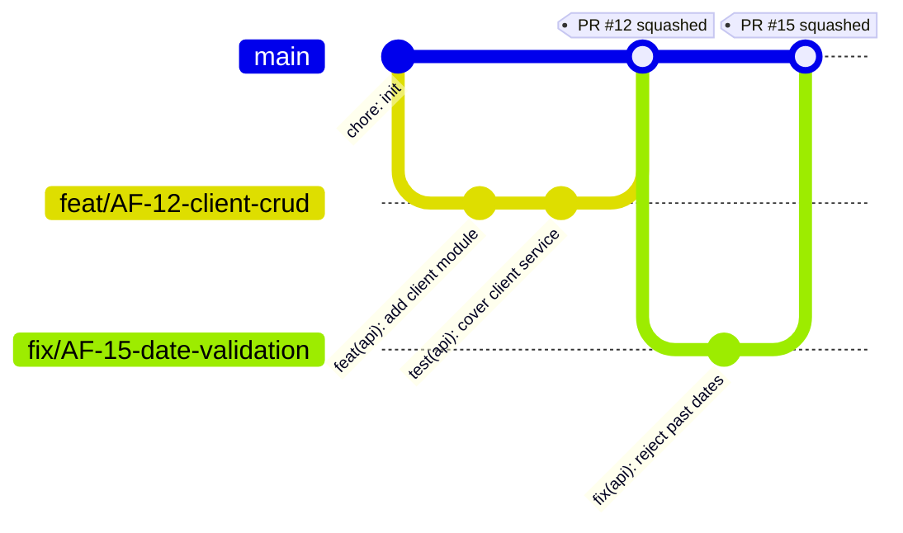
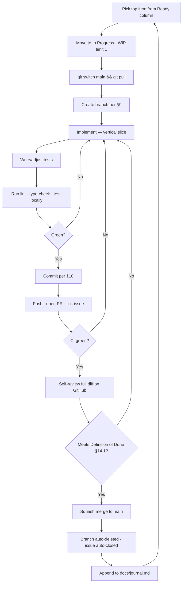
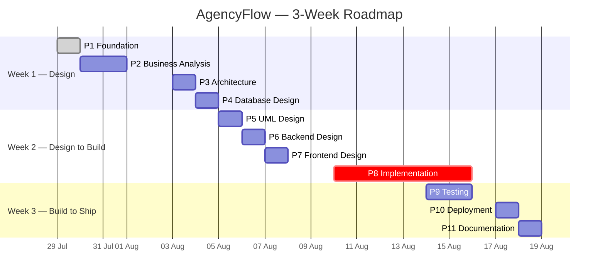
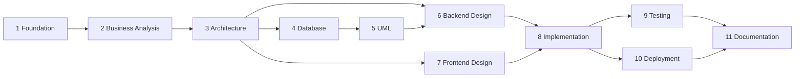

# AgencyFlow — Project Foundation Document

| Field | Value |
|---|---|
| **Document ID** | `00-Project-Foundation` |
| **Project** | AgencyFlow |
| **Phase** | Phase 1 — Project Foundation |
| **Version** | 1.0 |
| **Date** | 2026-07-29 |
| **Author** | Technical Lead / Software Architect |
| **Status** | **Approved** — 2026-07-29 |
| **Supersedes** | — |

---

## Document Control

| Version | Date | Author | Change |
|---|---|---|---|
| 1.0 | 2026-07-29 | Architect | Initial Project Foundation Document |

**Approval gate:** This document must be explicitly approved before Phase 2 (Business Analysis) begins. No design, schema, or code artefact may be produced until approval is recorded in the table below.

| Role | Name | Decision | Date |
|---|---|---|---|
| Project Owner | Yassine | ☑ **Approved** | 2026-07-29 |

**Note on §19:** the document is approved and Phase 2 is unblocked. The repository scaffolding items in the Phase 1 exit checklist (GitHub repo, tooling, CI, branch protection) remain outstanding and are carried forward as setup tasks to be completed in parallel with Phase 2.

**OQ-10 resolved (2026-07-29):** no prior SRS, user stories, use cases, or other documentation exists. Requirements Discovery starts from zero.

---

## Table of Contents

1. [Project Overview](#1-project-overview)
2. [Project Goals](#2-project-goals)
3. [Development Methodology](#3-development-methodology)
4. [Repository Organization](#4-repository-organization)
5. [Monorepo vs Multi-Repo Recommendation](#5-monorepo-vs-multi-repo-recommendation)
6. [Recommended Folder Structure](#6-recommended-folder-structure)
7. [Documentation Organization](#7-documentation-organization)
8. [Git Workflow](#8-git-workflow)
9. [Branch Naming Convention](#9-branch-naming-convention)
10. [Commit Message Convention](#10-commit-message-convention)
11. [Coding Standards](#11-coding-standards)
12. [Naming Conventions](#12-naming-conventions)
13. [Development Workflow](#13-development-workflow)
14. [Quality Standards](#14-quality-standards)
15. [Recommended Tools and Extensions](#15-recommended-tools-and-extensions)
16. [Complete Roadmap — All Project Phases](#16-complete-roadmap--all-project-phases)
17. [Risk Register](#17-risk-register)
18. [Open Questions](#18-open-questions)

---

## 1. Project Overview

### 1.1 Identity

**AgencyFlow** is a greenfield web application built as an internship engineering project, developed to production-grade standards rather than prototype standards.

### 1.2 What is deliberately *not* stated here

This section describes the **delivery context only**. The business domain of AgencyFlow — what the product does, who uses it, what problems it solves, which entities and rules it manages — is **not defined in this document and has not been assumed**.

That is the exclusive output of **Phase 2 — Business Analysis**, and it will be captured in the Software Requirements Specification (`docs/01-Software-Requirements-Specification.md`). Writing a domain description here would mean inventing requirements, which is out of scope for the Foundation phase and would contaminate every downstream artefact.

**Consequence:** Sections 1.3 and 2.2 below contain placeholders marked `[TBD → Phase 2]`. These are intentional, not omissions.

### 1.3 Product Statement

*Resolved 2026-07-30 by Phase 2. Source: `01-Software-Requirements-Specification.md` §1.3.*

> **AgencyFlow is a centralized web platform for a single digital and communication agency.** It replaces the scattered use of Excel, WhatsApp, email, and paper notes with one system in which agency staff and their clients manage projects, milestones, tasks, deliverables, and files. Project Managers plan and assign work, Team Members execute it, progress is computed automatically rather than maintained by hand, and Client Contacts gain continuous self-service visibility of their own projects and formally approve delivered work through a versioned review process.

### 1.4 Technical Context

| Aspect | Decision | Status |
|---|---|---|
| Backend framework | NestJS (Node.js, TypeScript) | Fixed by stakeholder |
| Database | MongoDB | Fixed by stakeholder |
| Frontend framework | React + Vite + TypeScript | Fixed by stakeholder |
| Language (both tiers) | TypeScript, `strict` mode | Architect recommendation, this document |
| Repository model | Monorepo (npm workspaces) | Architect recommendation, §5 |
| Source hosting | GitHub | Fixed by stakeholder |
| Runtime target | **Node.js 24 LTS** | Architect recommendation *(amended 2026-07-30 — see §15.1)* |
| API style | `[TBD → Phase 3]` (REST vs GraphQL is an architecture decision) | Deferred |
| Deployment target | `[TBD → Phase 10]` | Deferred |

**Why a single language across the stack matters here:** With TypeScript on both tiers, the API's data contracts can be defined once and consumed by both the NestJS controllers and the React client. This eliminates the single most common defect class in full-stack projects — the frontend and backend silently disagreeing about a payload shape — and it is the primary technical argument behind the monorepo recommendation in §5.

### 1.5 Delivery Constraints

| Constraint | Value | Impact |
|---|---|---|
| Team size | **1 developer (solo)** | No parallelism. Every phase is serial. Review rigour must be replaced by automation, since there is no second pair of eyes. |
| Calendar budget | **~3 weeks** (2026-07-29 → 2026-08-18, 15 working days) | Severe. Drives every simplification recommended in this document. |
| Quality bar | Production-ready enterprise application | In tension with the calendar budget. See §17 RISK-01. |
| Phase discipline | 11 sequential phases, each gated by approval | Adds coordination latency between phases. |

### 1.6 Architect's Assessment of the Timeline

I have to state this plainly, because planning around an unrealistic assumption is worse than naming it: **11 phases, a full-stack application, and a production-grade quality bar do not fit into 15 solo working days at full scope.** A realistic solo throughput for a designed, tested, documented full-stack CRUD-plus-workflow application is 6–10 weeks.

This does **not** mean the project fails. It means the variable that must flex is **feature scope**, not engineering quality — because in an internship deliverable, the evaluated artefact is the *engineering process and its evidence*, not the feature count.

The roadmap in §16 is therefore built on an explicit **MoSCoW scope-control mechanism**: Phase 2 must classify every requirement as Must / Should / Could / Won't, and only the **Must** set enters Phase 8 implementation. Everything else is documented, designed, and left unimplemented with that fact stated openly in the final documentation. A project that ships 8 well-tested, well-documented features and honestly lists 12 designed-but-deferred ones reads as professional. A project that ships 20 half-broken features does not.

**This assessment is advisory. The scope decision is yours.** If you confirm the 3-week timeline, the plan below is how I would execute it.

---

## 2. Project Goals

Goals are split into two categories, because they are evaluated differently.

### 2.1 Engineering Goals (owned by this document)

| ID | Goal | Success Measure |
|---|---|---|
| **EG-01** | Deliver a working, deployed full-stack application | Application reachable at a public URL; core flows demonstrable end-to-end |
| **EG-02** | Enforce type safety across the entire stack | TypeScript `strict: true`; zero `any` in committed code except documented escapes |
| **EG-03** | Maintain a clean, auditable Git history | 100 % of commits follow Conventional Commits; every commit traceable to an issue |
| **EG-04** | Automate all quality gates | CI blocks merge on lint, type-check, test, and build failures |
| **EG-05** | Produce complete phase documentation | All 11 phase deliverables exist, versioned in `docs/`, approved |
| **EG-06** | Achieve meaningful automated test coverage on business logic | ≥ 70 % line coverage on service/domain layer (see §14.3 for why not 100 %) |
| **EG-07** | Guarantee full requirements traceability | Every implemented feature traces to a requirement ID via the Traceability Matrix |
| **EG-08** | Ship a secure-by-default application | Authentication, authorization, input validation, and secret hygiene present from first implementation commit — not retrofitted |
| **EG-09** | Make the project reproducible by a third party | A new developer can clone and run the full stack from README in ≤ 15 minutes |

### 2.2 Product Goals

*Resolved 2026-07-30 by Phase 2. Authoritative source: `01-Software-Requirements-Specification.md` §2.3.*

| ID | Product Goal | Addresses |
|---|---|---|
| **PG-01** | Provide one centralized system holding all project information | P-1 |
| **PG-02** | Move project conversation out of external channels and attach it to the work it concerns | P-2 |
| **PG-03** | Make task state, ownership, and blockage visible at all times | P-3 |
| **PG-04** | Give clients continuous, self-service visibility of their projects' progress | P-4 |
| **PG-05** | Replace manual coordination with structured workflow and automatic progress calculation | P-5, P-3 |
| **PG-06** | Provide a formal, auditable deliverable approval process between agency and client | P-4 |

### 2.3 Explicit Non-Goals

Naming non-goals prevents scope creep, which is the dominant failure mode under a 3-week budget.

- **Not** a multi-tenant SaaS platform unless Phase 2 explicitly requires it.
- **Not** horizontally scalable / high-availability infrastructure. Single-instance deployment is acceptable and will be documented as a known limitation.
- **Not** mobile-native. Responsive web only.
- **Not** internationalized. Single-locale UI unless Phase 2 requires otherwise.
- **Not** micro-services. See §5 and Phase 3.
- **No** premature optimization. Performance work happens only against measured evidence.

---

## 3. Development Methodology

### 3.1 The Honest Characterization

The 11-phase sequence is **not** Scrum, and calling it Scrum would be inaccurate. Analysis → Architecture → Database Design → UML → Backend Design → Frontend Design → Implementation → Testing → Deployment is a **phase-gated, documentation-driven lifecycle** — structurally a **V-Model / structured waterfall**.

That is the correct label, and there is nothing wrong with it. It is the standard model for academic and internship engineering projects for a good reason: **the design artefacts are themselves graded deliverables**. In a commercial product you design in order to build; here you design in order to build *and* to demonstrate that you can design. Those are different optimization targets.

### 3.2 Chosen Methodology: Phase-Gated Lifecycle with Agile Execution Inside Phase 8

| Layer | Model | Rationale |
|---|---|---|
| **Macro (project level)** | V-Model / phase-gated, with formal approval between phases | Matches the mandated 11-phase structure; produces the documentation set that is itself a deliverable; each gate creates a natural checkpoint with your supervisor |
| **Micro (inside Phase 8)** | Kanban with WIP limit = 1, vertical feature slices | Solo developer, short horizon. Kanban gives flow and visibility without ceremony overhead |

### 3.3 Why Kanban and not Scrum for the implementation phase

Scrum's value comes from its ceremonies — sprint planning, daily standup, review, retrospective — and every one of them is a **team coordination mechanism**. A daily standup with one person is a monologue. Sprint planning for a solo developer with a 5-day implementation window is planning overhead consuming the time it plans.

Kanban delivers the parts that *do* help a solo developer:

- **Visualize the work** — a GitHub Projects board with `Backlog → Ready → In Progress → In Review → Done`.
- **Limit work in progress to 1** — the single highest-leverage rule for a solo developer. Finishing beats starting. Three half-done features at the deadline is worth zero; one finished feature is worth one.
- **Pull, don't push** — take the next item only when the current one is genuinely Done (§14.1).
- **Measure flow, not velocity** — with a 15-day budget, "how long does one feature actually take me" is a far more useful signal than story points.

### 3.4 Vertical Slicing (critical for this timeline)

Implementation work is sliced **vertically**, never horizontally.

- **Wrong (horizontal):** "Week 1: build all Mongoose schemas. Week 2: build all controllers. Week 3: build all UI." → Nothing is demonstrable until the final day. All integration risk is concentrated at the end, exactly when there is no time to absorb it.
- **Right (vertical):** "Feature A: schema + service + controller + API contract + UI + test, done and merged. Then Feature B." → Something works and is demonstrable from day one of implementation. If the deadline arrives early, you have N finished features instead of three unfinished layers.

Under a compressed timeline this is not a stylistic preference; it is the difference between a demonstrable project and a non-demonstrable one.

### 3.5 Cadence

| Ritual | Frequency | Duration | Purpose |
|---|---|---|---|
| Personal daily log | Daily, end of day | 5 min | Append to `docs/journal.md`: done / next / blocked. Becomes raw material for the final report and defends against "what did I do on day 6?" |
| Phase gate review | End of each phase | 15–30 min | Present the phase deliverable, obtain explicit approval, record it in the document control table |
| Weekly scope checkpoint | End of each week | 20 min | Compare progress against §16 roadmap; re-cut the MoSCoW scope if behind. **Re-cut scope early, never quality.** |
| Retrospective | End of project | 30 min | Feeds the Phase 11 lessons-learned section |

---

## 4. Repository Organization

### 4.1 Repository

A **single Git repository** named `agencyflow`, hosted on **GitHub**.

### 4.2 Visibility

**Decision (OQ-09, 2026-07-30): private.** The repository stays private throughout development and documentation, and is made public only once the project reaches a stable version suitable for presentation and portfolio use.

This is the correct default: internship work frequently touches company-specific processes, and publication is a one-way door — making a repository private again does not un-publish what was already fetched, forked, or indexed. Before flipping it public, review the full history for anything that should not be there, and confirm with your host company.

### 4.3 Workspace Layout

The repository uses **npm workspaces** to host multiple packages in one repo:

| Workspace | Path | Contents |
|---|---|---|
| `@agencyflow/api` | `apps/api` | NestJS backend application |
| `@agencyflow/web` | `apps/web` | React + Vite frontend application |
| `@agencyflow/contracts` | `packages/contracts` | Shared TypeScript types, DTO shapes, enums, validation schemas |
| `@agencyflow/config` | `packages/config` | Shared ESLint / TypeScript / Prettier base configuration |

> The **internal** structure of `apps/api` and `apps/web` is deliberately left undefined here. Backend module structure is decided in **Phase 6**, frontend structure in **Phase 7**. Deciding it now would be running ahead of the phase gates.

### 4.4 Why `apps/` and `packages/` rather than `frontend/` and `backend/`

`apps/` holds **deployable units**; `packages/` holds **shared libraries consumed by apps**. This is the near-universal convention across the JS/TS monorepo ecosystem (Nx, Turborepo, pnpm workspaces all assume it). Using the conventional layout means every tool's defaults work, and any engineer reading the repo orients in seconds.

### 4.5 Branch Protection (GitHub settings)

| Setting | Value | Rationale |
|---|---|---|
| Protect `main` | Yes | `main` must always be releasable |
| Require PR before merge | Yes | Forces a diff review moment even solo; produces the audit trail |
| Require status checks to pass | Yes — `lint`, `type-check`, `test`, `build` | The automated reviewer that replaces the human one |
| Require branches up to date | Yes | Prevents semantic merge conflicts |
| Require approvals | **0** | Solo project — a self-approval requirement is theatre, and GitHub does not let you approve your own PR |
| Allow force push to `main` | **No** | History integrity is non-negotiable |
| Allow deletion of `main` | **No** | — |
| Auto-delete head branches on merge | Yes | Keeps the branch list readable |

**Note on the 0-approval rule:** because there is no reviewer, the CI status checks become the *only* gate. That is why §14 specifies them as strictly as it does. Automation is not a supplement to review here — it *is* the review.

---

## 5. Monorepo vs Multi-Repo Recommendation

### 5.1 Recommendation

> **Adopt a MONOREPO**, managed with **npm workspaces**.

### 5.2 The Options Considered

| Option | Description |
|---|---|
| **A. Multi-repo** | `agencyflow-api` and `agencyflow-web` as separate repositories |
| **B. Monorepo, npm workspaces** | One repository, npm's built-in workspace support | 
| **C. Monorepo, Nx or Turborepo** | One repository with a dedicated monorepo build orchestrator |

### 5.3 Decision Analysis

| Criterion | A. Multi-repo | B. Monorepo (npm workspaces) | C. Monorepo (Nx/Turborepo) |
|---|---|---|---|
| Sharing types between API and UI | ✗ Requires publishing a package to a registry, or duplication | ✓ Direct workspace import | ✓ Direct workspace import |
| Atomic full-stack change | ✗ Two PRs, two merges, a window where they disagree | ✓ One commit, one PR | ✓ One commit, one PR |
| CI configuration effort | ✗ Two pipelines to write and maintain | ✓ One pipeline | ✓ One pipeline + task graph config |
| Local setup for a new dev | ✗ Clone 2 repos, link them | ✓ `git clone && npm install` | ✓ `git clone && npm install` |
| Single reviewable history for evaluation | ✗ Split across repos | ✓ One coherent narrative | ✓ One coherent narrative |
| Setup cost | Medium | **Very low (zero extra tooling)** | High — new tool to learn |
| Build caching / affected-only builds | N/A | ✗ Not provided | ✓ Excellent |
| Independent deployment | ✓ Native | ✓ Achievable via CI path filters | ✓ Native |
| Fit for solo dev, 3 weeks | Poor | **Excellent** | Poor |

### 5.4 Why Monorepo — the decisive arguments

**1. The shared-contract argument (dominant).**
This project has a NestJS API and a React client speaking to each other in TypeScript. In a monorepo, a DTO or enum is declared once in `packages/contracts` and imported by both. Change a field name, and the frontend fails to **compile** — at build time, in CI, before merge. In a multi-repo setup that same change fails at **runtime**, in the browser, possibly in front of your supervisor during the demo. Moving an entire defect class from runtime to compile-time is the highest-value structural decision available at this stage, and it is essentially free.

**2. The atomicity argument.**
Real features cross the stack. "Add a status field" touches the schema, the service, the controller, the contract, and the UI. In a monorepo that is one commit — reviewable as a unit, revertable as a unit, and it either works or it doesn't. In a multi-repo it is two commits in two repositories with an inherent ordering problem and a window during which `main` in one repo is incompatible with `main` in the other.

**3. The overhead argument, given the constraints.**
Multi-repo costs are fixed and paid up front: two repos to create, two CI pipelines, two dependency sets, two READMEs, cross-repo version coordination. Its benefits — independent release cadence, per-repo access control, independent team ownership — are all **team-scaling benefits**. There is one developer and one release stream. You would pay every cost and collect none of the benefits.

**4. The evaluation argument.**
An internship project is read as a single narrative. One repository whose history shows the project evolving coherently from foundation to deployment tells that story far better than two repos that must be cross-referenced by timestamp.

### 5.5 Why npm workspaces and not Nx or Turborepo

Nx and Turborepo are genuinely excellent tools, and I would recommend them at 4+ developers or 5+ packages. Their core value is **computation caching and affected-only task execution** — that value scales with the number of packages and the length of builds. Here there are 4 packages and a build measured in tens of seconds. The saving is negligible.

Their cost is not negligible: a new configuration model, a new mental model, a new failure mode to debug — spent from a 15-day budget. **npm workspaces ships inside the npm you already have, requires one `workspaces` array in the root `package.json`, and needs zero additional dependencies.**

This is the general principle applied throughout this document: **choose the simplest tool that solves the actual problem at the actual scale, and be able to explain what would make you upgrade.**

### 5.6 Migration Trigger (documented so the decision is defensible, not dogmatic)

Move from npm workspaces to Turborepo/Nx when **any** of these becomes true:
- CI wall-clock time exceeds ~5 minutes
- Package count exceeds ~8
- Team size exceeds ~4 developers
- You need per-package independent release versioning

None hold today. This decision will be recorded as **ADR-0001** (§7.3).

---

## 6. Recommended Folder Structure

```text
agencyflow/
├── .github/
│   ├── workflows/
│   │   └── ci.yml                    # Lint, type-check, test, build — runs on every PR
│   ├── ISSUE_TEMPLATE/
│   │   ├── feature.md
│   │   └── bug.md
│   └── pull_request_template.md
│
├── .vscode/
│   ├── extensions.json               # Recommended extensions (§15) — committed
│   └── settings.json                 # Format-on-save, ESLint integration — committed
│
├── apps/                             # Deployable applications
│   ├── api/                          # NestJS backend
│   │   └── [internal structure → Phase 6]
│   └── web/                          # React + Vite frontend
│       └── [internal structure → Phase 7]
│
├── packages/                         # Shared libraries
│   ├── contracts/                    # Shared TS types, DTO shapes, enums
│   └── config/                       # Shared eslint / tsconfig / prettier bases
│
├── docs/                             # All project documentation (§7)
│   ├── 00-Project-Foundation.md      # ← this document
│   ├── adr/                          # Architecture Decision Records
│   ├── assets/                       # Diagrams, images, exports
│   └── journal.md                    # Daily development log
│
├── .editorconfig                     # Editor-agnostic whitespace rules
├── .gitignore
├── .nvmrc                            # Pins Node version
├── .env.example                      # Documents required env vars — NEVER real values
├── package.json                      # Root: workspaces array + orchestration scripts
├── package-lock.json                 # Committed — reproducible installs
├── README.md
├── CHANGELOG.md                      # Generated from Conventional Commits
└── LICENSE
```

### 6.1 Rationale for key choices

| Choice | Why |
|---|---|
| `apps/` vs `packages/` split | Deployables vs libraries — ecosystem-standard, tool defaults just work (§4.4) |
| `packages/contracts` | The mechanism that delivers the §5.4 compile-time-safety argument |
| `packages/config` | One ESLint/TS rule set, defined once. Prevents the api and web drifting into different standards |
| `.vscode/` **committed** | Guarantees identical formatting behaviour on any machine and makes the environment reproducible (EG-09). This is a shared-config file, not personal preference |
| `.env.example` committed, `.env` git-ignored | Documents *which* variables exist without ever committing a secret. Non-negotiable security practice |
| `.nvmrc` | Eliminates "works on my machine" caused by Node version drift |
| `package-lock.json` committed | Byte-identical dependency trees between local and CI. Never git-ignore a lockfile |
| `docs/` in-repo | Documentation versions **with** the code it describes. A wiki drifts; a `docs/` folder is reviewed in the same PR as the change |
| Internal app structure deferred | Phases 6 and 7 own those decisions. Fixing them now would violate the phase gate |

### 6.2 `.gitignore` policy

At minimum: `node_modules/`, `dist/`, `build/`, `coverage/`, `.env`, `.env.*` (except `.env.example`), `*.log`, `.DS_Store`, `.vite/`, `.turbo/`.

**Never commit:** secrets, `.env` files, credentials, connection strings containing passwords, JWT signing keys, `node_modules/`, build output.

**Note:** if a secret is ever committed, rotating it is mandatory — deleting the file in a later commit does **not** remove it from history.

---

## 7. Documentation Organization

### 7.1 Principle: Docs-as-Code

Documentation lives in the repository, in Markdown, versioned with Git, and changed through the same PR process as code. This gives documentation the same review, history, and blame that code gets — and, crucially, it means a PR that changes behaviour and the PR that documents it are *the same PR*.

### 7.2 Numbered Deliverable Set

Documents are numbered by phase so that the folder sorts into project order. Each phase produces exactly one primary deliverable.

| # | File | Phase | Content |
|---|---|---|---|
| 00 | `00-Project-Foundation.md` | 1 | This document |
| 01 | `01-Software-Requirements-Specification.md` | 2 | Functional + non-functional requirements, scope, MoSCoW, glossary |
| 02 | `02-User-Stories.md` | 2 | User stories with acceptance criteria |
| 03 | `03-Use-Cases.md` | 2 | Use case specifications, actors, flows |
| 04 | `04-Requirements-Traceability-Matrix.md` | 2 | Requirement → story → use case → test mapping |
| 05 | `05-Software-Architecture.md` | 3 | Architecture style, layers, C4 views, cross-cutting concerns |
| 06 | `06-Database-Design.md` | 4 | Collections, embedding vs referencing, indexes, data dictionary |
| 07 | `07-UML-Design.md` | 5 | Class, sequence, activity, state, component diagrams |
| 08 | `08-Backend-Design.md` | 6 | Module decomposition, API specification, error model, auth design |
| 09 | `09-Frontend-Design.md` | 7 | Component hierarchy, routing, state management, UI structure |
| 10 | `10-Test-Plan-and-Report.md` | 9 | Test strategy, cases, coverage, defect log |
| 11 | `11-Deployment-Guide.md` | 10 | Environments, CI/CD, runbook, rollback |
| 12 | `12-Final-Project-Report.md` | 11 | Consolidated report, lessons learned, limitations, future work |

### 7.3 Architecture Decision Records (`docs/adr/`)

Every significant, hard-to-reverse technical decision gets an ADR: `NNNN-short-title.md`, using the Nygard format — **Context / Decision / Status / Consequences**.

**Why ADRs matter more than usual here:** an internship is evaluated on *reasoning*, not just output. "I chose MongoDB" is worth little; "I chose MongoDB, here was the context, here is what I traded away, here is what would change my mind" is the actual demonstration of engineering judgement. ADRs make that reasoning a durable artefact instead of something you have to remember during a viva.

Planned initial ADRs:
- `0001-monorepo-with-npm-workspaces.md` (decided — §5)
- `0002-github-flow-branching-strategy.md` (decided — §8)
- `0003-...` onwards as Phases 3–7 generate decisions

### 7.4 Living Documents

| Document | Update trigger |
|---|---|
| `README.md` | Any change to setup, scripts, or prerequisites |
| `CHANGELOG.md` | Generated from Conventional Commits at each release tag |
| `docs/journal.md` | Daily, end of day |
| `.env.example` | Any new environment variable |

### 7.5 Diagram Policy

Prefer **Mermaid** embedded directly in Markdown (renders natively on GitHub, diffs as text, edits without external tooling). Use a dedicated tool only where Mermaid genuinely cannot express the diagram — then commit **both** the source file and the exported PNG/SVG to `docs/assets/`. Never commit an image whose source file is not also committed; an un-editable diagram is a dead diagram.

### 7.6 Documentation Definition of Done

- Has document ID, version, date, status header
- Numbered sections, table of contents
- Every technical decision states its **rationale**, not just the outcome
- Cross-references use requirement IDs, never prose paraphrase
- No `[TBD]` markers remain at phase approval — an unresolved item is an Open Question with an owner, not a blank

---

## 8. Git Workflow

### 8.1 Recommendation: GitHub Flow

> **Adopt GitHub Flow**: a permanently releasable `main`, short-lived branches, Pull Request per change, squash merge.

### 8.2 The Options Considered

| Strategy | Branches | Designed for | Verdict here |
|---|---|---|---|
| **GitFlow** | `main`, `develop`, `feature/*`, `release/*`, `hotfix/*` | Teams shipping versioned releases, supporting multiple versions in production simultaneously | **Rejected** |
| **GitHub Flow** | `main` + short-lived branches | Continuous delivery, one production version | **Chosen** |
| **Trunk-Based** | `main`, commits direct or via <1-day branches | High-maturity teams with strong automated testing and feature flags | Rejected (no PR record) |

### 8.3 Why GitHub Flow and not GitFlow

GitFlow is the reflexive answer to "what branching strategy should we use?", and here it would be the wrong one.

GitFlow's `develop`, `release/*`, and `hotfix/*` branches exist to solve one specific problem: **you must patch version 1.2 in production while version 1.3 is being stabilized and version 1.4 is in development.** That is a real problem for teams shipping installed or versioned software.

This project has **one developer, one environment, and one version in existence at a time**. Adopting GitFlow would mean:
- Every feature merged twice (`feature → develop → main`)
- A `develop` branch that is always identical to `main` minus latency
- Release branches ceremonially created and immediately merged
- More merge conflicts, from more merge points, on a solo project

That is pure overhead with no corresponding benefit — and using a heavyweight process you cannot justify reads as *less* professional than using a light one you can.

GitHub Flow gives what is actually needed: `main` always deployable, isolated work per change, a PR as the review-and-CI checkpoint, and a clean linear history.

### 8.4 The Flow



**Step by step:**

1. Create a GitHub Issue describing the work. **The issue is the unit of work** — no work without an issue.
2. Branch from an up-to-date `main`, named per §9.
3. Commit in small, logical units per §10.
4. Push and open a Draft PR **early** — CI starts running while you are still working.
5. When complete, mark Ready for Review and complete the PR checklist.
6. CI must be green. No exceptions, no merging red.
7. **Self-review the full diff on GitHub before merging.** Reading your own diff in the PR view — not the editor — reliably surfaces leftover debug code, commented-out blocks, stray `console.log`, and accidentally-committed files. On a solo project this is the single most valuable habit you have.
8. **Squash merge** into `main`.
9. Delete the branch (automatic).
10. The issue closes automatically via `Closes #12` in the PR description.

### 8.5 Why squash merge

| Merge type | Result | Verdict |
|---|---|---|
| **Squash** | One commit per PR on `main`. `main` history = a clean list of delivered changes | **Chosen** |
| Merge commit | Preserves every WIP commit plus a merge commit. `main` becomes noisy | Rejected |
| Rebase merge | Linear, but replays every WIP commit onto `main` | Rejected |

Squashing lets you commit freely on your branch (including messy "fix typo" commits) while keeping `main` readable: one commit per feature, each with a Conventional Commit message, each linked to a PR and an issue. `git log main --oneline` becomes a legible changelog. That readability is worth more than preserving your intermediate keystrokes.

**Consequence:** the squashed commit message becomes the permanent record, so it must be a well-formed Conventional Commit (§10) — GitHub lets you edit it at merge time. Do so.

### 8.6 Rules

| Rule | Rationale |
|---|---|
| Never commit directly to `main` | Enforced by branch protection. Every change gets a PR record |
| Never force-push `main` | History integrity |
| Branches live < 2 days | Long-lived branches diverge and produce painful conflicts |
| One PR = one concern | A PR touching auth *and* styling *and* deps is unreviewable |
| Rebase your branch on `main` before merging | Keeps history linear, surfaces conflicts on your branch not on `main` |
| Never merge with failing CI | The gate exists to be a gate |
| PR description explains **why** | The diff shows *what*; only you can supply *why* |
| `main` is always deployable | If `main` is broken, fixing it is priority zero |

### 8.7 Tagging and Releases

Semantic Versioning (`vMAJOR.MINOR.PATCH`), annotated Git tags on `main`.
- Tag `v0.1.0` at the first working end-to-end vertical slice
- Tag `v1.0.0` at final delivery
- Pre-1.0, breaking changes bump MINOR (standard SemVer allowance for initial development)

---

## 9. Branch Naming Convention

### 9.1 Format

```text
<type>/<issue-id>-<short-kebab-description>
```

### 9.2 Types

| Type | Use for |
|---|---|
| `feat` | New feature |
| `fix` | Bug fix |
| `docs` | Documentation only |
| `refactor` | Restructuring without behaviour change |
| `test` | Adding or fixing tests |
| `chore` | Tooling, dependencies, config |
| `ci` | CI/CD pipeline changes |
| `perf` | Performance improvement |

### 9.3 Rules

- Lowercase only
- Hyphens as separators — never underscores, spaces, or camelCase
- Include the GitHub issue number (`AF-` prefix or bare `#` number, chosen once and kept consistent)
- Description ≤ 5 words, descriptive of *what*, not *how*
- Total length ≤ 60 characters

### 9.4 Examples

✅ **Good**

```text
feat/AF-12-client-crud
fix/AF-15-invalid-date-validation
docs/AF-03-database-design
refactor/AF-27-extract-auth-guard
chore/AF-01-eslint-setup
ci/AF-05-add-test-workflow
```

❌ **Bad**

| Branch | Problem |
|---|---|
| `new-feature` | No type, no issue, meaningless |
| `Feature/AF-12-Client` | Wrong case |
| `feat/AF_12_client_crud` | Underscores |
| `fix` | No description |
| `yassine-branch` | Personal branches don't describe work |
| `feat/AF-12-add-the-new-client-management-crud-endpoints-and-ui` | Too long |

### 9.5 Why this convention

The type prefix makes `git branch --list 'feat/*'` useful and tells you at a glance what a branch is. The issue ID creates a two-way link between the branch, the PR, the commit, and the requirement — which is exactly what the Traceability Matrix (EG-07) needs. Kebab-case is filesystem- and URL-safe on every platform including Windows.

---

## 10. Commit Message Convention

### 10.1 Standard: Conventional Commits 1.0.0

### 10.2 Format

```text
<type>(<scope>): <subject>
<BLANK LINE>
[optional body]
<BLANK LINE>
[optional footer]
```

### 10.3 Types

| Type | Meaning | SemVer impact |
|---|---|---|
| `feat` | New feature | MINOR |
| `fix` | Bug fix | PATCH |
| `docs` | Documentation only | — |
| `style` | Formatting, whitespace, semicolons — no logic change | — |
| `refactor` | Code change that neither fixes a bug nor adds a feature | — |
| `perf` | Performance improvement | PATCH |
| `test` | Adding or correcting tests | — |
| `build` | Build system or dependency changes | — |
| `ci` | CI configuration changes | — |
| `chore` | Maintenance not touching src or tests | — |
| `revert` | Reverts a previous commit | — |

### 10.4 Scopes

Scope = the affected area. Keep the set small and fixed:

`api`, `web`, `contracts`, `config`, `db`, `auth`, `docs`, `ci`, `deps`

### 10.5 Rules

| Rule | Example |
|---|---|
| Type lowercase | `feat:` not `Feat:` |
| Subject in **imperative mood** | `add client endpoint` not `added` / `adds` |
| No capital letter starting the subject | `feat(api): add ...` |
| No trailing period | — |
| Subject ≤ 72 characters | — |
| Body wrapped at 100 characters | — |
| Body explains **why**, not what | The diff already shows what |
| Breaking changes marked with `!` **and** a `BREAKING CHANGE:` footer | `feat(api)!: ...` |
| Reference issues in the footer | `Closes #12` |

**On imperative mood:** the convention comes from Git itself — a commit message completes the sentence *"If applied, this commit will ___"*. `add client endpoint` reads correctly there; `added client endpoint` does not. It also keeps every message grammatically uniform, which makes a generated changelog readable.

### 10.6 Examples

✅ **Good**

```text
feat(api): add client creation endpoint

Implements POST /clients with class-validator input validation and
duplicate-email rejection at the service layer.

Closes #12
```

```text
fix(web): prevent double submit on project form

The submit handler did not disable the button while the request was in
flight, allowing duplicate projects to be created by fast double-clicks.

Closes #34
```

```text
feat(api)!: change project status from string to enum

BREAKING CHANGE: `Project.status` now accepts only the values defined in
ProjectStatus. Existing documents must be migrated before deploy.

Refs #41
```

```text
docs(architecture): add ADR-0001 for monorepo decision
```

```text
chore(deps): upgrade nestjs to 11.0.3
```

❌ **Bad**

| Message | Problem |
|---|---|
| `update` | Says nothing |
| `Fixed the bug.` | Wrong mood, capitalized, trailing period, no type, which bug? |
| `feat: stuff` | Meaningless subject |
| `WIP` | Never on `main`; squash it away before merging |
| `feat(api): added client endpoint and fixed date bug and updated readme` | Three concerns in one commit |
| `asdasd` | — |

### 10.7 Enforcement

Convention that relies on discipline decays by week two. Automate it:

| Tool | Role |
|---|---|
| **commitlint** + `@commitlint/config-conventional` | Validates message format |
| **husky** | Git hooks — runs commitlint on `commit-msg` |
| **lint-staged** | Runs ESLint/Prettier on staged files at `pre-commit` |

A malformed commit is then rejected locally, before it exists.

### 10.8 The payoff

Because every message is machine-parseable:
- `CHANGELOG.md` is **generated**, never hand-written
- The next version number is **derived** from commit types
- `git log --grep '^feat'` answers "what shipped this week?" instantly
- The Git history becomes evidence of process discipline — visible to anyone evaluating the project

---

## 11. Coding Standards

### 11.1 Language: TypeScript, strict

```jsonc
// Non-negotiable compiler flags — packages/config/tsconfig.base.json
{
  "strict": true,
  "noImplicitAny": true,
  "strictNullChecks": true,
  "noUnusedLocals": true,
  "noUnusedParameters": true,
  "noFallthroughCasesInSwitch": true,
  "forceConsistentCasingInFileNames": true
}
```

**Why `strict` from day one:** enabling strict mode on an existing codebase means fixing hundreds of errors at the worst possible moment. Enabling it on an empty repository costs nothing. `strictNullChecks` alone eliminates the entire "cannot read property of undefined" defect family at compile time — the single most common runtime error in JavaScript applications.

**`forceConsistentCasingInFileNames` matters specifically here:** you develop on Windows (case-insensitive filesystem) and will deploy to Linux (case-sensitive). Without this flag, `import { X } from './myFile'` resolving to `MyFile.ts` works locally and fails in production. This flag catches it at compile time.

### 11.2 The `any` rule

`any` is **forbidden** in committed code. If it is genuinely unavoidable:

```ts
// eslint-disable-next-line @typescript-eslint/no-explicit-any -- <reason and ticket>
```

An `any` disables type checking for everything it touches and propagates silently. Prefer `unknown` plus a narrowing check.

### 11.3 Formatting: Prettier

**Prettier owns formatting entirely. It is not configurable by preference and it is not debated.** Format-on-save locally, checked in CI. The value of an automatic formatter is that formatting stops being a decision — every file looks the same, and diffs contain only semantic changes.

Baseline: `printWidth: 100`, `singleQuote: true`, `semi: true`, `trailingComma: "all"`, `arrowParens: "always"`, `endOfLine: "lf"`.

> **`endOfLine: "lf"` is critical on Windows.** Without it, Git line-ending conversion produces PRs where every line appears changed. Pair it with `.gitattributes` containing `* text=auto eol=lf`.

**Amendment (2026-07-31, Slice 1): `docs/` and `README.md` are excluded from Prettier.**

Prettier's justification above is that *diffs contain only semantic changes*. On markdown prose it produces the opposite result: it repads whole tables when one word changes. Measured before deciding — **872 changed lines in a single approved document, with zero content difference**; roughly 5 000 lines across the twelve design documents.

Prettier therefore owns **code** formatting; markdown prose is reviewed by a human. CI gate 1 (§14.4) checks code paths only. Recorded in `.prettierignore` with the same rationale.

### 11.4 Linting: ESLint

- `@typescript-eslint` recommended + type-checked rules
- Import ordering enforced (`import/order`)
- **Zero warnings policy**: CI runs `eslint --max-warnings=0`. A tolerated warning is a warning that will still be there at the end of the project; 200 of them means nobody reads any of them.

### 11.5 General Principles

| Principle | Application |
|---|---|
| **SOLID** | Especially Single Responsibility and Dependency Inversion — NestJS's DI container makes both natural |
| **DRY, applied with judgement** | Extract on the *third* occurrence. Premature abstraction couples unrelated things and is harder to undo than duplication |
| **KISS** | The simplest thing that satisfies the requirement |
| **YAGNI** | Build what requirements state. Speculative generality is the top source of dead code |
| **Fail fast** | Validate at boundaries; reject invalid input at the edge, never deep in the domain |
| **Explicit over implicit** | Named constants over magic values; explicit return types on public functions |
| **Composition over inheritance** | Deep class hierarchies are rigid; NestJS providers compose cleanly |

### 11.6 Code Hygiene

- **Function length:** guideline ≤ 40 lines. Longer usually means multiple responsibilities.
- **Nesting depth:** ≤ 3. Use guard clauses and early returns.
- **Parameters:** ≤ 4; beyond that, take an options object.
- **File length:** guideline ≤ 300 lines.
- **No commented-out code.** Git remembers. Commented code is noise that decays into lies.
- **No `console.log` in committed code.** Use the framework logger. Enforced by ESLint.
- **No magic numbers or strings.** Named constants or enums.
- **Comments explain *why*, never *what*.** `// increment i` is noise; `// API returns 1-indexed pages` is essential.
- **`TODO` must include an issue reference:** `// TODO(#42): handle pagination`. A bare TODO is a promise nobody made.

### 11.7 Error Handling

- Never swallow an error silently (`catch {}` is a defect).
- Never `catch (e) { console.log(e) }` and continue as if nothing happened.
- Throw typed, domain-meaningful errors — not bare strings.
- Never leak stack traces, internal paths, or database errors to API clients.
- Log with correlation context so a production error is traceable to a request.

*Detailed error taxonomy and HTTP mapping are a Phase 6 deliverable.*

### 11.8 Security Baseline (applies from the first implementation commit)

| Rule | Reason |
|---|---|
| No secrets in source, ever | Committed secrets persist in history permanently and must be rotated |
| All configuration via environment variables, validated at boot | Fail at startup, not at first request |
| Validate and sanitize **all** external input at the boundary | Injection and mass-assignment defence |
| Never trust client-supplied IDs, roles, or prices | Authorization is a server-side decision |
| Hash passwords with bcrypt or argon2 — never a raw hash, never reversible encryption | — |
| Never log credentials, tokens, or PII | Logs are widely readable and long-lived |
| Dependencies: `npm audit` in CI; no known-critical vulnerabilities at delivery | — |

---

## 12. Naming Conventions

### 12.1 General

| Element | Convention | Example |
|---|---|---|
| Variables, functions | `camelCase` | `activeClients`, `calculateTotal()` |
| Classes, interfaces, types, enums | `PascalCase` | `ClientService`, `ProjectStatus` |
| Constants (true immutable literals) | `UPPER_SNAKE_CASE` | `MAX_UPLOAD_SIZE` |
| Booleans | `is` / `has` / `can` / `should` prefix | `isActive`, `hasPermission`, `canEdit` |
| Functions | Verb phrase | `createClient()`, `findAllProjects()` |
| Arrays / collections | Plural noun | `clients`, `projects` |
| Private class members | `camelCase`, `private` keyword — no `_` prefix | `private readonly repo` |
| Generic type parameters | Single capital or descriptive `PascalCase` | `T`, `TEntity` |

### 12.2 Interfaces and Types

**Do not prefix interfaces with `I`.** `IClient` is a C#/Java convention imported into TypeScript by habit. In TypeScript, whether a contract is an `interface` or a `type` is an implementation detail that may change; encoding it in the name means the name lies when you change it. Name the concept: `Client`.

### 12.3 Files and Directories

| Element | Convention | Example |
|---|---|---|
| Directories | `kebab-case`, plural for collections | `user-profiles/` |
| Backend files | `kebab-case` with NestJS type suffix | `client.service.ts`, `create-client.dto.ts` |
| React components | `PascalCase.tsx`, matching the component name | `ClientTable.tsx` |
| React hooks | `camelCase` with `use` prefix | `useClients.ts` |
| Test files | Mirror source + `.spec.ts` / `.test.tsx` | `client.service.spec.ts` |
| Shared types | `kebab-case` | `client.types.ts` |

**One exported concept per file**, and the filename matches it. `ClientTable.tsx` exports `ClientTable`. Anything else forces a reader to open files to find things.

### 12.4 Database (MongoDB)

*Provisional — final naming is a Phase 4 deliverable.*

| Element | Convention | Example |
|---|---|---|
| Collections | `camelCase`, **plural** | `clients`, `projectTasks` |
| Fields | `camelCase` | `createdAt`, `clientId` |
| Reference fields | `<entity>Id` / `<entity>Ids` | `ownerId`, `memberIds` |
| Booleans | `is`/`has` prefix | `isArchived` |
| Timestamps | `createdAt`, `updatedAt`, `deletedAt` | — |
| Indexes | `idx_<field>[_<field>]` | `idx_email_unique` |

**Why `camelCase` and not `snake_case` in MongoDB:** field names cross the wire into JavaScript objects with zero transformation. Using `snake_case` in the database forces either a mapping layer or `snake_case` keys inside TypeScript code that uses `camelCase` everywhere else. Consistency with the language beats convention imported from SQL.

### 12.5 API

*Provisional — final API design is a Phase 6 deliverable.*

| Element | Convention | Example |
|---|---|---|
| Endpoints | `kebab-case`, **plural** nouns, no verbs | `/api/v1/clients` |
| Path parameters | `camelCase` | `/clients/:clientId` |
| Query parameters | `camelCase` | `?sortBy=createdAt&pageSize=20` |
| JSON payload keys | `camelCase` | `{ "clientName": "..." }` |
| Versioning | URI prefix | `/api/v1/...` |

REST endpoints name **resources**, not actions — the HTTP verb supplies the action. `POST /clients` is correct; `POST /createClient` duplicates the verb and breaks the uniform interface.

### 12.6 Git and Project Artefacts

| Element | Convention | Reference |
|---|---|---|
| Branches | `<type>/<issue>-<desc>` | §9 |
| Commits | Conventional Commits | §10 |
| Documents | `NN-Title-In-Pascal-Kebab.md` | §7.2 |
| ADRs | `NNNN-short-title.md` | §7.3 |
| Environment variables | `UPPER_SNAKE_CASE` | `MONGODB_URI` |

---

## 13. Development Workflow

### 13.1 Definition: the Unit of Work

**Nothing is built without a GitHub Issue.** The issue is the atom: it carries the requirement link, the acceptance criteria, and the discussion. The branch, the commits, the PR, and the traceability matrix entry all hang off it.

### 13.2 The Loop



### 13.3 Board Columns (GitHub Projects)

| Column | Meaning | Entry criterion |
|---|---|---|
| **Backlog** | Identified, not yet specified | An idea or requirement exists |
| **Ready** | Fully specified, unblocked, startable | Acceptance criteria written; requirement ID linked; dependencies done |
| **In Progress** | Actively being worked | **Max 1 item** |
| **In Review** | PR open, CI running, awaiting self-review | PR opened |
| **Done** | Merged to `main` | Definition of Done satisfied (§14.1) |

**The WIP limit of 1 is the most important rule on this board.** Under a 15-day budget, three items at 70 % completion have delivered nothing. One item at 100 % has delivered one feature.

### 13.4 Daily Rhythm

| When | Action |
|---|---|
| Start of day | Review board; confirm today's single objective; check for blockers |
| During | One item at a time. Commit small and often on your branch |
| Blocked > 45 min | **Stop. Write the blocker down. Escalate or work around it.** Silent grinding is the most expensive failure mode on a short timeline |
| End of day | Push all work (never leave code only on a laptop); append to `docs/journal.md`; update the board |

### 13.5 Phase Gate Protocol

At each of the 11 phase boundaries:

1. Produce the phase deliverable in `docs/`
2. Self-check against §14.2 and §7.6
3. Commit as `docs(<phase>): ...`, open a PR, merge
4. **Present it and request explicit approval**
5. Record the approval in the document's control table
6. **Only then** begin the next phase

Approval is a hard gate. Starting Phase 4 before Phase 3 is approved risks discarding the work.

### 13.6 Handling Discovery Mid-Phase

When implementation reveals that a design is wrong (it will):

- **Do not silently deviate.** Silent deviation is how documentation becomes fiction.
- Record the discovery in the journal.
- If small: fix the design document in the same PR as the code, and note it in the commit body.
- If significant: raise it, decide explicitly, and write an ADR.

The design documents must stay true at delivery. A design doc that contradicts the running code is worse than no design doc — it actively misleads.

---

## 14. Quality Standards

### 14.1 Definition of Done

An item is Done only when **every** box is checked. No partial credit.

- [ ] Acceptance criteria in the issue are met
- [ ] Code follows §11 standards and §12 naming
- [ ] `strict` TypeScript passes with zero errors
- [ ] ESLint passes with **zero warnings**
- [ ] Prettier formatting applied
- [ ] Unit tests written for new business logic and passing
- [ ] No `console.log`, commented-out code, or unreferenced `TODO`
- [ ] No secret, credential, or `.env` file committed
- [ ] Error paths handled, not just the happy path
- [ ] Relevant documentation updated in the same PR
- [ ] Conventional Commit message
- [ ] CI fully green
- [ ] Self-reviewed as a full diff on GitHub
- [ ] Squash-merged to `main`; `main` still runs

### 14.2 Definition of Ready

Before an item may enter **In Progress**:

- [ ] Linked to a requirement ID from the SRS
- [ ] Acceptance criteria written and testable
- [ ] Dependencies complete
- [ ] Scoped to ≤ 1 day of work — if larger, split it
- [ ] No unresolved open question blocks it

### 14.3 Testing Standards

*Full test strategy is a Phase 9 deliverable. These are the floor.*

| Layer | Approach | Target |
|---|---|---|
| Backend services / domain logic | Unit tests, dependencies mocked | **≥ 70 % line coverage** |
| Backend controllers / API | Integration tests against a real test database | All happy paths + key error paths |
| Frontend components | Component tests for interactive behaviour | Critical components |
| End-to-end | Smoke test of the primary user journey | ≥ 1 complete flow |

**Why 70 % and not 100 %:** a coverage target is a proxy metric, and pushed to 100 % it starts producing tests written to satisfy the number rather than to catch defects — trivial getter tests inflate coverage while adding nothing. 70 % concentrated on business logic, plus integration tests on real API paths, catches materially more real defects than 100 % spread thin. **Coverage on the service layer is what matters; total-repository coverage is nearly meaningless** because it is dominated by configuration and boilerplate.

**Given the 3-week constraint**, testing effort is prioritized in this order: (1) business logic units, (2) API integration on Must-have endpoints, (3) one E2E smoke test, (4) everything else. If time runs out, it runs out at the bottom of that list — and the Phase 9 report states exactly what was not covered.

### 14.4 CI Quality Gates

Every PR must pass, in this order (fail fast — cheapest check first):

| # | Gate | Command | Blocking |
|---|---|---|---|
| 1 | Format check | `prettier --check .` | Yes |
| 2 | Lint | `eslint . --max-warnings=0` | Yes |
| 3 | Type check | `tsc --noEmit` (all workspaces) | Yes |
| 4 | Unit + integration tests | `npm test` | Yes |
| 5 | Build | `npm run build` (all workspaces) | Yes |
| 6 | Dependency audit | `npm audit --audit-level=high` | Warn (blocking before delivery) |

**A red CI is never merged and never disabled.** Turning off a failing check to unblock a merge converts a known problem into an unknown one.

### 14.5 Non-Functional Quality Attributes

| Attribute | Standard | Verification |
|---|---|---|
| **Security** | OWASP Top 10 considered; no critical dependency vulnerabilities; authn + authz enforced server-side | Manual checklist + `npm audit` |
| **Reliability** | No unhandled promise rejections; graceful shutdown; all errors handled | Code review + tests |
| **Maintainability** | Standards §11–12 upheld; no file > 300 lines without justification | Lint + review |
| **Usability** | Every action produces feedback; loading and error states always present | Manual review |
| **Accessibility** | Semantic HTML, keyboard navigable, labelled form inputs | Manual + `eslint-plugin-jsx-a11y` |
| **Performance** | Indexed queries on all filter fields; no N+1 query patterns | Phase 4 index design + review |
| **Observability** | Structured logging; unhandled errors logged with context | Manual review |

### 14.6 Technical Debt Policy

Debt is acceptable when it is **deliberate and recorded**. It is unacceptable when it is invisible.

- Every knowing shortcut gets a GitHub Issue labelled `tech-debt`, explaining what was traded and why.
- Open tech-debt items are listed in the Phase 11 final report under "Known Limitations."

Under a compressed schedule you *will* take shortcuts. Documenting them converts a weakness into evidence of engineering judgement — an evaluator distinguishes sharply between "didn't notice" and "noticed, decided, recorded."

---

## 15. Recommended Tools and Extensions

### 15.1 Core Toolchain

| Tool | Version | Purpose | Why this one |
|---|---|---|---|
| **Node.js** | **24 LTS** | Runtime | LTS = security support through the project and beyond. Never use an odd/current release for a project you intend to deploy. **Amended 2026-07-30:** originally specified as 22 LTS; the development machine runs 24.14.0, which entered LTS in October 2025 and is supported by NestJS 11, Vite, and the deployment platform. Pinned in `.node-version` and `.nvmrc`, and bounded in `engines.node` — three pins because the host, the CI runner and Vercel each read a different one |
| **npm** | 10+ | Package manager + workspaces | Ships with Node; workspaces built in; zero extra tooling (§5.5) |
| **Git** | 2.4x+ | Version control | — |
| **MongoDB** | 7.x | Database | Fixed requirement |
| **Docker Desktop** | Latest | Local MongoDB container | Running Mongo in Docker avoids a Windows service install and makes the environment reproducible and disposable |
| **VS Code** | Latest | IDE | Best-in-class TypeScript support |

### 15.2 Development Dependencies

| Tool | Role | Justification |
|---|---|---|
| **TypeScript** | Type system | Fixed |
| **ESLint** + `@typescript-eslint` | Static analysis | Catches defects the compiler cannot |
| **Prettier** | Formatting | Ends formatting debate; keeps diffs semantic |
| **Husky** | Git hooks | Enforces standards at commit time, not review time |
| **lint-staged** | Run linters on staged files only | Fast pre-commit — seconds, not minutes |
| **commitlint** | Commit message validation | Makes §10 real rather than aspirational |
| **Jest** | Backend testing | NestJS's default; zero-config integration |
| **Vitest** | Frontend testing | Native Vite integration; shares the Vite config, so no duplicated build pipeline |
| **React Testing Library** | Component testing | Tests behaviour as users experience it, not implementation details |
| **Supertest** | HTTP integration testing | Standard for NestJS end-to-end tests |

### 15.3 VS Code Extensions (`.vscode/extensions.json` — committed)

**Essential**

| Extension | ID | Purpose |
|---|---|---|
| ESLint | `dbaeumer.vscode-eslint` | Inline lint errors |
| Prettier | `esbenp.prettier-vscode` | Format on save |
| EditorConfig | `editorconfig.editorconfig` | Honours `.editorconfig` |
| GitLens | `eamodio.gitlens` | Inline blame, history — invaluable when reconstructing your own decisions weeks later |
| MongoDB for VS Code | `mongodb.mongodb-vscode` | Browse and query collections without leaving the editor |
| REST Client *or* Thunder Client | `humao.rest-client` / `rangav.vscode-thunder-client` | Test API endpoints from a file that can be **committed** — unlike Postman collections that live on one machine |
| Error Lens | `usernamehw.errorlens` | Surfaces errors inline instead of in a panel you have to open — measurably shortens the feedback loop |

**Recommended**

| Extension | ID | Purpose |
|---|---|---|
| NestJS Files | `.` (any NestJS snippet pack) | Scaffolds modules/services/controllers |
| Tailwind IntelliSense | `bradlc.vscode-tailwindcss` | Only if Phase 7 selects Tailwind |
| Markdown All in One | `yzhang.markdown-all-in-one` | You will write ~12 documents — TOC generation and table formatting pay for themselves |
| Mermaid Preview | `bierner.markdown-mermaid` | Preview §7.5 diagrams in-editor |
| Code Spell Checker | `streetsidesoftware.code-spell-checker` | Typos in identifiers and docs are embarrassing and permanent |
| Conventional Commits | `vivaxy.vscode-conventional-commits` | Guided commit message composer — helps the convention stick in week one |
| GitHub Actions | `github.vscode-github-actions` | Workflow syntax validation |

### 15.4 VS Code Workspace Settings (committed)

```jsonc
{
  "editor.formatOnSave": true,
  "editor.defaultFormatter": "esbenp.prettier-vscode",
  "editor.codeActionsOnSave": { "source.fixAll.eslint": "explicit" },
  "files.eol": "\n",                    // critical on Windows — see §11.3
  "typescript.tsdk": "node_modules/typescript/lib",
  "typescript.preferences.importModuleSpecifier": "non-relative"
}
```

> `"typescript.tsdk"` pins the editor to the workspace TypeScript version, so VS Code and CI report identical errors. Without it, the editor uses its own bundled TypeScript and you get "it's fine in my editor but CI disagrees."

### 15.5 Supporting Tools

| Tool | Purpose |
|---|---|
| **GitHub Projects** | Kanban board (§13.3) — native issue integration, no third-party account |
| **GitHub Actions** | CI (§14.4) — native to the platform, free for private repos at this scale |
| **MongoDB Compass** | GUI for inspecting data during development |
| **Mermaid** | Diagrams-as-code (§7.5) |
| **Dependabot** | Automated dependency update PRs — enable, but batch-review to avoid noise |

### 15.6 Deliberately Not Adopted

Naming rejected tools prevents revisiting settled questions.

| Tool | Why not |
|---|---|
| Nx / Turborepo | Overhead exceeds benefit at this scale (§5.5) |
| pnpm / Yarn | npm workspaces suffice; changing package manager costs time and buys nothing here |
| Docker for the app itself (dev) | Container-based dev slows the inner loop. Docker for **MongoDB only** during development; app containerization is revisited in Phase 10 |
| Kubernetes | Vastly disproportionate to a single-instance deployment |
| Storybook | Genuinely valuable, but a multi-day investment that competes directly with delivering features in a 15-day budget |
| Microservices | See Phase 3 — a modular monolith is almost certainly correct here |

---

## 16. Complete Roadmap — All Project Phases

### 16.1 Calendar

| | |
|---|---|
| **Start** | Wednesday 2026-07-29 |
| **End** | Tuesday 2026-08-18 |
| **Working days** | 15 (3 weeks × 5 days) |

### 16.2 Timeline Overview



### 16.3 Phase Detail

| # | Phase | Days | Dates | Primary Deliverable | Exit Criterion |
|---|---|---|---|---|---|
| **1** | **Project Foundation** | 1 | Jul 29 | `00-Project-Foundation.md` | Document approved; repo initialized with tooling |
| **2** | **Business Analysis** | 2 | Jul 30 – 31 | `01-SRS`, `02-User-Stories`, `03-Use-Cases`, `04-RTM` | Every requirement has an ID, priority (MoSCoW), and acceptance criteria; **scope frozen** |
| **3** | **Software Architecture** | 1 | Aug 3 | `05-Software-Architecture.md` + ADRs | Architecture style chosen and justified; C4 Context + Container views; cross-cutting concerns decided |
| **4** | **Database Design** | 1 | Aug 4 | `06-Database-Design.md` | Every collection defined; embed-vs-reference decisions justified per relationship; indexes specified |
| **5** | **UML Design** | 1 | Aug 5 | `07-UML-Design.md` | Class diagram + sequence diagrams for the critical use cases + state diagram for the core entity lifecycle |
| **6** | **Backend Design** | 1 | Aug 6 | `08-Backend-Design.md` | Module decomposition; full endpoint specification; error model; auth/authz design |
| **7** | **Frontend Design** | 1 | Aug 7 | `09-Frontend-Design.md` | Route map; component hierarchy; state management strategy; wireframes for main screens |
| **8** | **Implementation** | 6 | Aug 10 – 17* | Working application | All **Must-have** requirements implemented, merged, and demonstrable end-to-end |
| **9** | **Testing** | 2 | Aug 14 – 17* | `10-Test-Plan-and-Report.md` | Coverage targets met (§14.3); all tests green in CI; defect log complete |
| **10** | **Deployment** | 1 | Aug 17 | `11-Deployment-Guide.md` | Application live at a public URL; CI/CD pipeline deploys automatically |
| **11** | **Documentation** | 1 | Aug 18 | `12-Final-Project-Report.md`, final README | All documents consistent with delivered software; limitations and future work stated |

> **\* Phases 8 and 9 deliberately overlap.** Tests are written alongside each vertical slice, not in a separate block afterwards. The Phase 9 window is for *consolidation* — E2E tests, coverage gap-filling, and writing the test report — not for starting testing. Testing scheduled entirely after implementation is the classic way for a compressed project to ship untested code.

### 16.4 Phase Dependencies



**Critical path:** 1 → 2 → 3 → 4 → 5 → 6 → 8 → 9 → 11. Any slip in Phase 2 propagates through everything. **Phase 2 is where scope must be controlled**, because it is the last point at which reducing scope is cheap.

### 16.5 Milestones

| Milestone | Target | Definition |
|---|---|---|
| **M1 — Foundation set** | Jul 29 | Repo live, CI green on an empty project, conventions enforced by hooks |
| **M2 — Scope frozen** | Jul 31 | Requirements approved, MoSCoW assigned. **Changes after this point require explicit re-approval** |
| **M3 — Design complete** | Aug 7 | Phases 3–7 approved; implementation is unblocked |
| **M4 — First vertical slice** | Aug 11 | One feature working end-to-end: DB → API → UI, tested and merged. Tag `v0.1.0` |
| **M5 — Feature complete** | Aug 17 | All Must-have requirements implemented |
| **M6 — Deployed** | Aug 17 | Live public URL |
| **M7 — Delivered** | Aug 18 | Documentation complete. Tag `v1.0.0` |

**M4 is the most important early signal in the plan.** A working vertical slice by Aug 11 proves the entire technical stack is wired — database connection, API, auth, client-server contract, build, deploy path. If M4 slips, the correct response is to cut scope immediately, not to work longer hours.

### 16.6 Scope Control Mechanism

Because the timeline is the binding constraint, the plan needs an explicit release valve:

| Checkpoint | Question | Action if behind |
|---|---|---|
| End of Week 1 (Aug 4) | Are Phases 1–4 approved? | Compress Phases 5–7 to half-days; drop optional diagram types |
| M4 (Aug 11) | Does one slice work end-to-end? | Cut Should-haves from the implementation set immediately |
| End of Week 2 (Aug 14) | Are ≥ 60 % of Must-haves done? | Re-classify the weakest Must-haves to Won't; document the decision |
| Aug 17 | Is it deployed? | Deployment takes priority over the last feature. **An undeployed application cannot be demonstrated** |

**The rule: cut scope, never cut quality gates.** A smaller, well-engineered, fully documented application is a stronger deliverable than a larger broken one — and it is the version you can defend in a review.

---

## 17. Risk Register

| ID | Risk | Likelihood | Impact | Mitigation |
|---|---|---|---|---|
| **RISK-01** | 3-week budget insufficient for full scope | **High** | **High** | MoSCoW in Phase 2; scope checkpoints §16.6; vertical slicing so partial delivery is still demonstrable |
| **RISK-02** | Scope creep during implementation | High | High | Scope frozen at M2; new requests become issues in a "Future Work" milestone, not work |
| **RISK-03** | Design phases overrun, compressing implementation | Medium | High | Hard timeboxes per §16.3; "good enough to build from" beats "perfect" for design docs |
| **RISK-04** | Deployment problems discovered on the last day | Medium | **High** | Deploy a hello-world to the target platform during Week 1, before it matters |
| **RISK-05** | Solo developer blocked with no one to unblock them | Medium | Medium | 45-minute blocker rule (§13.4); escalate rather than grind |
| **RISK-06** | Testing squeezed out at the end | **High** | High | Tests written per-slice inside Phase 8, not deferred to Phase 9 |
| **RISK-07** | Unfamiliarity with NestJS or MongoDB costs learning time | Medium | Medium | Budget learning into Week 1; prefer framework defaults over custom solutions |
| **RISK-08** | Secret accidentally committed | Low | **High** | `.gitignore` from commit 1; `.env.example` pattern; pre-commit hook |
| **RISK-09** | Windows/Linux line-ending or case-sensitivity breakage | Medium | Medium | `.gitattributes` + `endOfLine: lf` + `forceConsistentCasingInFileNames` from day 1 (§11.1, §11.3) |
| **RISK-10** | Documentation drifts from delivered code | Medium | Medium | Docs updated in the same PR as code (§13.6); final consistency pass in Phase 11 |

---

## 18. Open Questions

These block or shape later phases. **None are answered by assumption.**

| ID | Question | Blocks | Needed by |
|---|---|---|---|
| **OQ-01** | What is AgencyFlow's business domain, and who are its users? | Everything | **Phase 2 — start** |
| **OQ-02** | Is there a real client/stakeholder whose requirements must be gathered, or is the domain defined by you? | Phase 2 method | Phase 2 start |
| **OQ-03** | Does the host company impose technical standards, a deployment platform, or a review process? | Phases 3, 10 | Phase 3 |
| **OQ-04** | What are the internship's *evaluation criteria*? (Documentation-weighted vs demo-weighted materially changes effort allocation) | §16.6 trade-offs | Week 1 |
| **OQ-05** | Is a defence/presentation required, and on what date? | Phase 11 scope | Week 1 |
| **OQ-06** | Is there a budget for hosting, or must deployment use free tiers? | Phase 10 | Week 1 (see RISK-04) |
| **OQ-07** | Does an existing system need to be replaced or integrated with? | Phase 2, 3 | Phase 2 |
| **OQ-08** | Is authentication required, and if so, with what roles? *(Strongly expected, but must come from requirements — not assumed)* | Phases 3, 6 | Phase 2 |
| ~~OQ-09~~ | ✅ **RESOLVED 2026-07-30.** The repository remains **private** throughout development and documentation. It is made public only once the project reaches a stable version suitable for presentation and portfolio use | Closed |
| **OQ-10** | Prior AgencyFlow documentation was referenced in an earlier session but is not present in this workspace. Does it exist elsewhere and should it be recovered? | Phase 2 effort | **Immediately** |

---

## 19. Phase 1 Exit Checklist

Phase 1 is complete when:

- [ ] This document is reviewed and **approved**
- [ ] OQ-09 and OQ-10 answered
- [ ] Git repository created on GitHub, private, named `agencyflow`
- [ ] Monorepo skeleton created per §6 (workspaces wired; **no application code**)
- [ ] Root tooling configured: TypeScript, ESLint, Prettier, EditorConfig, `.gitattributes`, `.nvmrc`
- [ ] Husky + lint-staged + commitlint installed and verified by an intentionally-bad test commit
- [ ] `.gitignore` and `.env.example` in place
- [ ] GitHub Actions CI workflow running and green
- [ ] Branch protection configured on `main` per §4.5
- [ ] GitHub Projects board created with the §13.3 columns
- [ ] `README.md` skeleton committed
- [ ] `ADR-0001` (monorepo) and `ADR-0002` (GitHub Flow) written
- [ ] First commit follows Conventional Commits

---

## 20. Summary of Architectural Decisions Made in Phase 1

| # | Decision | Choice | Primary Justification |
|---|---|---|---|
| 1 | Repository model | **Monorepo** | Compile-time-safe shared contracts between API and UI; atomic full-stack changes (§5.4) |
| 2 | Monorepo tooling | **npm workspaces** | Zero additional tooling; Nx/Turborepo value doesn't materialize at 4 packages (§5.5) |
| 3 | Methodology | **Phase-gated + Kanban inside Phase 8** | Matches the mandated 11 phases; Scrum ceremonies are team mechanisms with no solo value (§3.3) |
| 4 | Branching | **GitHub Flow** | GitFlow solves multi-version parallel release — a problem this project does not have (§8.3) |
| 5 | Merge strategy | **Squash** | Clean, changelog-grade `main` history; free WIP commits on branches (§8.5) |
| 6 | Commits | **Conventional Commits + commitlint** | Machine-readable history; generated changelog; enforced not merely intended (§10) |
| 7 | Type safety | **TypeScript `strict` from commit 1** | Free now, expensive later; eliminates the null-deref defect class (§11.1) |
| 8 | Formatting | **Prettier, non-negotiable** | Removes formatting from the decision space; diffs stay semantic (§11.3) |
| 9 | Quality enforcement | **CI gates + Git hooks** | With no reviewer, automation *is* the review (§4.5, §14.4) |
| 10 | Delivery strategy | **Vertical slices + MoSCoW scope control** | Guarantees a demonstrable product at any point on a compressed timeline (§3.4, §16.6) |

---

## END OF PHASE 1 DELIVERABLE

**Phase 1 — Project Foundation is complete and awaiting your approval.**

Nothing further will be produced — no repository scaffolding, no business analysis, no schemas, no code — until this document is explicitly approved and the open questions flagged as blocking are resolved.
