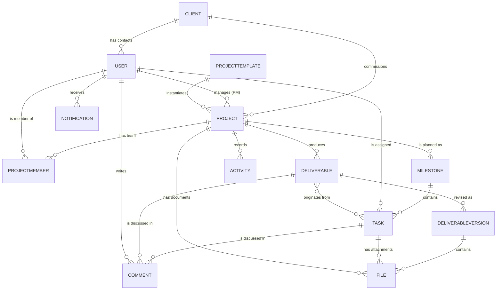
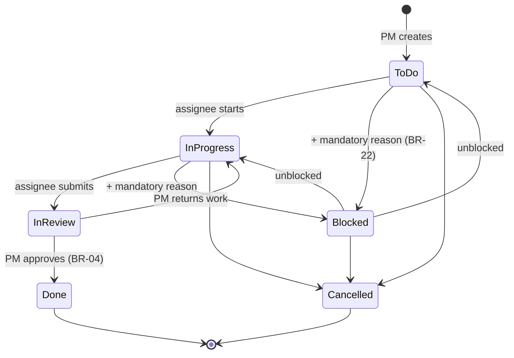
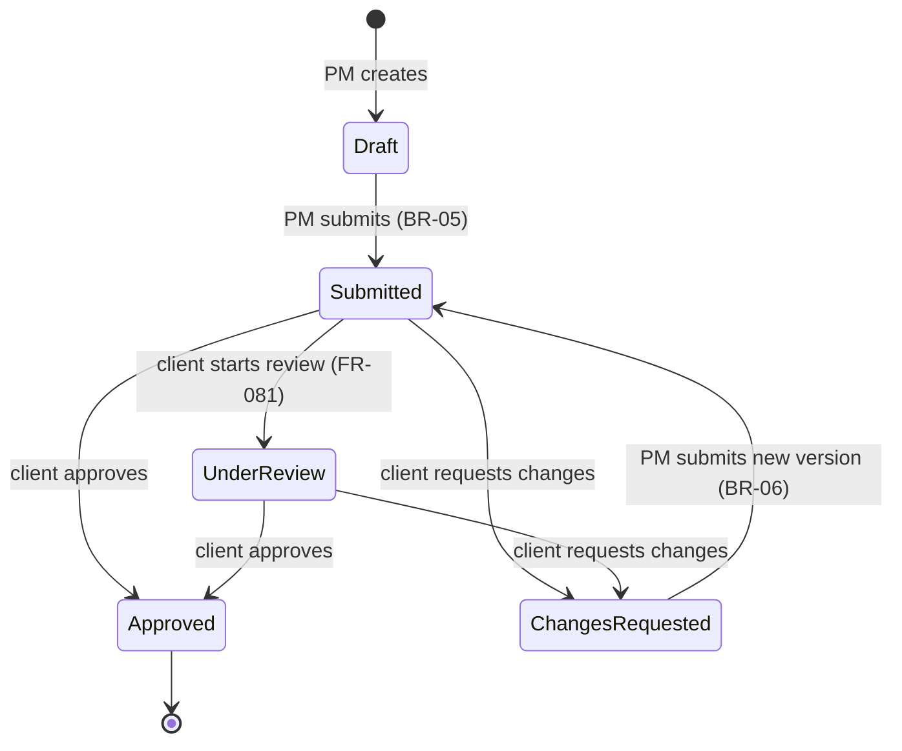
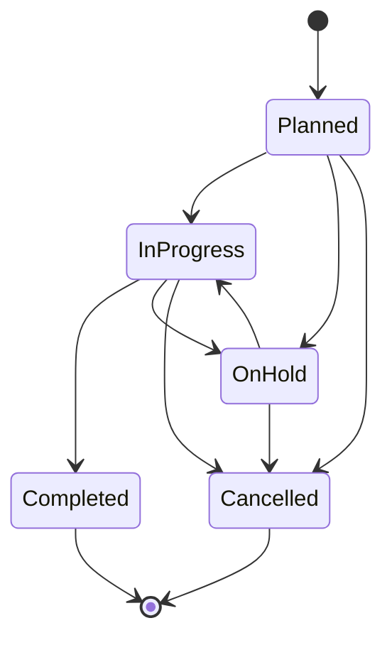

# AgencyFlow — Software Requirements Specification (SRS)

| Field | Value |
|---|---|
| **Document ID** | `01-Software-Requirements-Specification` |
| **Project** | AgencyFlow |
| **Phase** | Phase 2 — Business Analysis |
| **Version** | **1.1** |
| **Date** | 2026-07-30 |
| **Author** | Senior Business Analyst |
| **Status** | **Approved — 2026-07-30. Baseline frozen.** |
| **Standard** | Adapted from IEEE 830 / ISO-IEC-IEEE 29148 |
| **Related** | `00-Project-Foundation.md`, `02-User-Stories.md`, `03-Use-Cases.md`, `04-Requirements-Traceability-Matrix.md` |

---

## Document Control

| Version | Date | Author | Change |
|---|---|---|---|
| 1.0 | 2026-07-30 | Business Analyst | Initial SRS produced from the structured discovery interview (Q1–Q10) |
| **1.1** | 2026-07-30 | Architect | Amendments from the Domain & Data Model Review. **FR-081** added (explicit `start-review` action — the transition to `Under Review` is no longer a side effect of a read). **FR-008** amended (unique `username` for mentions). **FR-010** amended (deactivation refused while the user holds open tasks). **BR-31 – BR-33** added. §6.2 state model updated. **OQ-11 resolved** (ADR-0003). Approved by Project Owner 2026-07-30 |

| Role | Name | Decision | Date |
|---|---|---|---|
| Project Owner | Yassine | ☑ **Approved** | 2026-07-30 |

**Provenance statement.** Every requirement in this document originates from a recorded answer in the Phase 2 discovery interview. Nothing has been invented. Where the interview did not settle a detail, it appears in §11 (Assumptions) or §12 (Open Questions) — never as a silent decision.

---

## Table of Contents

1. [Introduction](#1-introduction)
2. [Overall Description](#2-overall-description)
3. [User Classes and Characteristics](#3-user-classes-and-characteristics)
4. [Business Rules](#4-business-rules)
5. [Conceptual Domain Model](#5-conceptual-domain-model)
6. [State Models](#6-state-models)
7. [Functional Requirements](#7-functional-requirements)
8. [Permission Matrix](#8-permission-matrix)
9. [Non-Functional Requirements](#9-non-functional-requirements)
10. [Out of Scope](#10-out-of-scope)
11. [Assumptions and Dependencies](#11-assumptions-and-dependencies)
12. [Open Questions](#12-open-questions)
13. [MoSCoW Summary](#13-moscow-summary)
14. [Glossary](#14-glossary)

---

## 1. Introduction

### 1.1 Purpose

This document specifies the functional and non-functional requirements for **AgencyFlow**, version 1.0. It is the authoritative statement of *what* the system must do. It does not describe *how* — architecture is `05`, database design is `06`, and detailed design is `08`/`09`.

It is the single source of truth for all downstream phases. Any design, schema, endpoint, or line of code that cannot be traced back to a requirement ID in this document is out of scope.

### 1.2 Intended Audience

| Audience | Use |
|---|---|
| Project Owner | Validate that the specification matches the intended product |
| Architect (Phase 3) | Derive architecture from requirements and constraints |
| Developer (Phase 8) | Implement against acceptance criteria |
| Tester (Phase 9) | Derive test cases; every FR must be verifiable |
| Internship evaluator | Assess requirement quality, completeness, and traceability |

### 1.3 Product Scope

AgencyFlow is a **centralized web platform for a single digital and communication agency**, replacing the scattered use of Excel, WhatsApp, email, and paper notes with one system in which agency staff and their clients manage projects, milestones, tasks, deliverables, and files, and in which clients gain direct visibility into project progress and formally approve delivered work.

The product is **not** multi-tenant. It serves one agency organization.

### 1.4 Requirement Identification Scheme

| Prefix | Meaning |
|---|---|
| `BR-nn` | Business Rule — a constraint of the business domain |
| `FR-nnn` | Functional Requirement — something the system must do |
| `NFR-nn` | Non-Functional Requirement — a quality attribute or constraint |
| `A-nn` | Assumption |
| `OQ-nn` | Open Question |
| `M-n` | Module |

**Priority** uses MoSCoW: 🔴 **Must** · 🟡 **Should** · 🟢 **Could** · ⚪ **Won't (v1)**.

Requirement verbs follow RFC-2119 convention: **shall** = mandatory.

### 1.5 References

| Ref | Document |
|---|---|
| R1 | `00-Project-Foundation.md` — methodology, conventions, roadmap, constraints |
| R2 | Phase 2 discovery interview transcript, questions Q1–Q10, 2026-07-29 → 2026-07-30 |

---

## 2. Overall Description

### 2.1 Product Perspective

AgencyFlow is a **new, self-contained system**. It does not replace, integrate with, or migrate data from any existing internal application. It is inspired by the real operating workflow of Moroccan digital agencies such as NewDev Maroc, but is not a reproduction of any specific company's internal system.

It consists of two logical faces sharing one backend and one database:

| Face | Users | Character |
|---|---|---|
| **Internal workspace** | Administrator, Project Manager, Team Member | Operational — planning, assigning, executing, reviewing |
| **Client portal** | Client Contact | Consultative and decisional — visibility and formal approval |

### 2.2 Problem Statement

The problems AgencyFlow exists to solve, as stated by the Project Owner:

| ID | Problem | Primarily affects |
|---|---|---|
| **P-1** | Project information is scattered across Excel, WhatsApp, email, and paper notes | All roles |
| **P-2** | Communication is fragmented across disconnected channels | Team Members, Project Managers |
| **P-3** | Tasks are difficult to track | Project Managers |
| **P-4** | Clients have little or no visibility into project progress | Clients |
| **P-5** | Managers spend excessive time coordinating work manually | Project Managers, Administrators |

### 2.3 Product Goals

Each goal maps to the problems it addresses. These are the business goals; engineering goals live in `00-Project-Foundation.md` §2.1.

| ID | Product Goal | Addresses |
|---|---|---|
| **PG-01** | Provide one centralized system holding all project information | P-1 |
| **PG-02** | Move project conversation out of external channels and attach it to the work it concerns | P-2 |
| **PG-03** | Make task state, ownership, and blockage visible at all times | P-3 |
| **PG-04** | Give clients continuous, self-service visibility of their projects' progress | P-4 |
| **PG-05** | Replace manual coordination with structured workflow and automatic progress calculation | P-5, P-3 |
| **PG-06** | Provide a formal, auditable deliverable approval process between agency and client | P-4 |

### 2.4 Operating Environment

| Aspect | Value |
|---|---|
| Delivery model | Web application, browser-based |
| Client browsers | Latest Chrome, Firefox, Edge, Safari |
| Device priority | Desktop-first with responsive support; **the Client Portal shall be fully usable on smartphones and tablets** |
| Mobile app | None in v1 |
| Backend | NestJS on Node.js 24 LTS |
| Database | MongoDB 7.x |
| Frontend | React + Vite + TypeScript |
| Interface language | French (single locale) |

### 2.5 Design and Implementation Constraints

| ID | Constraint | Source |
|---|---|---|
| **C-01** | Technology stack is fixed: NestJS, MongoDB, React + Vite + TypeScript | Project Owner, Phase 1 |
| **C-02** | Single-tenant: one agency, no tenant partitioning | Q2 |
| **C-03** | Delivery window ends 2026-08-18; 6 working days for implementation | Phase 1 §16 |
| **C-04** | Solo developer | Phase 1 §1.5 |
| **C-05** | UI strings in French; code, data, API, and documentation in English | Q9 |
| **C-06** | Architecture shall be modular and extensible to permit later addition of time tracking, Gantt, email notifications, billing, and AI modules without structural change | Q7 |

---

## 3. User Classes and Characteristics

Four authenticated actors. There are no anonymous users; every capability requires authentication.

| ID | Actor | Location | Technical skill | Frequency | Primary job in the system |
|---|---|---|---|---|---|
| **A-1** | **Administrator** | Internal | Medium | Daily | Govern the agency: accounts, clients, all projects, oversight |
| **A-2** | **Project Manager** | Internal | Medium | Continuous | Plan and drive their projects; review work; deliver to clients |
| **A-3** | **Team Member** | Internal | Medium–high | Continuous | Execute assigned tasks and submit them for review |
| **A-4** | **Client Contact** | External | **Low — assume none** | Occasional | Check progress and approve or reject deliverables |

**Design consequence of A-4.** The Client Contact is the only external, low-frequency, low-technical-skill user, and the most likely to use a phone. The client portal must therefore be self-explanatory without training, and its primary action — reviewing a deliverable — must be reachable immediately on login. This drives NFR-U2 and FR-073.

**Team Member specialization.** A Team Member carries a `skill` attribute (Backend, Frontend, UI/UX, Graphic Design, QA). Skill is descriptive data used for identification and assignment support. **Skill never affects permissions** (BR-02).

---

## 4. Business Rules

Business rules are domain truths. They constrain multiple requirements and must be enforced on the server, never only in the user interface.

| ID | Rule | Source |
|---|---|---|
| **BR-01** | AgencyFlow serves exactly one agency. The system is not multi-tenant | Q2 |
| **BR-02** | Permissions derive from role only. `skill` is descriptive data and grants no rights | Q2 |
| **BR-03** | A Task has exactly one assigned Team Member. A Project belongs to exactly one Client | Q3 |
| **BR-04** | A Team Member **shall not** set a Task to `Done`. Only a Project Manager or Administrator may | Q4 |
| **BR-05** | Only a Project Manager (or Administrator) may submit a Deliverable to a Client | Q4 |
| **BR-06** | When a Client requests changes, a **new version** of the same Deliverable is created; prior versions are preserved | Q4 |
| **BR-07** | An **Approved** Deliverable is final. It cannot be un-approved, edited, or deleted. Further change requires a new version or a new Deliverable | Q4 |
| **BR-08** | Milestone status and progress are **computed** from tasks and shall never be set manually | Q4 |
| **BR-09** | A Client is an **organization**. One or more Client Contact user accounts link to it | Q5 |
| **BR-10** | 🔒 A Client Contact may access **only** data belonging to their own Client organization. Enforced server-side on every request | Q5 |
| **BR-11** | There is no public registration. The Administrator creates staff accounts; the Administrator or a Project Manager creates Client Contact accounts | Q5 |
| **BR-12** | Cancelled Tasks are excluded from milestone progress. Blocked Tasks are counted. A Milestone completes only when every non-cancelled Task is `Done` | Q5 |
| **BR-13** | Authentication is email + password. No self-service password reset, no 2FA, no persistent sessions in v1 | Q5 |
| **BR-14** | Task Comments are visible to internal staff only. Deliverable Comments are visible to internal staff **and** Client Contacts of the owning organization | Q6 |
| **BR-15** | Uploaded files shall be limited to PDF, PNG, JPG, JPEG, SVG, DOCX, XLSX, PPTX, ZIP, maximum **20 MB** each | Q6 |
| **BR-16** | Files exist in exactly three contexts: Deliverable Files, Task Attachments, Project Files | Q6 |
| **BR-17** | Notifications are in-app only in v1. No email, no WebSocket push | Q6 |
| **BR-18** | The system has no chat feature. Communication occurs through contextual comments and the Activity Feed | Q6 |
| **BR-19** | Comments are flat (non-threaded) and support `@username` mentions, which notify the mentioned user with a link to the source | Q6 |
| **BR-20** | Deadline alerts (*due soon*, *overdue*) are **computed on read**. They are never stored as notification records and require no scheduler | Q7 |
| **BR-21** | Every Activity is flagged `client-visible` or `internal`. Client Contacts see only client-visible activities of their own organization's projects | Q7 |
| **BR-22** | `Blocked` is a manual Task status set by the assignee or the Project Manager, and **requires a reason**. There are no automatic dependency links | Q7 |
| **BR-23** | A Team Member must be a member of a Project's team before any of its Tasks can be assigned to them | Q8 |
| **BR-24** | Each Project has exactly one owning Project Manager. Only an Administrator may reassign it | Q8 |
| **BR-25** | A Project Manager sees and manages only the Projects they own | Q8 |
| **BR-26** | A Team Member sees only Projects they belong to. Within those Projects they may **view** all Tasks but may **modify** only Tasks assigned to them | Q8 |
| **BR-27** | Client Contacts may upload Project Files | Q8 |
| **BR-28** | Client Contacts cannot see Tasks, Task Comments, the team roster, member skills, workload, assignments, or internal activities. They may see the **author name** of client-visible comments and activities | Q8 |
| **BR-29** | The Administrator holds every permission in the system. There is no separate "override" mechanism | Q8 |
| **BR-30** | All deletions are **soft**. Records are flagged as deleted and retained so that history and the Activity Feed remain intact | Q9 |
| **BR-31** | The transition to `Under Review` is an **explicit Client Contact action**. No read operation shall change the state of any record | v1.1 — DM-02 |
| **BR-32** | A user shall not be deactivated while they hold Tasks that are neither `Done` nor `Cancelled`. Such tasks must first be reassigned or cancelled | v1.1 — DM-04 |
| **BR-33** | Every user has a **unique, immutable `username`**, assigned at account creation and used to address `@mentions` | v1.1 — DM-03 |

---

## 5. Conceptual Domain Model

This is the **business** view of the information AgencyFlow manages. Physical modelling — collections, embedding versus referencing, indexes — is a Phase 4 deliverable and is deliberately not decided here.

### 5.1 Entities

| # | Entity | Definition |
|---|---|---|
| E-01 | **User** | Any person who can authenticate. Carries exactly one role |
| E-02 | **Client** | A client **organization** that commissions work from the agency |
| E-03 | **Project** | A body of work delivered by the agency for one Client |
| E-04 | **ProjectMember** | The link making a Team Member part of a Project's team |
| E-05 | **Milestone** | A named stage of a Project's roadmap, containing Tasks |
| E-06 | **Task** | A unit of work inside a Milestone, assigned to one Team Member |
| E-07 | **Deliverable** | A formal output of a Project, submitted to the Client for approval |
| E-08 | **DeliverableVersion** | A successive revision of a Deliverable, preserving history |
| E-09 | **File** | An uploaded document, attached to a Deliverable version, a Task, or a Project |
| E-10 | **Comment** | A flat message attached to a Task or a Deliverable |
| E-11 | **Notification** | An in-app alert addressed to one User |
| E-12 | **Activity** | An immutable record of a business event, flagged client-visible or internal |
| E-13 | **ProjectTemplate** | A reusable definition of standard Milestones for creating new Projects |

### 5.2 Relationships

### 5.3 Cardinality summary

| Relationship | Cardinality | Rule |
|---|---|---|
| Client → Project | 1 : N | BR-03 |
| Client → Client Contact (User) | 1 : N | BR-09 |
| Project → Project Manager (User) | N : 1 | BR-24 |
| Project ↔ Team Member (User) | N : N via ProjectMember | BR-23 |
| Project → Milestone | 1 : N | Q3 |
| Milestone → Task | 1 : N | Q3 |
| Task → Assignee (User) | N : 1 | BR-03 |
| Project → Deliverable | 1 : N | Q3 |
| Deliverable → DeliverableVersion | 1 : N | BR-06 |
| Deliverable ↔ Task | N : N, **optional** | Q3, A-05 |

---

## 6. State Models

### 6.1 Task

| State | Meaning | Who may enter it |
|---|---|---|
| `To Do` | Created, not started | PM / Admin on creation |
| `In Progress` | Being worked on | Assignee, PM, Admin |
| `In Review` | Work finished, awaiting PM verification | Assignee, PM, Admin |
| `Done` | Verified complete | **PM / Admin only** (BR-04) |
| `Blocked` | Halted; reason mandatory | Assignee, PM, Admin (BR-22) |
| `Cancelled` | No longer required; excluded from progress | PM / Admin (BR-12) |

### 6.2 Deliverable

`Approved` is terminal and immutable (BR-07).

**On `Under Review` (v1.1).** This state is entered only by an explicit client action — `POST /deliverables/:id/start-review` (FR-081) — never as a side effect of opening or reading the deliverable (BR-31). A read operation that mutates state violates HTTP semantics and races when two Client Contacts of the same organization open the same deliverable simultaneously.

Because the state is now opt-in, a client may also decide directly from `Submitted` without passing through `Under Review`. Both paths are valid; `Under Review` signals to the Project Manager that the client has actively taken up the review.

### 6.3 Milestone — computed only (BR-08)

| Computed state | Condition |
|---|---|
| `Not Started` | No non-cancelled task has left `To Do` |
| `In Progress` | At least one non-cancelled task has left `To Do`, but not all are `Done` |
| `Completed` | Every non-cancelled task is `Done` (BR-12) |

`progress % = (non-cancelled tasks with status Done) ÷ (total non-cancelled tasks) × 100`, defined as 0 when the denominator is 0.

### 6.4 Project

Project status is set manually by the owning Project Manager or the Administrator.

---

## 7. Functional Requirements

**81 functional requirements across 13 modules.**

> *Reconciliation note:* the discovery session cited "48 requirements" as a working estimate over feature groups. Formal enumeration of atomic, individually testable requirements yields **80**, plus **FR-081** added in v1.1 — **81** in total. The scope is identical; the granularity is finer.
>
> *Numbering note:* requirement identifiers are **never reused or renumbered**. FR-081 appears within module M-7 despite its number, because renumbering would silently invalidate every existing reference in the stories, use cases, and traceability matrix.

Each requirement states the actor, the behaviour, and its acceptance criterion. Every requirement is individually verifiable — a requirement that cannot be tested is a requirement that cannot be accepted.

### M-1 · Authentication and Session

| ID | Requirement | Actor | Acceptance criteria | Pri |
|---|---|---|---|---|
| **FR-001** | The system shall authenticate a user with email and password | All | Valid credentials return a session token; invalid credentials return a generic failure that does not reveal whether the email exists | 🔴 |
| **FR-002** | The system shall issue a JWT valid for 12 hours | All | Token contains user id and role; expires exactly 12 h after issue; expired token is rejected | 🔴 |
| **FR-003** | The system shall enforce role-based authorization on every protected operation, server-side | All | A request whose role lacks the permission is rejected with 403, regardless of what the UI displays | 🔴 |
| **FR-004** | The system shall allow a user to log out | All | Client-side token is discarded; subsequent requests without a token are rejected | 🔴 |
| **FR-005** | The system shall allow an authenticated user to change their own password | All | Current password required; new password ≥ 8 characters; stored bcrypt-hashed | 🔴 |
| **FR-006** | The system shall allow the Administrator to reset another user's password | A-1 | New password takes effect immediately; no email is sent (BR-13) | 🔴 |
| **FR-007** | The system shall reject any attempt to self-register | — | No public registration endpoint exists (BR-11) | 🔴 |

### M-2 · User Management

| ID | Requirement | Actor | Acceptance criteria | Pri |
|---|---|---|---|---|
| **FR-008** | The Administrator shall create an internal staff account specifying name, email, **username**, role, and — for Team Members — a skill | A-1 | Email **and username** are unique; username is immutable after creation (BR-33); role ∈ {Administrator, Project Manager, Team Member}; skill required only for Team Member | 🔴 |
| **FR-009** | The Administrator shall edit a user's name, role, and skill | A-1 | Changes take effect on the user's next request; role change immediately alters permissions | 🔴 |
| **FR-010** | The Administrator shall deactivate a user account | A-1 | **Refused while the user holds tasks that are neither `Done` nor `Cancelled`, listing them (BR-32)**; once deactivated the user cannot authenticate; their historical records remain intact (BR-30) | 🔴 |
| **FR-011** | The Administrator shall list and filter users by role, skill, and status | A-1 | Results paginated; filters combinable | 🔴 |
| **FR-012** | A user shall view and edit their own profile (name, password) | All | A user cannot change their own role or skill | 🟡 |

### M-3 · Client Management

| ID | Requirement | Actor | Acceptance criteria | Pri |
|---|---|---|---|---|
| **FR-013** | The Administrator shall create a Client organization with name and contact details | A-1 | Name is required and unique | 🔴 |
| **FR-014** | The Administrator shall edit a Client organization | A-1 | Changes reflected everywhere the client is displayed | 🔴 |
| **FR-015** | The Administrator and Project Manager shall list and search Client organizations | A-1, A-2 | Search matches on name; results paginated | 🔴 |
| **FR-016** | The Administrator or a Project Manager shall create a Client Contact account linked to a Client organization | A-1, A-2 | Account is created with role Client Contact and a mandatory `clientId` (BR-09, BR-11) | 🔴 |
| **FR-017** | The system shall list the Client Contacts belonging to a Client organization | A-1, A-2 | Only contacts of that organization are listed | 🔴 |
| **FR-018** | The Administrator shall archive a Client organization | A-1 | Archived clients are hidden from default lists but their projects and history remain accessible (BR-30) | 🟡 |

### M-4 · Project Management

| ID | Requirement | Actor | Acceptance criteria | Pri |
|---|---|---|---|---|
| **FR-019** | The Administrator or a Project Manager shall create a Project specifying name, description, Client, owning Project Manager, start date, and end date | A-1, A-2 | Exactly one Client and one PM (BR-03, BR-24); end date not earlier than start date; initial status `Planned` | 🔴 |
| **FR-020** | The owning Project Manager or the Administrator shall edit a Project's details | A-1, A-2 | A PM may edit only projects they own (BR-25) | 🔴 |
| **FR-021** | The owning Project Manager or the Administrator shall change a Project's status among Planned, In Progress, On Hold, Completed, Cancelled | A-1, A-2 | Only transitions defined in §6.4 are permitted | 🔴 |
| **FR-022** | The Administrator shall reassign a Project's owning Project Manager | A-1 | Only an Administrator may do this (BR-24); the new PM immediately gains access, the previous PM loses it | 🔴 |
| **FR-023** | The owning Project Manager or the Administrator shall add a Team Member to a Project's team | A-1, A-2 | Only users with role Team Member may be added; duplicates rejected (BR-23) | 🔴 |
| **FR-024** | The owning Project Manager or the Administrator shall remove a Team Member from a Project's team | A-1, A-2 | Removal is refused while the member still has non-cancelled, non-done tasks in the project | 🔴 |
| **FR-025** | The system shall list Projects scoped to the requesting user's role | All | Admin: all. PM: owned only (BR-25). Team Member: projects they belong to (BR-26). Client Contact: their organization's only (BR-10) | 🔴 |
| **FR-026** | The system shall display a Project detail view showing milestones, progress, team, deliverables, and files, filtered by the viewer's permissions | All | A Client Contact's view excludes tasks, internal comments, and the team roster (BR-28) | 🔴 |
| **FR-027** | The owning Project Manager or the Administrator shall archive a Project | A-1, A-2 | Archived projects are hidden from default lists and become read-only; they remain retrievable | 🟡 |
| **FR-028** | The Administrator shall delete a Project | A-1 | Soft delete only (BR-30); Administrator exclusively | 🟡 |

### M-5 · Milestone Management

| ID | Requirement | Actor | Acceptance criteria | Pri |
|---|---|---|---|---|
| **FR-029** | The owning Project Manager or the Administrator shall create a Milestone within a Project, with name, description, due date, and order | A-1, A-2 | Milestones are ordered within their project | 🔴 |
| **FR-030** | The owning Project Manager or the Administrator shall edit a Milestone | A-1, A-2 | Status is not editable — it is computed (BR-08) | 🔴 |
| **FR-031** | The system shall compute a Milestone's status from its tasks | — | Per §6.3; recomputed whenever a task's status changes | 🔴 |
| **FR-032** | The system shall compute a Milestone's progress percentage, excluding cancelled tasks | — | Per §6.3 and BR-12; a milestone with no non-cancelled tasks reports 0 % | 🔴 |
| **FR-033** | The system shall list a Project's Milestones in order, each with computed status and progress | All | Visible to Client Contacts of the owning organization | 🔴 |
| **FR-034** | The owning Project Manager or the Administrator shall delete a Milestone | A-1, A-2 | Refused if the milestone still contains non-cancelled tasks | 🟡 |

### M-6 · Task Management

| ID | Requirement | Actor | Acceptance criteria | Pri |
|---|---|---|---|---|
| **FR-035** | The owning Project Manager or the Administrator shall create a Task within a Milestone, with title, description, assignee, and due date | A-1, A-2 | Team Members cannot create tasks; initial status `To Do` | 🔴 |
| **FR-036** | The owning Project Manager or the Administrator shall assign or reassign a Task to a Team Member | A-1, A-2 | The assignee must already be a member of the project team (BR-23); exactly one assignee (BR-03) | 🔴 |
| **FR-037** | The owning Project Manager or the Administrator shall edit a Task's title, description, and due date | A-1, A-2 | — | 🔴 |
| **FR-038** | The assignee shall advance their own Task from To Do → In Progress → In Review | A-3 | A Team Member may modify only tasks assigned to them (BR-26) | 🔴 |
| **FR-039** | The system shall reject any attempt by a Team Member to set a Task to `Done` | A-3 | Rejected with 403 server-side, not merely hidden in the UI (BR-04) | 🔴 |
| **FR-040** | The Project Manager or Administrator shall mark a Task in `In Review` as `Done`, or return it to `In Progress` | A-1, A-2 | Only from state `In Review` | 🔴 |
| **FR-041** | The assignee, owning Project Manager, or Administrator shall mark a Task as `Blocked`, supplying a mandatory reason | A-1, A-2, A-3 | Empty or whitespace-only reason is rejected (BR-22) | 🔴 |
| **FR-042** | The owning Project Manager or Administrator shall cancel a Task | A-1, A-2 | Cancelled tasks are excluded from milestone progress (BR-12) | 🔴 |
| **FR-043** | The system shall list a Project's Tasks with filtering by status, assignee, and milestone | A-1, A-2, A-3 | A Team Member may view all tasks of projects they belong to (BR-26); Client Contacts see none (BR-28) | 🔴 |
| **FR-044** | The system shall present Tasks on a Kanban board grouped by status, allowing drag-and-drop status change | A-1, A-2, A-3 | A Team Member may drag only their own cards; drops that violate the state model or BR-04 are rejected | 🟡 |

### M-7 · Deliverable Management

| ID | Requirement | Actor | Acceptance criteria | Pri |
|---|---|---|---|---|
| **FR-045** | The owning Project Manager or the Administrator shall create a Deliverable with name, description, and due date | A-1, A-2 | Belongs to exactly one Project; initial status `Draft` | 🔴 |
| **FR-046** | The owning Project Manager or the Administrator shall attach one or more Files to a Deliverable version | A-1, A-2 | Subject to BR-15 | 🔴 |
| **FR-047** | The owning Project Manager or the Administrator shall submit a Deliverable to the Client | A-1, A-2 | Only from `Draft` or `Changes Requested`; requires at least one attached file; sets status `Submitted` (BR-05) | 🔴 |
| **FR-081** | A Client Contact shall **explicitly start the review** of a submitted Deliverable | A-4 | Only from status `Submitted`, only for their own organization (BR-10); sets status `Under Review`; **no read operation performs this transition (BR-31)** | 🔴 |
| **FR-048** | A Client Contact shall approve a submitted Deliverable | A-4 | Only from `Submitted` or `Under Review`, only for their own organization (BR-10); status becomes `Approved` and terminal (BR-07) | 🔴 |
| **FR-049** | A Client Contact shall request changes on a submitted Deliverable, supplying a mandatory comment | A-4 | Empty comment rejected; status becomes `Changes Requested` | 🔴 |
| **FR-050** | The system shall create a new Deliverable version when the Project Manager resubmits after a change request | — | Prior versions and their files are preserved unchanged (BR-06) | 🔴 |
| **FR-051** | The system shall prevent any modification, deletion, or un-approval of an Approved Deliverable | — | All such attempts rejected server-side (BR-07) | 🔴 |
| **FR-052** | The system shall list a Project's Deliverables with status and due date | All | Visible to Client Contacts of the owning organization | 🔴 |
| **FR-053** | The owning Project Manager or the Administrator shall link a Deliverable to one or more completed Tasks | A-1, A-2 | Optional (A-05); linked tasks must belong to the same project | 🟡 |
| **FR-054** | The system shall display a Deliverable's full version history with each version's files, date, and outcome | All | Client Contacts see the history of their own organization's deliverables | 🟡 |

### M-8 · File Management

| ID | Requirement | Actor | Acceptance criteria | Pri |
|---|---|---|---|---|
| **FR-055** | The system shall accept file uploads restricted to PDF, PNG, JPG, JPEG, SVG, DOCX, XLSX, PPTX, ZIP, maximum 20 MB | A-1, A-2, A-3, A-4 | Type and size validated **server-side**; rejection message states the reason (BR-15) | 🔴 |
| **FR-056** | The system shall allow download of any file the requesting user is permitted to see | All | Permission checked server-side on every download; a direct URL does not bypass it (BR-10) | 🔴 |
| **FR-057** | A Team Member, Project Manager, or Administrator shall upload Task Attachments | A-1, A-2, A-3 | Only on tasks within projects they belong to; never visible to Client Contacts (BR-28) | 🟡 |
| **FR-058** | Internal staff and Client Contacts shall upload Project Files | A-1, A-2, A-3*, A-4 | Client Contacts may upload only to their own organization's projects (BR-27); Team Members may view but not upload | 🟡 |
| **FR-059** | The uploader, owning Project Manager, or Administrator shall delete a file | A-1, A-2, A-3, A-4 | Soft delete (BR-30); files of an Approved deliverable version cannot be deleted (BR-07) | 🟡 |

### M-9 · Collaboration — Comments and Mentions

| ID | Requirement | Actor | Acceptance criteria | Pri |
|---|---|---|---|---|
| **FR-060** | Internal staff and Client Contacts shall post a Comment on a Deliverable | All | Client Contacts only on their own organization's deliverables; comments are flat (BR-19) | 🔴 |
| **FR-061** | The system shall display Deliverable Comments chronologically with author name and timestamp | All | Client Contacts see author names but gain no other information about staff (BR-28) | 🔴 |
| **FR-062** | Internal staff shall post a Comment on a Task | A-1, A-2, A-3 | Never visible or accessible to Client Contacts (BR-14) | 🟡 |
| **FR-063** | The system shall recognize `@username` mentions in a comment and notify the mentioned user with a link to the source | — | Mention resolves to an existing user the author may see; a Client Contact cannot mention internal staff outside the shared deliverable context (BR-19, BR-28) | 🟡 |

### M-10 · Notifications and Activity Feed

| ID | Requirement | Actor | Acceptance criteria | Pri |
|---|---|---|---|---|
| **FR-064** | The system shall generate an in-app notification on: task assignment, task status change, deliverable submission, deliverable approval, deliverable change request, new comment, and user mention | — | Exactly one notification per event per recipient; no email, no push (BR-17) | 🟡 |
| **FR-065** | A user shall view their notifications, newest first, with an unread count, and mark them read | All | Each notification links directly to its source object | 🟡 |
| **FR-066** | The system shall record an Activity for every significant business event, flagged `client-visible` or `internal` per BR-21 | — | Activities are immutable; the flag is set by the event type, never by the user | 🟡 |
| **FR-067** | The system shall display a Project's Activity Feed in reverse-chronological order, filtered by the viewer's permissions | All | A Client Contact sees only client-visible activities of their own organization's projects (BR-21) | 🟡 |

### M-11 · Dashboards and Client Portal

| ID | Requirement | Actor | Acceptance criteria | Pri |
|---|---|---|---|---|
| **FR-068** | The system shall present an Administrator dashboard: project counts by status, active projects, team workload, agency-wide overdue tasks, deliverables awaiting client approval, recent activity | A-1 | All figures reflect current data at page load | 🔴 |
| **FR-069** | The system shall present a Project Manager dashboard: my projects, **tasks awaiting my review**, deliverables awaiting client response, blocked tasks with reasons, due-soon tasks, overdue tasks, recent activity | A-2 | Scoped to owned projects only (BR-25) | 🔴 |
| **FR-070** | The system shall present a Team Member dashboard: my tasks grouped by status, due-soon tasks, overdue tasks, my mentions, recent activity on my projects | A-3 | Scoped to assigned tasks and member projects (BR-26) | 🔴 |
| **FR-071** | The system shall present a Client Contact dashboard: my organization's projects with progress, **deliverables awaiting my approval**, recently approved deliverables, upcoming milestones, client-visible activity | A-4 | Scoped strictly to the contact's own organization (BR-10) | 🔴 |
| **FR-072** | The system shall compute *due soon* (due within 3 days) and *overdue* task alerts at read time | — | No stored notification records; no scheduled job (BR-20) | 🔴 |
| **FR-073** | The Client Portal shall be fully usable on smartphones and tablets | A-4 | All client actions — view progress, open a deliverable, approve, request changes, comment, upload — are operable on a 375 px-wide viewport | 🔴 |

### M-12 · Search, Templates, Reporting, and Workload

| ID | Requirement | Actor | Acceptance criteria | Pri |
|---|---|---|---|---|
| **FR-074** | The system shall provide a global search across projects, tasks, and deliverables, scoped to what the requesting user may see | All | A user never receives a result they are not permitted to open (BR-10, BR-25, BR-26) | 🟡 |
| **FR-075** | The Administrator or a Project Manager shall create and manage Project Templates defining a standard set of Milestones | A-1, A-2 | A template holds milestone names, descriptions, and order (A-06) | 🟢 |
| **FR-076** | The Administrator or a Project Manager shall create a Project from a Template | A-1, A-2 | Template milestones are copied into the new project; later template edits do not alter existing projects | 🟢 |
| **FR-077** | The Administrator or a Project Manager shall export a Project Summary as PDF | A-1, A-2 | Contains project details, milestones with progress, deliverable statuses | 🟢 |
| **FR-078** | The system shall display team workload as the number of active (non-done, non-cancelled) tasks per Team Member | A-1, A-2 | Never visible to Client Contacts (BR-28) | 🟢 |

### M-13 · Cross-Cutting Security

| ID | Requirement | Actor | Acceptance criteria | Pri |
|---|---|---|---|---|
| **FR-079** | 🔒 The system shall scope every data-returning operation by the requesting user's role and ownership, enforced server-side | — | Substituting another organization's identifier in any request returns 403/404, never data (BR-10). **This requirement has a dedicated test case in Phase 9** | 🔴 |
| **FR-080** | The system shall validate all external input at the API boundary and reject malformed requests | — | Unknown fields rejected; no client-supplied role, ownership, or status value is trusted | 🔴 |

---

## 8. Permission Matrix

Authoritative. Any conflict between this table and prose elsewhere is resolved in favour of this table. ✅ permitted · ❌ denied · ⚙️ conditional.

| Action | Admin | PM | Team Member | Client Contact |
|---|:--:|:--:|:--:|:--:|
| Manage internal user accounts | ✅ | ❌ | ❌ | ❌ |
| Create Client Contact accounts | ✅ | ✅ | ❌ | ❌ |
| Create / edit Client organizations | ✅ | ❌ | ❌ | ❌ |
| Create project | ✅ | ✅ | ❌ | ❌ |
| Edit project | ✅ | ⚙️ own | ❌ | ❌ |
| Change project status | ✅ | ⚙️ own | ❌ | ❌ |
| Reassign project's PM | ✅ | ❌ | ❌ | ❌ |
| Archive project | ✅ | ⚙️ own | ❌ | ❌ |
| Delete project | ✅ | ❌ | ❌ | ❌ |
| Manage project team | ✅ | ⚙️ own | ❌ | ❌ |
| Create / edit / delete milestones | ✅ | ⚙️ own | ❌ | ❌ |
| Create / edit / assign tasks | ✅ | ⚙️ own | ❌ | ❌ |
| View tasks | ✅ all | ⚙️ own projects | ⚙️ member projects | ❌ |
| Advance own task To Do → In Review | ✅ | ✅ | ⚙️ assigned only | ❌ |
| Mark task **Done** | ✅ | ⚙️ own | ❌ **BR-04** | ❌ |
| Mark task Blocked (+ reason) | ✅ | ⚙️ own | ⚙️ assigned only | ❌ |
| Cancel task | ✅ | ⚙️ own | ❌ | ❌ |
| Create deliverable | ✅ | ⚙️ own | ❌ | ❌ |
| Submit deliverable to client | ✅ | ⚙️ own **BR-05** | ❌ | ❌ |
| Approve / request changes | ❌ | ❌ | ❌ | ⚙️ own org |
| Comment on tasks | ✅ | ✅ | ✅ | ❌ **BR-14** |
| Comment on deliverables | ✅ | ✅ | ✅ | ⚙️ own org |
| Upload task attachments | ✅ | ✅ | ⚙️ member projects | ❌ |
| Upload project files | ✅ | ✅ | ❌ | ⚙️ own org |
| View project files | ✅ | ✅ | ✅ | ⚙️ own org |
| Download deliverable files | ✅ | ✅ | ✅ | ⚙️ own org |
| View team roster / skills / workload | ✅ | ✅ | ⚙️ own projects | ❌ **BR-28** |
| Manage project templates | ✅ | ✅ | ❌ | ❌ |
| Export project summary PDF | ✅ | ⚙️ own | ❌ | ❌ |
| Global search | ✅ all | ⚙️ own scope | ⚙️ own scope | ⚙️ own org |

---

## 9. Non-Functional Requirements

### 9.1 Localization

| ID | Requirement |
|---|---|
| **NFR-01** | The user interface shall be presented in **French** |
| **NFR-02** | The system shall not implement internationalization or multi-language switching in v1 |
| **NFR-03** | The system shall not support right-to-left layouts |
| **NFR-04** | Dates shall be displayed as `dd/MM/yyyy` |
| **NFR-05** | The system timezone shall be `Africa/Casablanca` |
| **NFR-06** | Source code, identifiers, database fields, API paths, commit messages, and documentation shall be in **English**. User-facing French strings shall be centralized in a single `fr.ts` constants file |

### 9.2 Usability and Accessibility

| ID | Requirement |
|---|---|
| **NFR-07** | The application shall be desktop-first with responsive layout support |
| **NFR-08** | The Client Portal shall be fully operable on smartphones and tablets down to a 375 px viewport |
| **NFR-09** | Every user action shall produce visible feedback: loading, success, or error |
| **NFR-10** | The interface shall use semantic HTML, be keyboard navigable, and label all form inputs. No formal WCAG certification is claimed |
| **NFR-11** | A Client Contact shall be able to complete a deliverable review without training or documentation |

### 9.3 Performance and Scale

| ID | Requirement |
|---|---|
| **NFR-12** | Pages shall load in under 2 seconds on a normal broadband connection |
| **NFR-13** | API responses for typical read operations shall complete in under 500 ms |
| **NFR-14** | The system shall support ≤ 100 internal users and ≤ 300 client organizations |
| **NFR-15** | The system shall support ≤ 30 concurrent users |
| **NFR-16** | The system shall support ≤ 1 000 projects and ≤ 500 tasks per project |
| **NFR-17** | All list endpoints shall be paginated; all fields used for filtering or sorting shall be indexed |

### 9.4 Security

| ID | Requirement |
|---|---|
| **NFR-18** | Passwords shall be hashed with bcrypt. Plaintext passwords shall never be stored or logged |
| **NFR-19** | Sessions shall use JWT expiring after 12 hours. No refresh tokens, no "remember me" |
| **NFR-20** | 🔒 Every authorization decision shall be made server-side. UI-level hiding is never the enforcement mechanism |
| **NFR-21** | Client organization data isolation (BR-10) shall be enforced at the data-access layer, not at the controller layer alone |
| **NFR-22** | All external input shall be validated at the API boundary before reaching business logic |
| **NFR-23** | Error responses shall not leak stack traces, internal paths, or database errors |
| **NFR-24** | Uploaded files shall be validated for type and size server-side; the declared client-side content type shall not be trusted |
| **NFR-25** | No secret, credential, or connection string shall appear in source code or version control |
| **NFR-26** | The application shall have no known critical dependency vulnerabilities at delivery |

### 9.5 Reliability and Data

| ID | Requirement |
|---|---|
| **NFR-27** | Availability is best-effort. No SLA, no high-availability, single-instance deployment |
| **NFR-28** | Backups are limited to whatever the hosting provider supplies; this is documented as a known limitation |
| **NFR-29** | All deletions shall be soft (BR-30). No business record is physically removed |
| **NFR-30** | The system shall handle all error paths explicitly. No unhandled promise rejection shall reach the user |

### 9.6 Maintainability and Extensibility

| ID | Requirement |
|---|---|
| **NFR-31** | The architecture shall be modular, with clear boundaries between business modules, so that future modules — time tracking, Gantt, email notifications, billing, AI assistant — can be added without structural change (C-06) |
| **NFR-32** | Business rules shall be implemented in a single authoritative place per rule, not duplicated across layers |
| **NFR-33** | The codebase shall comply with the standards in `00-Project-Foundation.md` §11–12 |
| **NFR-34** | Business logic shall reach ≥ 70 % line coverage at the service layer |

### 9.7 Compatibility

| ID | Requirement |
|---|---|
| **NFR-35** | The application shall function on the latest versions of Chrome, Firefox, Edge, and Safari. Internet Explorer is not supported |

---

## 10. Out of Scope

Explicitly excluded from version 1. Each was considered during discovery and deliberately rejected.

| Excluded | Reason |
|---|---|
| Multi-tenancy / multiple agencies | Q2 — single-agency product |
| Task dependency graph | Q7 — `Blocked` is a manual status with a reason |
| Time tracking and timesheets | Q7 — a module in its own right |
| Project budgets, costs, profitability | Q7 |
| Invoicing and billing | Q7 — a separate product |
| Gantt charts | Q7 — cost disproportionate to value here |
| Calendar view | Q7 — a due-date-sorted list delivers most of the value |
| Client satisfaction surveys | Q7 |
| Chat / instant messaging | Q6 — contextual comments solve the problem better |
| Email notifications | Q6 — external dependency and deployment risk |
| Real-time WebSocket push | Q6 |
| Self-service password reset | Q5 — requires an email provider |
| Two-factor authentication | Q5 |
| "Remember me" / persistent sessions | Q5 |
| Public self-registration | Q5 — internal tool |
| Native mobile applications | Q9 — responsive web only |
| Internationalization / RTL | Q9 — single French locale |
| Video or large media files | Q6 — 20 MB limit |
| Monetary values and currency handling | Q9 — no financial features in v1 |

**Deferred items remain specified.** Should and Could requirements not implemented within the delivery window will be reported as *designed and specified, not implemented*, in `12-Final-Project-Report.md`. They are not deleted from this specification.

---

## 11. Assumptions and Dependencies

These were not explicitly settled during discovery. **They stand as written unless corrected at approval.** Each is a decision, made visibly rather than silently.

| ID | Assumption |
|---|---|
| **A-01** | The Team Member `skill` list is a fixed set — Backend, Frontend, UI/UX, Graphic Design, QA — defined in code, not editable by the Administrator in v1 |
| **A-02** | A Project may exist with no milestones; a Milestone may exist with no tasks. Progress is 0 % in that case |
| **A-03** | A Client organization may exist with no Client Contact accounts (created before its contacts) |
| **A-04** | Deliverables belong to a Project, not to a Milestone |
| **A-05** | Linking a Deliverable to Tasks is optional. A Deliverable is valid with no linked tasks |
| **A-06** | A Project Template defines Milestones only — name, description, order. It does not carry tasks, deliverables, or team assignments |
| **A-07** | "Due soon" means due within the next 3 calendar days |
| **A-08** | A Client Contact account belongs to exactly one Client organization and cannot be moved between organizations |
| **A-09** | Notifications are never deleted by users; they are marked read |
| **A-10** | The Administrator role always has at least one active account; the system prevents deactivating the last Administrator |
| **A-11** | Uploaded files are stored by the application and served through permission-checked endpoints; the storage mechanism is a Phase 3 decision (see OQ-11) |
| **A-12** | Only one Administrator account type exists; there is no super-admin above it (BR-29) |
| **A-13** | `username` is lowercase, alphanumeric with dots or hyphens, 3–30 characters, proposed by the Administrator at creation and immutable thereafter (BR-33) |
| **A-14** | A Client Contact may approve or request changes directly from `Submitted` without first calling `start-review`. `Under Review` is an optional, informative state (BR-31) |

### Dependencies

| Dependency | Impact if unavailable |
|---|---|
| MongoDB instance (local Docker in development, hosted in production) | Total — no persistence |
| Hosting platform supporting Node.js and persistent file storage | See OQ-11 — ephemeral storage would silently destroy uploaded files |
| No third-party runtime service is required in v1 | Deliberate — email, push, and payment integrations were all excluded |

---

## 12. Open Questions

| ID | Question | Blocks | Needed by |
|---|---|---|---|
| **OQ-03** | Does the host company impose technical standards, a deployment platform, or a review process? | Phases 3, 10 | Phase 3 |
| **OQ-04** | What are the internship's evaluation criteria? Documentation-weighted versus demo-weighted changes effort allocation | Scope trade-offs | Immediate |
| **OQ-05** | Is a defence or presentation required, and on what date? | Phase 11 | Immediate |
| **OQ-06** | Is there a hosting budget, or must deployment use free tiers? | Phase 10 | Week 1 |
| **OQ-09** | Repository private during the internship, publishable afterwards? | Repo setup | Immediate |
| ~~OQ-11~~ | ✅ **RESOLVED 2026-07-30 — see ADR-0003.** Uploaded files are stored in **Cloudinary**, accessed through a `StorageService` port, with all downloads proxied through permission-checked API endpoints. Local disk was rejected as ephemeral on free hosting | — | Closed |
| **OQ-12** | Should the Administrator be able to edit the `skill` list at runtime? (A-01 assumes not) | FR-008 | Phase 6 |

---

## 13. MoSCoW Summary

| Priority | Count | Meaning |
|---|---|---|
| 🔴 **Must** | 59 | Mandatory for v1. Implemented first, in priority order |
| 🟡 **Should** | 18 | Implemented after all Must requirements are complete and tested |
| 🟢 **Could** | 4 | Implemented only if time remains |
| **Total** | **81** | |

| Module | Must | Should | Could | Total |
|---|:--:|:--:|:--:|:--:|
| M-1 Authentication | 7 | — | — | 7 |
| M-2 User Management | 4 | 1 | — | 5 |
| M-3 Client Management | 5 | 1 | — | 6 |
| M-4 Project Management | 8 | 2 | — | 10 |
| M-5 Milestones | 5 | 1 | — | 6 |
| M-6 Tasks | 9 | 1 | — | 10 |
| M-7 Deliverables | 9 | 2 | — | 11 |
| M-8 Files | 2 | 3 | — | 5 |
| M-9 Comments | 2 | 2 | — | 4 |
| M-10 Notifications & Activity | — | 4 | — | 4 |
| M-11 Dashboards & Portal | 6 | — | — | 6 |
| M-12 Search, Templates, Reporting | — | 1 | 4 | 5 |
| M-13 Cross-Cutting Security | 2 | — | — | 2 |
| **Total** | **59** | **18** | **4** | **81** |

### Must-have modules — the delivery spine

| Slice | Modules | Requirements |
|---|---|---|
| 1 | Authentication, User Management, cross-cutting security | FR-001 – FR-011, FR-079, FR-080 |
| 2 | Client Management, Project Management, team membership | FR-013 – FR-017, FR-019 – FR-026 |
| 3 | Milestones, Tasks, computed progress | FR-029 – FR-033, FR-035 – FR-043 |
| 4 | Deliverables, files, approval loop, deliverable comments | FR-045 – FR-052, FR-055, FR-056, FR-060, FR-061, **FR-081** |
| 5 | Dashboards and Client Portal | FR-068 – FR-073 |

### Scope-freeze statement

Scope was frozen on **2026-07-30** (milestone M2). The Project Owner elected **Option A**: retain the complete specified scope and implement in strict MoSCoW order. Any change to this specification after approval requires explicit re-approval and a version increment of this document.

**Recorded risk.** The Must set was estimated at approximately 6.5 developer-days against a 6-day implementation window. Should and Could requirements are therefore at material risk of non-delivery. This is accepted, understood, and will be reported transparently rather than concealed. See `00-Project-Foundation.md` §16.6 and RISK-01.

---

## 14. Glossary

| Term | Definition |
|---|---|
| **Activity** | An immutable record of a business event, flagged client-visible or internal |
| **Agency** | The single digital and communication agency operating AgencyFlow |
| **Blocked** | A Task status, set manually, requiring a stated reason |
| **Client** | A client **organization** that commissions projects. Not a person |
| **Client Contact** | A user account belonging to a Client organization |
| **Client-visible** | An activity or comment a Client Contact of the owning organization may see |
| **Deliverable** | A formal project output submitted to the Client for approval |
| **Deliverable Version** | One revision of a Deliverable, preserved when changes are requested |
| **Due soon** | Due within the next 3 calendar days (A-07) |
| **Internal staff** | Administrator, Project Manager, and Team Member — all non-client users |
| **Milestone** | A named stage of a Project's roadmap containing Tasks |
| **MoSCoW** | Prioritization scheme: Must, Should, Could, Won't |
| **Overdue** | Past its due date and not `Done` |
| **Project Member** | A Team Member explicitly added to a Project's team |
| **Skill** | A descriptive attribute of a Team Member. Grants no permissions (BR-02) |
| **Soft delete** | Flagging a record deleted while retaining it (BR-30) |
| **Task** | A unit of work within a Milestone, assigned to exactly one Team Member |

---

## END OF SPECIFICATION

**Status:** awaiting Project Owner approval. On approval, this document becomes the frozen baseline for Phases 3 – 11, and every subsequent artefact must trace to a requirement ID defined here.
