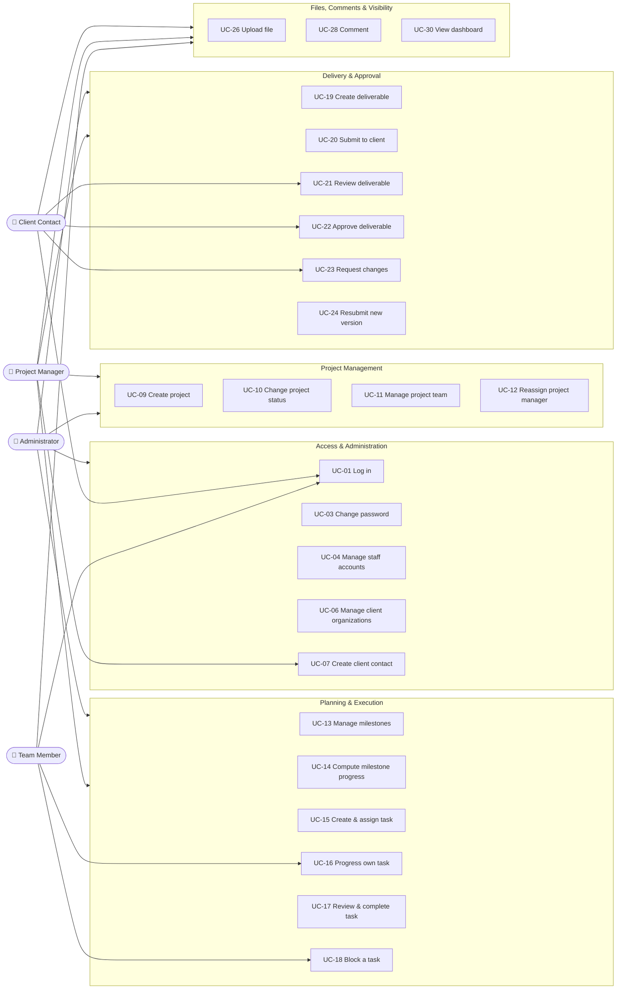

# AgencyFlow — Use Case Specifications

| Field | Value |
|---|---|
| **Document ID** | `03-Use-Cases` |
| **Project** | AgencyFlow |
| **Phase** | Phase 2 — Business Analysis |
| **Version** | **1.1** |
| **Date** | 2026-07-30 |
| **Author** | Senior Business Analyst |
| **Status** | **Approved — 2026-07-30** |
| **Depends on** | `01-Software-Requirements-Specification.md`, `02-User-Stories.md` |

---

## Document Control

| Version | Date | Author | Change |
|---|---|---|---|
| 1.0 | 2026-07-30 | Business Analyst | Initial use case set derived from the approved requirement baseline |
| **1.1** | 2026-07-30 | Architect | **UC-21 amended** — the transition to `Under Review` is now an explicit client action (FR-081, BR-31), not a side effect of opening the deliverable. UC-05 amended for BR-32. UC-04 amended for BR-33 |

| Role | Name | Decision | Date |
|---|---|---|---|
| Project Owner | Yassine | ☑ **Approved** | 2026-07-30 |

---

## 1. Introduction

### 1.1 Purpose

Where user stories express *intent*, use cases express **interaction**: the exact sequence of steps between an actor and the system, including everything that can go wrong. They are the bridge between requirements and design — Phase 5's sequence diagrams are drawn from the main flows below, and Phase 9's test cases are drawn from the alternative and exception flows.

### 1.2 Notation

| Element | Meaning |
|---|---|
| **Main flow** | The success path when everything works |
| **Alternative flow** | A different but valid path to a successful outcome |
| **Exception flow** | A failure. The system must handle it explicitly, never crash or ignore it |
| **Precondition** | Must be true before the use case can start |
| **Postcondition** | Guaranteed true after successful completion |

Detailed specifications are provided for the **18 significant use cases** — those with branching logic, state transitions, or security consequences. The remaining **14 are specified in brief** in §5, because a full narrative for "the Administrator edits a name" adds pages without adding information. This is deliberate: specification effort follows risk.

### 1.3 Actors

| ID | Actor | Type |
|---|---|---|
| **A-1** | Administrator | Primary, internal |
| **A-2** | Project Manager | Primary, internal |
| **A-3** | Team Member | Primary, internal |
| **A-4** | Client Contact | Primary, external |
| **SYS** | The System | Supporting — performs automatic computation with no human trigger |

---

## 2. Use Case Diagram

---

## 3. Use Case Index

| ID | Use Case | Primary actor | Pri |
|---|---|---|---|
| UC-01 | Log in | All | 🔴 |
| UC-02 | Log out | All | 🔴 |
| UC-03 | Change own password | All | 🔴 |
| UC-04 | Create staff account | A-1 | 🔴 |
| UC-05 | Deactivate user account | A-1 | 🔴 |
| UC-06 | Create client organization | A-1 | 🔴 |
| UC-07 | Create client contact account | A-1, A-2 | 🔴 |
| UC-08 | Reset a user's password | A-1 | 🔴 |
| UC-09 | Create a project | A-1, A-2 | 🔴 |
| UC-10 | Change project status | A-1, A-2 | 🔴 |
| UC-11 | Manage project team | A-1, A-2 | 🔴 |
| UC-12 | Reassign project manager | A-1 | 🔴 |
| UC-13 | Create milestone | A-1, A-2 | 🔴 |
| UC-14 | Compute milestone status and progress | SYS | 🔴 |
| UC-15 | Create and assign a task | A-1, A-2 | 🔴 |
| UC-16 | Progress own task | A-3 | 🔴 |
| UC-17 | Review and complete a task | A-1, A-2 | 🔴 |
| UC-18 | Block a task | A-2, A-3 | 🔴 |
| UC-19 | Create a deliverable | A-1, A-2 | 🔴 |
| UC-20 | Submit deliverable to client | A-1, A-2 | 🔴 |
| UC-21 | Review a deliverable | A-4 | 🔴 |
| UC-22 | Approve a deliverable | A-4 | 🔴 |
| UC-23 | Request changes to a deliverable | A-4 | 🔴 |
| UC-24 | Resubmit a revised deliverable | A-1, A-2 | 🔴 |
| UC-25 | View deliverable version history | All | 🟡 |
| UC-26 | Upload a file | All | 🔴 |
| UC-27 | Download a file | All | 🔴 |
| UC-28 | Post a comment | All | 🔴 |
| UC-29 | Mention a user | All | 🟡 |
| UC-30 | View role dashboard | All | 🔴 |
| UC-31 | View project activity feed | All | 🟡 |
| UC-32 | Search | All | 🟡 |

---

## 4. Detailed Specifications

### UC-01 — Log in 🔴

| | |
|---|---|
| **Actor** | All |
| **Description** | A user authenticates to obtain access appropriate to their role |
| **Trigger** | The user submits the login form |
| **Precondition** | The user has an active account created by an Administrator (BR-11) |
| **Postcondition** | The user holds a valid 12-hour session and is on their role's dashboard |
| **Traces** | FR-001, FR-002, US-001 |

**Main flow**

1. The user opens the login page.
2. The user enters email and password.
3. The system verifies the email corresponds to an active account.
4. The system verifies the password against the stored bcrypt hash.
5. The system issues a JWT valid for 12 hours containing the user's identity and role.
6. The system redirects the user to the dashboard for their role (UC-30).

**Exception flows**

| # | Condition | System response |
|---|---|---|
| E1 | Email not found | Generic failure message. The system **shall not** reveal whether the email exists — that would allow account enumeration |
| E2 | Password incorrect | Identical generic message to E1 |
| E3 | Account deactivated | Access refused; the same generic message is used |
| E4 | Required field empty | Client-side and server-side validation both refuse the submission |

---

### UC-04 — Create staff account 🔴

| | |
|---|---|
| **Actor** | A-1 Administrator |
| **Description** | The Administrator creates an account for an internal employee |
| **Trigger** | The Administrator submits the new-user form |
| **Precondition** | The actor is authenticated as Administrator |
| **Postcondition** | The account exists, can authenticate, and holds exactly one role |
| **Traces** | FR-008, BR-02, BR-11, US-006 |

**Main flow**

1. The Administrator opens user management and chooses to create a user.
2. The Administrator enters name, email, **username**, role, and an initial password.
3. If the role is Team Member, the Administrator selects a skill.
4. The system validates that the email is unique and well-formed, and that the **username is unique** and matches the permitted format (A-13). The username is immutable once set (BR-33).
5. The system validates that a skill is present when and only when the role is Team Member.
6. The system hashes the password with bcrypt and stores the account.
7. The system confirms creation and returns to the user list.

**Alternative flow**

| # | Condition | Path |
|---|---|---|
| A1 | Role is Administrator or Project Manager | Step 3 is skipped; skill is not applicable (BR-02) |

**Exception flows**

| # | Condition | System response |
|---|---|---|
| E1 | Email already in use | Creation refused, stating the conflict |
| E2 | Team Member selected without a skill | Refused; skill is mandatory for that role |
| E3 | Password shorter than 8 characters | Refused with the policy stated |
| E4 | Actor is not an Administrator | 403, enforced server-side (NFR-20) |

---

### UC-07 — Create client contact account 🔴

| | |
|---|---|
| **Actor** | A-1 Administrator, A-2 Project Manager |
| **Description** | An account is created for a person at a client organization so they can access the client portal |
| **Precondition** | The Client organization exists (UC-06) |
| **Postcondition** | A Client Contact account exists, permanently bound to one organization |
| **Traces** | FR-016, BR-09, BR-10, BR-11, US-012 |

**Main flow**

1. The actor opens the client organization.
2. The actor chooses to add a contact.
3. The actor enters name, email, and an initial password.
4. The system creates the account with role Client Contact and `clientId` set to that organization.
5. The system confirms creation.

**Exception flows**

| # | Condition | System response |
|---|---|---|
| E1 | Email already in use | Refused |
| E2 | Actor is a Team Member or Client Contact | 403 |
| E3 | No organization selected | Refused — a Client Contact cannot exist without an organization (BR-09) |

> **Security note.** `clientId` is set by the server from the organization context. It is never accepted from the request body — a client-supplied organization id would defeat BR-10 entirely.

---

### UC-09 — Create a project 🔴

| | |
|---|---|
| **Actor** | A-1 Administrator, A-2 Project Manager |
| **Description** | A new project is opened for a client and assigned an owning Project Manager |
| **Precondition** | The Client organization exists; at least one Project Manager account exists |
| **Postcondition** | The project exists with status `Planned`, one client, and one owning PM |
| **Traces** | FR-019, BR-03, BR-24, US-014 |

**Main flow**

1. The actor chooses to create a project.
2. The actor enters name, description, start date, and end date.
3. The actor selects exactly one Client organization.
4. The actor selects the owning Project Manager.
5. The system validates that the end date is not earlier than the start date.
6. The system creates the project with status `Planned`.
7. The system records a client-visible activity "project created" (BR-21).

**Alternative flow**

| # | Condition | Path |
|---|---|---|
| A1 | A template is selected (UC-33, 🟢) | The template's milestones are copied into the new project (FR-076) |

**Exception flows**

| # | Condition | System response |
|---|---|---|
| E1 | End date precedes start date | Refused |
| E2 | No client selected | Refused — a project must belong to exactly one client (BR-03) |
| E3 | Actor is a Team Member or Client Contact | 403 |

---

### UC-11 — Manage project team 🔴

| | |
|---|---|
| **Actor** | A-1 Administrator, A-2 owning Project Manager |
| **Description** | Team Members are added to or removed from a project, controlling both assignment eligibility and visibility |
| **Precondition** | The project exists; the actor owns it or is the Administrator |
| **Postcondition** | Membership reflects who works on the project; members can see it, non-members cannot |
| **Traces** | FR-023, FR-024, BR-23, BR-26, US-018, US-019 |

**Main flow — add**

1. The actor opens the project's team.
2. The actor selects a user with role Team Member.
3. The system verifies the user is not already a member.
4. The system creates the membership.
5. The project immediately appears in that member's project list.

**Main flow — remove**

1. The actor selects a current member and chooses to remove them.
2. The system checks whether the member holds tasks in the project that are neither `Done` nor `Cancelled`.
3. If none, the system removes the membership and the member loses access.

**Exception flows**

| # | Condition | System response |
|---|---|---|
| E1 | User is already a member | Refused as a duplicate |
| E2 | Selected user is not a Team Member | Refused — only Team Members join project teams |
| E3 | Member still holds open tasks | Refused, listing the tasks that must first be reassigned or cancelled |
| E4 | Actor is a PM who does not own the project | 403 (BR-25) |

---

### UC-14 — Compute milestone status and progress 🔴

| | |
|---|---|
| **Actor** | **SYS** — no human trigger |
| **Description** | The system derives a milestone's status and progress percentage from its tasks |
| **Trigger** | Any task within the milestone is created, cancelled, or changes status |
| **Precondition** | The milestone exists |
| **Postcondition** | Status and progress reflect the milestone's tasks exactly |
| **Traces** | FR-031, FR-032, BR-08, BR-12, US-024 |

**Main flow**

1. The system collects all tasks of the milestone.
2. The system **excludes** every task with status `Cancelled` (BR-12).
3. The system counts the remaining tasks as the denominator.
4. The system counts those with status `Done` as the numerator.
5. The system computes `progress = numerator ÷ denominator × 100`.
6. The system derives status:
   - **Completed** — numerator equals denominator and denominator > 0
   - **Not Started** — no remaining task has left `To Do`
   - **In Progress** — otherwise
7. The system exposes both values wherever the milestone is displayed.

**Exception flows**

| # | Condition | System response |
|---|---|---|
| E1 | Denominator is 0 (no tasks, or all cancelled) | Progress is **0 %**, status `Not Started`. No division occurs (A-02) |

> **Design note.** This use case has no user interface and no actor-initiated trigger. It exists as a use case precisely because it carries business rules that must be specified and tested independently of any screen. Its edge cases — E1, and the exclusion in step 2 — are the most likely source of a silent defect in the entire system.

---

### UC-15 — Create and assign a task 🔴

| | |
|---|---|
| **Actor** | A-1 Administrator, A-2 owning Project Manager |
| **Description** | A unit of work is created inside a milestone and given to exactly one Team Member |
| **Precondition** | The milestone exists; the intended assignee is a member of the project team (BR-23) |
| **Postcondition** | The task exists with status `To Do` and one assignee; milestone progress is recomputed |
| **Traces** | FR-035, FR-036, BR-03, BR-23, US-026 |

**Main flow**

1. The actor opens a milestone and chooses to add a task.
2. The actor enters title, description, and due date.
3. The actor selects an assignee from the project team.
4. The system verifies the assignee is a project member.
5. The system creates the task with status `To Do`.
6. The system triggers UC-14 to recompute milestone progress.
7. The system generates a notification for the assignee (FR-064, 🟡).

**Exception flows**

| # | Condition | System response |
|---|---|---|
| E1 | Assignee is not a project member | Refused; the actor is directed to add them to the team first (BR-23) |
| E2 | Actor is a Team Member | 403 — Team Members cannot create tasks |
| E3 | Actor is a PM who does not own the project | 403 |
| E4 | Title empty | Refused |

---

### UC-16 — Progress own task 🔴

| | |
|---|---|
| **Actor** | A-3 Team Member |
| **Description** | The assignee advances their own task through the permitted states |
| **Precondition** | The task is assigned to the actor |
| **Postcondition** | The task's status has advanced; milestone progress is recomputed |
| **Traces** | FR-038, FR-039, BR-04, BR-26, US-030, US-031, US-032 |

**Main flow**

1. The Team Member opens a task assigned to them.
2. The Team Member selects the next status: `To Do → In Progress`, or `In Progress → In Review`.
3. The system verifies the actor is the assignee.
4. The system verifies the transition is permitted by the state model (§6.1 of the SRS).
5. The system saves the new status.
6. The system triggers UC-14.
7. On reaching `In Review`, the task appears in the owning Project Manager's review queue.

**Exception flows**

| # | Condition | System response |
|---|---|---|
| E1 | **Actor attempts to set `Done`** | **403 — refused server-side (BR-04).** This must hold even when the request is made directly to the API, bypassing the interface |
| E2 | Task is assigned to another user | 403 (BR-26) — the actor may *view* the task but not modify it |
| E3 | Transition not permitted by the state model | Refused, stating the valid transitions |
| E4 | Task belongs to a project the actor is not a member of | 403 |

> **This is the most security-relevant internal use case.** E1 is not a user-interface concern; hiding the button is a convenience, and the server refusal is the control. It carries a dedicated test case in Phase 9.

---

### UC-17 — Review and complete a task 🔴

| | |
|---|---|
| **Actor** | A-1 Administrator, A-2 owning Project Manager |
| **Description** | The Project Manager verifies submitted work and either accepts it or returns it |
| **Precondition** | The task is in status `In Review` |
| **Postcondition** | The task is `Done`, or has returned to `In Progress`; milestone progress is recomputed |
| **Traces** | FR-040, BR-04, US-033 |

**Main flow**

1. The Project Manager opens their dashboard and sees tasks awaiting review.
2. The PM opens a task in `In Review` and inspects the work and attachments.
3. The PM marks the task `Done`.
4. The system verifies the task is currently `In Review`.
5. The system saves the status and triggers UC-14.
6. If this completes the milestone, the system records a **client-visible** activity "milestone completed" (BR-21).

**Alternative flow**

| # | Condition | Path |
|---|---|---|
| A1 | The work is unsatisfactory | The PM returns the task to `In Progress`, optionally with a task comment (UC-28). The assignee is notified |

**Exception flows**

| # | Condition | System response |
|---|---|---|
| E1 | Task is not in `In Review` | Refused — only reviewed work may be completed |
| E2 | Actor is a PM who does not own the project | 403 |

---

### UC-18 — Block a task 🔴

| | |
|---|---|
| **Actor** | A-2 Project Manager, A-3 assignee |
| **Description** | A task is marked as halted, with a mandatory explanation |
| **Precondition** | The task is `To Do` or `In Progress` |
| **Postcondition** | The task is `Blocked` with a stored reason, visible on the PM dashboard |
| **Traces** | FR-041, BR-22, US-034 |

**Main flow**

1. The actor opens the task and chooses to block it.
2. The actor enters the reason.
3. The system verifies the reason is non-empty after trimming whitespace.
4. The system sets status `Blocked` and stores the reason and its author.
5. The reason appears on the owning Project Manager's dashboard.

**Alternative flow**

| # | Condition | Path |
|---|---|---|
| A1 | The blockage is resolved | The actor unblocks the task, which returns to `To Do` or `In Progress` |

**Exception flows**

| # | Condition | System response |
|---|---|---|
| E1 | Reason empty or whitespace only | **Refused (BR-22).** A blockage with no stated cause is exactly the invisible-blocker problem the system exists to eliminate |
| E2 | Task is `Done` or `Cancelled` | Refused — terminal states cannot be blocked |
| E3 | Actor is neither the assignee, the owning PM, nor an Administrator | 403 |

---

### UC-20 — Submit deliverable to client 🔴

| | |
|---|---|
| **Actor** | A-1 Administrator, A-2 owning Project Manager |
| **Description** | Finished work is formally presented to the client for approval |
| **Precondition** | The deliverable is `Draft` or `Changes Requested` and has at least one attached file |
| **Postcondition** | Status is `Submitted`; it appears on the client's dashboard as awaiting review |
| **Traces** | FR-047, BR-05, US-037 |

**Main flow**

1. The Project Manager opens a deliverable in `Draft`.
2. The PM confirms the attached files are correct.
3. The PM submits the deliverable to the client.
4. The system verifies at least one file is attached to the current version.
5. The system verifies the actor is the owning PM or an Administrator (BR-05).
6. The system sets status `Submitted`.
7. The system records a **client-visible** activity and notifies the organization's Client Contacts.

**Exception flows**

| # | Condition | System response |
|---|---|---|
| E1 | No files attached | Refused — an empty deliverable cannot be reviewed |
| E2 | Actor is a Team Member | **403 (BR-05)** — only a PM speaks to the client |
| E3 | Deliverable is already `Approved` | Refused (BR-07) |

---

### UC-21 — Review a deliverable 🔴

| | |
|---|---|
| **Actor** | A-4 Client Contact |
| **Description** | The client opens submitted work to examine it before deciding |
| **Precondition** | A deliverable of the actor's own organization is `Submitted` |
| **Postcondition** | The client has seen the content. If they chose to start the review, status is `Under Review`; otherwise the status is unchanged |
| **Traces** | FR-052, FR-056, **FR-081**, BR-10, **BR-31**, US-038 |

**Main flow**

1. The Client Contact logs in and sees "deliverables awaiting my approval" on their dashboard.
2. The client opens the deliverable.
3. The system verifies the deliverable belongs to the actor's own organization (BR-10).
4. The system displays name, description, due date, files, version history, and comments. **This is a read operation and changes nothing (BR-31).**
5. The client downloads or previews the files (UC-27).
6. The client presses **"Start review"**, issuing `POST /deliverables/:id/start-review`.
7. The system verifies the deliverable is in status `Submitted` and sets it to `Under Review`.
8. The system notifies the owning Project Manager that the client has taken up the review.

**Alternative flows**

| # | Condition | Path |
|---|---|---|
| A1 | The client decides immediately without starting a review | Steps 6–8 are skipped. The client proceeds directly to UC-22 or UC-23 from `Submitted`. **Both paths are valid (A-14)** |
| A2 | The deliverable is already `Under Review` | Step 6 is not offered. The client proceeds to decide |

**Exception flows**

| # | Condition | System response |
|---|---|---|
| E1 | **Deliverable belongs to another organization** | **403/404. No data is returned (BR-10).** This holds when the identifier is supplied directly in the URL, not only when navigating the interface |
| E2 | Deliverable is still `Draft` | Not visible to the client at all |
| E3 | `start-review` called on a deliverable not in `Submitted` | Refused. The action is only valid from `Submitted` |
| E4 | Two Client Contacts of the same organization start the review concurrently | The first succeeds; the second is a no-op, not an error. **The state is a fact about the organization, not about one person** |

> **Design note (v1.1).** In version 1.0 this use case set `Under Review` as a side effect of step 4 — a read that mutated state. That violates HTTP semantics for `GET`, makes the transition untestable in isolation, and races when two contacts open the deliverable at once (E4). Making the action explicit costs the client one click and eliminates all three problems, while preserving the review state the Project Owner wanted for workflow visibility.

---

### UC-22 — Approve a deliverable 🔴

| | |
|---|---|
| **Actor** | A-4 Client Contact |
| **Description** | The client formally accepts the work, creating an auditable record of acceptance |
| **Precondition** | The deliverable is `Submitted` or `Under Review` and belongs to the actor's organization. Passing through `Under Review` is optional (A-14) |
| **Postcondition** | Status is `Approved` — terminal and immutable |
| **Traces** | FR-048, BR-07, BR-10, US-039 |

**Main flow**

1. The client, having reviewed the work (UC-21), chooses to approve.
2. The system asks for confirmation, stating that approval is final.
3. The client confirms.
4. The system sets status `Approved` and records the approving contact and the timestamp.
5. The system records a client-visible activity and notifies the owning Project Manager.

**Exception flows**

| # | Condition | System response |
|---|---|---|
| E1 | Deliverable already `Approved` | Refused as a no-op |
| E2 | Any later attempt to edit, delete, or un-approve | **Refused (BR-07).** Correction proceeds only through a new deliverable |
| E3 | Deliverable belongs to another organization | 403/404 |

---

### UC-23 — Request changes to a deliverable 🔴

| | |
|---|---|
| **Actor** | A-4 Client Contact |
| **Description** | The client rejects the current version and states what must change |
| **Precondition** | The deliverable is `Submitted` or `Under Review` and belongs to the actor's organization |
| **Postcondition** | Status is `Changes Requested`; the reason is recorded as a comment; the PM is notified |
| **Traces** | FR-049, US-040 |

**Main flow**

1. The client opens the deliverable and chooses to request changes.
2. The client enters an explanatory comment.
3. The system verifies the comment is non-empty.
4. The system sets status `Changes Requested`.
5. The system stores the comment against the current version.
6. The system records a client-visible activity and notifies the owning Project Manager.

**Exception flows**

| # | Condition | System response |
|---|---|---|
| E1 | Comment empty | **Refused.** A rejection without a reason gives the agency nothing to act on, and reproduces the very communication failure the product exists to solve |
| E2 | Deliverable is `Approved` | Refused (BR-07) |

---

### UC-24 — Resubmit a revised deliverable 🔴

| | |
|---|---|
| **Actor** | A-1 Administrator, A-2 owning Project Manager |
| **Description** | The agency corrects rejected work and returns it as a new version, preserving all history |
| **Precondition** | The deliverable is `Changes Requested` |
| **Postcondition** | A new version exists and is `Submitted`; all prior versions remain intact |
| **Traces** | FR-050, BR-06, US-041 |

**Main flow**

1. The Project Manager opens the deliverable and reads the client's change request.
2. The PM creates a new version.
3. The PM attaches the corrected files to the new version.
4. The system verifies at least one file is attached.
5. The system increments the version number, leaving all earlier versions and their files unmodified (BR-06).
6. The system sets status `Submitted`.
7. The system notifies the organization's Client Contacts.

**Exception flows**

| # | Condition | System response |
|---|---|---|
| E1 | Deliverable is not `Changes Requested` | Refused — a new version arises only from a change request |
| E2 | No files attached to the new version | Refused |
| E3 | Any attempt to modify a previous version | **Refused.** Version history is append-only; it is the audit record of the agency–client negotiation |

---

### UC-26 — Upload a file 🔴

| | |
|---|---|
| **Actor** | All, per context |
| **Description** | A file is attached to a deliverable version, a task, or a project |
| **Precondition** | The actor may write to the target context |
| **Postcondition** | The file is stored and retrievable only by permitted users |
| **Traces** | FR-055, FR-057, FR-058, BR-15, BR-16, BR-27, NFR-24, US-043 |

**Main flow**

1. The actor selects a file in the relevant context.
2. The system validates the extension against the permitted set: PDF, PNG, JPG, JPEG, SVG, DOCX, XLSX, PPTX, ZIP.
3. The system validates the size does not exceed 20 MB.
4. The system validates the actor's permission for that context.
5. The system stores the file and links it to the target.
6. The system records an activity with the visibility appropriate to the context (BR-21).

**Alternative flows**

| # | Context | Permitted actors |
|---|---|---|
| A1 | Deliverable file | Administrator, owning PM |
| A2 | Task attachment | Administrator, PM, Team Member of the project |
| A3 | Project file | Administrator, PM, **Client Contact of the owning organization** (BR-27) |

**Exception flows**

| # | Condition | System response |
|---|---|---|
| E1 | Disallowed file type | Refused, naming the permitted types |
| E2 | Larger than 20 MB | Refused, stating the limit |
| E3 | Client Contact attempts to upload a task attachment | 403 (BR-28) |
| E4 | Type validated only by the client-declared value | **Not acceptable.** Validation is server-side (NFR-24) |

---

### UC-27 — Download a file 🔴

| | |
|---|---|
| **Actor** | All, per permission |
| **Description** | A stored file is retrieved |
| **Precondition** | The actor is permitted to see the file's context |
| **Postcondition** | The file is delivered, or access is refused |
| **Traces** | FR-056, BR-10, BR-28, US-044 |

**Main flow**

1. The actor requests a file.
2. The system resolves the file's context — deliverable, task, or project.
3. The system evaluates the actor's permission for that context, including client-organization ownership (BR-10).
4. The system streams the file.

**Exception flows**

| # | Condition | System response |
|---|---|---|
| E1 | **Client Contact requests a file from another organization** | **403/404 (BR-10)** |
| E2 | Client Contact requests a task attachment | 403 (BR-28) |
| E3 | Actor has the direct storage URL but no permission | **Access refused.** Files are served through permission-checked endpoints, never as unguessable-but-public URLs — obscurity is not authorization |

---

### UC-30 — View role dashboard 🔴

| | |
|---|---|
| **Actor** | All |
| **Description** | On login, each role is shown the information and primary action relevant to their job |
| **Precondition** | The actor is authenticated |
| **Postcondition** | The actor sees current, permission-scoped information |
| **Traces** | FR-068 – FR-072, BR-20, US-055 – US-059 |

**Main flow**

1. The actor logs in (UC-01).
2. The system determines the actor's role.
3. The system assembles that role's dashboard, scoped by ownership and membership.
4. The system computes due-soon and overdue tasks **at this moment** from due dates (BR-20) — no stored alerts, no background job.
5. The system displays the dashboard with its role-specific primary action.

**Alternative flows**

| # | Role | Content and primary action |
|---|---|---|
| A1 | Administrator | Agency-wide counts, active projects, workload, overdue tasks, deliverables awaiting client approval. *Action: oversee* |
| A2 | Project Manager | Owned projects, **tasks awaiting my review**, deliverables awaiting client response, blocked tasks with reasons, due-soon and overdue. *Action: review submitted work* |
| A3 | Team Member | My tasks grouped by status, due soon, overdue, my mentions. *Action: what do I work on now* |
| A4 | Client Contact | My organization's projects with progress, **deliverables awaiting my approval**, recently approved, upcoming milestones, client-visible activity. *Action: approve work* |

**Exception flows**

| # | Condition | System response |
|---|---|---|
| E1 | The actor has no projects | The dashboard renders an empty state with guidance, not an error and not a blank page |
| E2 | A Client Contact's organization has no projects | Empty state; no other organization's data is ever shown as a fallback |

---

## 5. Use Cases Specified in Brief

Simple, single-path use cases whose behaviour is fully determined by their requirement and story. A full narrative would restate them without adding information.

| ID | Use Case | Actor | Essential behaviour | Traces |
|---|---|---|---|---|
| **UC-02** | Log out | All | Session token discarded; protected routes unreachable | FR-004, US-002 |
| **UC-03** | Change own password | All | Current password verified; new password ≥ 8 chars, bcrypt-hashed | FR-005, US-004 |
| **UC-05** | Deactivate user | A-1 | **Refused while the user holds non-`Done`, non-`Cancelled` tasks, listing them (BR-32)**; otherwise the account cannot authenticate; records retained; the last Administrator cannot be deactivated | FR-010, BR-32, A-10, US-008 |
| **UC-06** | Create client organization | A-1 | Unique name required; becomes selectable for projects | FR-013, US-011 |
| **UC-08** | Reset a user's password | A-1 | New password effective immediately; no email sent | FR-006, US-005 |
| **UC-10** | Change project status | A-1, A-2 | Only transitions in SRS §6.4; recorded as client-visible activity | FR-021, US-016 |
| **UC-12** | Reassign project manager | A-1 | Administrator only; access transfers immediately | FR-022, BR-24, US-017 |
| **UC-13** | Create / edit / delete milestone | A-1, A-2 | Ordered within the project; status never editable; deletion refused while non-cancelled tasks remain | FR-029, FR-030, FR-034, US-022 |
| **UC-19** | Create a deliverable | A-1, A-2 | Name, description, due date; starts in `Draft`; belongs to one project | FR-045, US-035 |
| **UC-25** | View deliverable version history | All | All versions with files, dates, outcomes; client sees only their own organization's | FR-054, US-042 |
| **UC-28** | Post a comment | All | Flat, timestamped, attributed. **Task comments are never visible to Client Contacts (BR-14)** | FR-060 – FR-062, US-047, US-048 |
| **UC-29** | Mention a user | All | `@username` resolves to a visible user and generates a linked notification | FR-063, US-049 |
| **UC-31** | View project activity feed | All | Reverse-chronological; Client Contacts see only client-visible events of their own organization (BR-21) | FR-066, FR-067, US-053, US-054 |
| **UC-32** | Search | All | Across projects, tasks, deliverables; results never include records the actor cannot open | FR-074, US-061 |

---

## 6. Cross-Cutting Rules

These apply to **every** use case above and are not repeated in each specification.

| Rule | Statement |
|---|---|
| **Authentication** | Every use case requires an authenticated session. There are no anonymous capabilities |
| **Server-side authorization** | Every permission decision is made on the server. Hiding a control in the interface is a usability measure, never a security control (NFR-20) |
| **Client isolation** | Every use case reachable by a Client Contact is scoped to their own organization (BR-10). Supplying another organization's identifier returns 403/404, never data |
| **Input validation** | Every input is validated at the API boundary before business logic runs (NFR-22) |
| **Error disclosure** | No exception flow reveals a stack trace, internal path, or database error (NFR-23) |
| **Soft delete** | No use case physically removes a business record (BR-30) |
| **No state change on read** | No use case changes the state of any record as a side effect of a read operation. Every transition is an explicit, named action (BR-31) |
| **Activity recording** | Every state-changing use case records an Activity, flagged client-visible or internal by event type (BR-21) |
| **Session expiry** | Any use case may terminate with session expiry after 12 hours, returning the actor to UC-01 |

---

## 7. Traceability Summary

| Actor | Use cases | Must-have |
|---|---|---|
| Administrator | UC-01 – UC-15, UC-17, UC-19, UC-20, UC-24, UC-26 – UC-32 | 20 |
| Project Manager | UC-01 – UC-03, UC-07, UC-09 – UC-20, UC-24 – UC-32 | 19 |
| Team Member | UC-01 – UC-03, UC-16, UC-18, UC-26 – UC-28, UC-30 – UC-32 | 7 |
| Client Contact | UC-01 – UC-03, UC-21 – UC-23, UC-25 – UC-28, UC-30 – UC-32 | 8 |
| System (automatic) | UC-14 | 1 |

Full requirement-level traceability is in `04-Requirements-Traceability-Matrix.md`.

---

## END OF DOCUMENT
