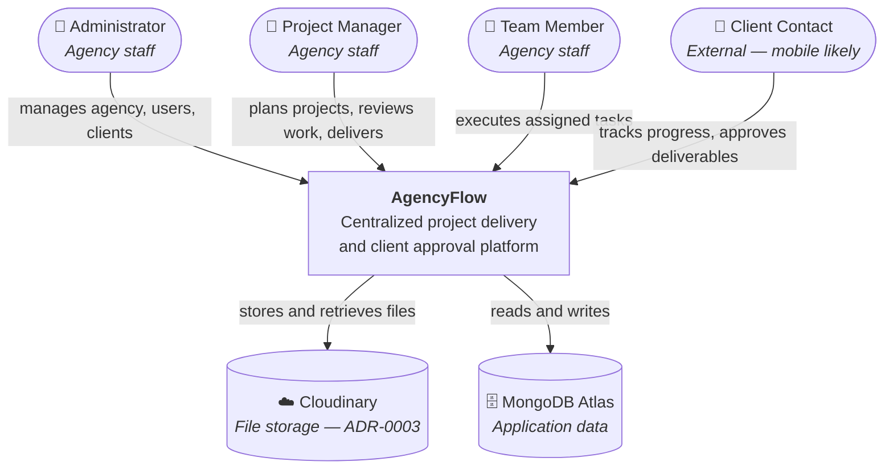
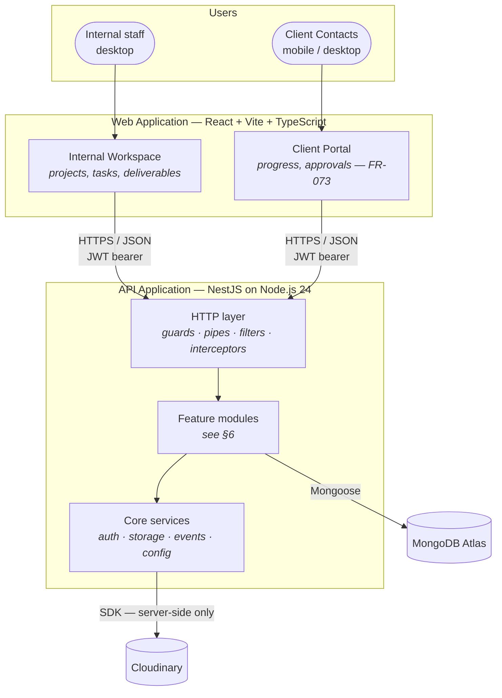
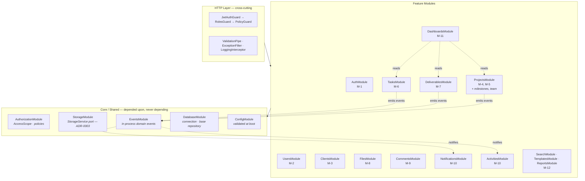
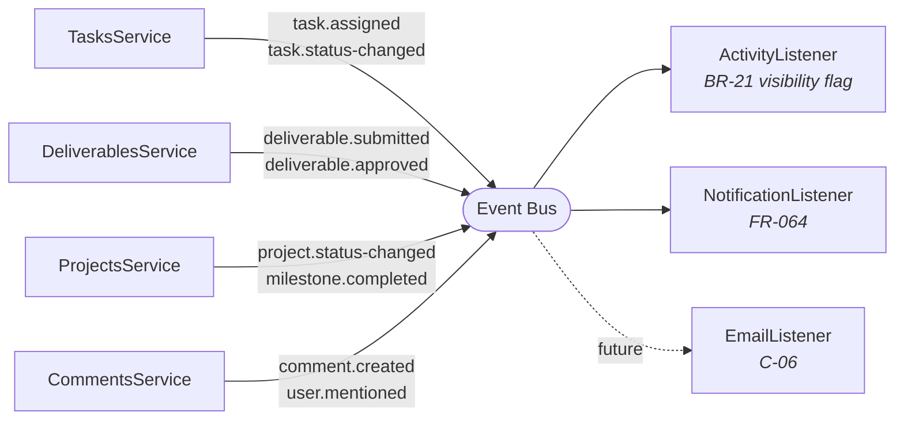
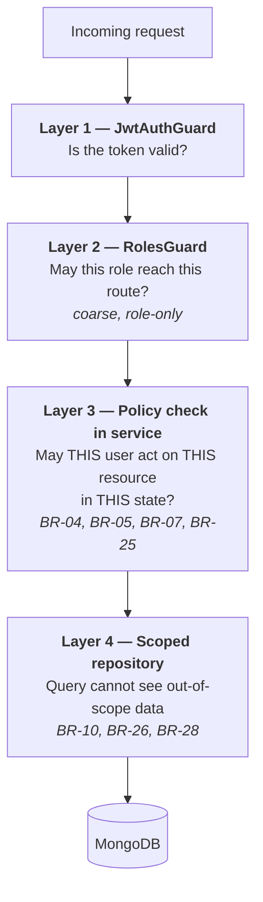
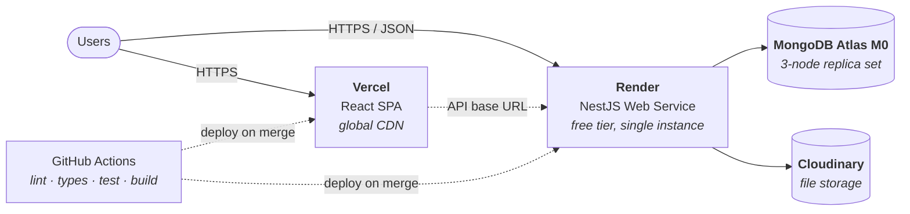

# AgencyFlow — Software Architecture Document

| Field | Value |
|---|---|
| **Document ID** | `05-Software-Architecture` |
| **Project** | AgencyFlow |
| **Phase** | Phase 3 — Software Architecture |
| **Version** | 1.0 |
| **Date** | 2026-07-30 |
| **Author** | Senior Software Architect |
| **Status** | **Approved — 2026-07-30** |
| **Baseline** | `01-SRS` v1.1, `02-User-Stories` v1.1, `03-Use-Cases` v1.1, `04-RTM` v1.1 |
| **Decisions** | ADR-0001 – ADR-0004 |

---

## Document Control

| Version | Date | Author | Change |
|---|---|---|---|
| 1.0 | 2026-07-30 | Architect | Initial architecture derived from the frozen requirement baseline |

| Role | Name | Decision | Date |
|---|---|---|---|
| Project Owner | Yassine | ☑ **Approved** | 2026-07-30 |

**Traceability statement.** Every architectural decision below cites the requirement, business rule, or constraint that forced it. An architecture decision with no driver is a preference, and preferences do not belong in this document.

---

## Table of Contents

1. [Purpose and Scope](#1-purpose-and-scope)
2. [Architectural Drivers](#2-architectural-drivers)
3. [Architecture Style](#3-architecture-style)
4. [C4 Level 1 — System Context](#4-c4-level-1--system-context)
5. [C4 Level 2 — Containers](#5-c4-level-2--containers)
6. [C4 Level 3 — Backend Components](#6-c4-level-3--backend-components)
7. [Module Dependency Rules](#7-module-dependency-rules)
8. [Layering Within a Module](#8-layering-within-a-module)
9. [Domain Events](#9-domain-events)
10. [API Architecture](#10-api-architecture)
11. [Security Architecture](#11-security-architecture)
12. [Cross-Cutting Concerns](#12-cross-cutting-concerns)
13. [Frontend Architecture](#13-frontend-architecture)
14. [Data Architecture](#14-data-architecture)
15. [Deployment View](#15-deployment-view)
16. [Quality Attribute Scenarios](#16-quality-attribute-scenarios)
17. [Technology Decision Register](#17-technology-decision-register)
18. [Architectural Risks](#18-architectural-risks)
19. [Open Questions](#19-open-questions)

---

## 1. Purpose and Scope

### 1.1 Purpose

This document defines **how** AgencyFlow is structured to satisfy the requirements frozen in Phase 2. It is the bridge between *what the system must do* and *how it will be built*.

### 1.2 In scope

Architecture style · system decomposition · module boundaries and dependency rules · API architecture · security architecture · cross-cutting concerns · technology decisions · deployment topology.

### 1.3 Out of scope — deliberately deferred

| Concern | Owner |
|---|---|
| Collection schemas, field types, index definitions | Phase 4 (`06-Database-Design`) |
| Class, sequence, state, and component diagrams | Phase 5 (`07-UML-Design`) |
| Endpoint-by-endpoint specification, DTO fields, error taxonomy | Phase 6 (`08-Backend-Design`) |
| Component hierarchy, routing table, wireframes, styling | Phase 7 (`09-Frontend-Design`) |
| Hosting provider, CI/CD pipeline, environment variables | Phase 10 (`11-Deployment-Guide`) |

§14 and §15 give the **shape** of the data and deployment views because architecture must state them; the detail belongs to those phases.

### 1.4 Method

Structure follows the **C4 model** (Context → Container → Component), chosen because it produces four diagrams at decreasing zoom rather than one diagram nobody can read. Significant decisions are recorded as ADRs in `docs/adr/` (`00-Project-Foundation.md` §7.3).

---

## 2. Architectural Drivers

Architecture is determined by constraints and quality attributes, not by feature count. These are the forces that shaped every decision below.

### 2.1 Constraints — non-negotiable

| ID | Constraint | Architectural consequence |
|---|---|---|
| **C-01** | Stack fixed: NestJS · MongoDB · React + Vite + TypeScript | Framework idioms are adopted rather than fought |
| **C-02** | Single tenant (BR-01) | **No tenant partitioning anywhere.** Removes a dimension from every query, index, and test |
| **C-03** | 6 implementation days | Every avoidable moving part is removed. Complexity must earn its place |
| **C-04** | Solo developer | No service boundaries requiring coordination. No component that only one person could maintain |
| **C-05** | French UI, English code | A presentation-layer concern only; no architectural impact beyond one constants module |
| **C-06** | Must extend later to time tracking, Gantt, email, billing, AI (NFR-31) | **Drives the module boundary discipline in §7 and the event model in §9** |

### 2.2 Quality attributes ranked

Ranking matters: when two attributes conflict, the higher one wins. This ordering is the single most important statement in the document.

| Rank | Attribute | Why it ranks here | Key requirements |
|---|---|---|---|
| **1** | **Security** | A cross-client data leak destroys the product's premise. Nothing else compensates | BR-10, BR-28, NFR-20, NFR-21, FR-079 |
| **2** | **Correctness of business rules** | The rules *are* the product. Silent progress corruption or a bypassed review gate is worse than an outage | BR-04 – BR-08, BR-12, BR-31 |
| **3** | **Maintainability / extensibility** | Explicitly required, and it is what an internship is evaluated on | NFR-31 – NFR-34, C-06 |
| **4** | **Usability** | Low-skill external users must operate the portal unaided | NFR-08, NFR-11, FR-073 |
| **5** | **Performance** | Real but undemanding at the stated scale | NFR-12 – NFR-17 |
| **6** | **Availability** | Explicitly best-effort. Single instance accepted | NFR-27, NFR-28 |

**Consequence of ranking security first:** where a safe design costs performance, the safe design wins (see §11.3 — scoped repositories, and ADR-0003 — proxied downloads). Where performance would cost simplicity without measured evidence, simplicity wins (ADR-0004 §3 — progress computed on read).

### 2.3 Architecturally significant requirements

Most of the 81 requirements are CRUD and do not shape architecture. These do:

| Requirement | Why it is architecturally significant |
|---|---|
| **BR-10 / FR-079** — client data isolation | Cannot be met by discipline alone. Requires a structural mechanism (§11.3) |
| **BR-04 / BR-05** — segregation of duties | Authorization depends on resource **state and ownership**, not role alone. Rules out simple role guards as the only mechanism |
| **BR-08 / BR-12** — computed progress | Cross-aggregate computation between Task and Milestone (ADR-0004 §3) |
| **BR-06 / BR-07** — versioning and immutability | Append-only structure; write paths must be closed, not merely unused (ADR-0004 §1) |
| **BR-21** — activity visibility | Every write path emits an event. Drives the event model (§9) |
| **BR-31** — no state change on read | Command/query separation at the API surface (§10.4) |
| **NFR-31 / C-06** — future modules | Drives module boundaries and events over direct coupling |
| **FR-073** — mobile client portal | Two distinct UI surfaces sharing one API |

---

## 3. Architecture Style

### 3.1 Decision

> **A layered Modular Monolith**: one deployable backend, internally partitioned into modules with explicit boundaries and one-directional dependencies.

### 3.2 Options considered

| Style | Description | Verdict |
|---|---|---|
| **Microservices** | Independently deployable services per domain | ❌ **Rejected** |
| **Modular monolith** | One deployment, strong internal module boundaries | ✅ **Chosen** |
| **Unstructured layered monolith** | Global `controllers/`, `services/`, `models/` folders | ❌ **Rejected** |
| **Serverless functions** | Per-endpoint functions | ❌ **Rejected** |

### 3.3 Why not microservices

Microservices solve **organizational** problems: independent team deployment, per-service scaling, technology heterogeneity, fault isolation across large systems. AgencyFlow has **one developer, one deployment, one database, and 30 concurrent users.** None of those problems exist here.

Adopting them would buy distributed transactions across Task and Milestone (BR-08), network calls where a function call suffices, N deployment pipelines instead of one, and a debugging story requiring distributed tracing — paid from a six-day budget.

Choosing microservices here would demonstrate that the pattern is known, not that it is understood. **Knowing when *not* to distribute is the more senior judgement**, and it is the one this project should demonstrate.

### 3.4 Why not an unstructured monolith

The obvious alternative — one `services/` folder containing everything — fails **NFR-31 and C-06** outright. When every service can call every other service, "add a billing module later" becomes "untangle a ball of mutual references first." The modularity requirement is explicit and stated by the Project Owner; it must be structural, not aspirational.

### 3.5 Why the modular monolith fits

| Driver | How the style satisfies it |
|---|---|
| C-03, C-04 | One codebase, one deployment, one debugger, one log stream |
| **C-06, NFR-31** | Module boundaries are the seams along which features are added — or services extracted, if ever needed |
| Quality rank 1 (security) | One process, one authorization mechanism, one place to get isolation right |
| Quality rank 2 (correctness) | Cross-aggregate rules (BR-08, BR-12) execute in-process, with real transactions available |
| NFR-32 | Each rule lives in exactly one module's service layer |

> **The modular monolith is the architecture you can grow out of gracefully.** Extracting a module into a service later is tractable *if the boundary already exists*; it is a rewrite if it does not. That is the whole argument.

---

## 4. C4 Level 1 — System Context



### 4.1 External dependencies

| System | Purpose | Failure impact | Mitigation |
|---|---|---|---|
| **MongoDB Atlas** | All application data | Total outage | None in v1 — NFR-27 accepts best-effort availability |
| **Cloudinary** | File bytes (ADR-0003) | Upload/download fail; all other functionality intact | Isolated behind the `StorageService` port; failure is contained to file features |

**No other third-party runtime dependency exists.** This is deliberate: email, push, payment, and analytics integrations were all excluded during discovery, and each avoided integration is one fewer credential, failure mode, and deployment risk.

---

## 5. C4 Level 2 — Containers



### 5.1 Containers

| Container | Technology | Responsibility |
|---|---|---|
| **Web Application** | React 19, Vite, TypeScript | All rendering and interaction. **Holds no authorization logic** — it hides controls for usability, never for security (NFR-20) |
| **API Application** | NestJS 11, Node.js 24 LTS | All business rules, all authorization, all persistence. **The only component that may be trusted** |
| **Database** | MongoDB 7 (Atlas) | Persistence. 10 collections (ADR-0004) |
| **File storage** | Cloudinary | File bytes only. Never addressed directly by the browser (ADR-0003) |

### 5.2 One application, two faces

The Internal Workspace and Client Portal are **one deployed SPA with two route trees**, not two applications.

| Considered | Verdict |
|---|---|
| Two separate SPAs | ❌ Two builds, two deployments, two auth flows, duplicated shared components — from a 6-day budget |
| **One SPA, two route trees, role-based shell** | ✅ **Chosen** — one build, shared components, one auth flow |

**This creates no security asymmetry.** Both faces call the same API, and every authorization decision is made server-side (NFR-20). A Client Contact who reaches an internal route sees a shell with no data, because the API returns nothing. Route separation serves navigation and clarity, never protection.

---

## 6. C4 Level 3 — Backend Components

Modules map to the SRS module list (`01-SRS` §7), so a requirement's module tells you where its code lives.



### 6.1 Module responsibilities

| Module | Owns | Key rules enforced |
|---|---|---|
| **AuthModule** | Login, JWT issue/verify, password hashing | BR-11, BR-13 |
| **UsersModule** | User accounts, roles, skills, usernames | BR-02, BR-32, BR-33 |
| **ClientsModule** | Client organizations and their contacts | BR-09 |
| **ProjectsModule** | Projects, **embedded milestones**, **embedded team membership**, computed progress | BR-03, BR-08, BR-12, BR-23, BR-24, BR-25 |
| **TasksModule** | Tasks and their state machine | **BR-04**, BR-22, BR-26 |
| **DeliverablesModule** | Deliverables, embedded versions, approval workflow | **BR-05**, **BR-06**, **BR-07**, BR-31 |
| **FilesModule** | Upload validation, permission-checked download, `projectFiles` | BR-15, BR-16, BR-27 |
| **CommentsModule** | Comments on tasks and deliverables, mention parsing | **BR-14**, BR-19 |
| **NotificationsModule** | In-app notifications | BR-17 |
| **ActivitiesModule** | Immutable activity log with visibility flag | **BR-21** |
| **DashboardsModule** | Role-specific read models; computed deadline alerts | BR-20, BR-25, BR-26, BR-28 |
| **Search / Templates / Reports** | Should and Could features | — |

**ProjectsModule owns milestones and team membership** because ADR-0004 embeds both in the Project document. A separate `MilestonesModule` would mean two modules writing the same document — the classic path to lost updates.

---

## 7. Module Dependency Rules

**This section is what makes NFR-31 real.** Without enforced rules, "modular" degrades into "folders" within two weeks.

### 7.1 The rules

| # | Rule | Rationale |
|---|---|---|
| **R1** | Feature modules **may** depend on Core modules | Core is infrastructure — it must not know its callers |
| **R2** | Core modules **shall never** depend on a feature module | Prevents the cycle that destroys extractability |
| **R3** | A feature module may depend on another **only through its exported service** | The service is the contract; the repository is private |
| **R4** | A module **shall never** access another module's repository or Mongoose model | The most common boundary violation, and the one that makes later extraction impossible |
| **R5** | **No circular dependencies between feature modules** | A cycle means the boundary is wrong |
| **R6** | Cross-module side effects go through **domain events**, not direct calls | §9 |
| **R7** | A business rule is implemented in **exactly one** module's service layer | NFR-32 |

### 7.2 Permitted read dependencies

Direct, one-directional, no cycles:

| Module | May read from | Reason |
|---|---|---|
| ProjectsModule | UsersModule, ClientsModule | Validate PM and team members exist (BR-23, BR-24) |
| TasksModule | ProjectsModule | Verify membership before assignment (BR-23) |
| DeliverablesModule | ProjectsModule | Ownership check before submission (BR-05) |
| FilesModule | ProjectsModule, TasksModule, DeliverablesModule | Resolve file context for permission checks |
| CommentsModule | UsersModule | Resolve `@mentions` (BR-33) |
| DashboardsModule | Projects, Tasks, Deliverables, Activities | Read-only aggregation |

**DashboardsModule reads from four modules and is written to by none.** That is intentional: it is a **read model**, the one place where cross-module reads are expected, and it holds no business rules of its own.

### 7.3 Enforcement

Rules that rely on memory decay by week two. They are enforced by:

- **ESLint `import/no-restricted-paths`** — a deep import into another module's `repositories/` or `schemas/` fails CI (R4)
- **NestJS DI** — a module can only inject what another module `exports` (R3)
- **`madge --circular` in CI** — a cycle fails the build (R5)
- **Code review against this section** — a checklist item in the PR template

> This mirrors the Phase 1 principle: *automation is the review* (`00-Project-Foundation.md` §4.5). With no second developer, a rule that is not machine-checked is a rule that will be broken.

---

## 8. Layering Within a Module

Every feature module has the same internal shape. Uniformity means any module can be navigated without re-learning.

```
modules/<feature>/
├── <feature>.controller.ts     HTTP: routing, status codes, DTO binding
├── <feature>.service.ts        Business rules, orchestration, events
├── <feature>.repository.ts     Data access — the ONLY place queries are written
├── dto/                        Request/response shapes + validation
├── schemas/                    Mongoose schemas (private to the module)
└── <feature>.module.ts         Wiring; declares what is exported
```

### 8.1 Layer responsibilities

| Layer | Does | Must never |
|---|---|---|
| **Controller** | Bind HTTP to a service call; apply guards; map to status codes | Contain a business rule, or query the database |
| **Service** | **All** business rules; orchestrate; emit domain events; own transactions | Know about HTTP — no request or response objects |
| **Repository** | Build and execute queries; **always apply the AccessScope** (§11.3) | Contain a business rule |
| **DTO** | Define and validate the wire contract | Leak internal fields |

### 8.2 Two rules that carry most of the value

**Business rules live in services — nowhere else (NFR-32).**
BR-04 is not "hide the Done button." It is one guard clause in `TasksService`, reached by every route into that state change. If the same rule appears in a controller *and* a service, one of them will eventually be updated alone.

**Repositories are the only place queries are written.**
Not stylistic. §11.3 depends on it: if a service can build an ad-hoc query, it can build one without a scope filter, and BR-10 is broken by that single line.

---

## 9. Domain Events

### 9.1 The problem

BR-21 requires an Activity for **every** significant business event, and FR-064 requires notifications for seven of them. Naively, `TasksService`, `DeliverablesService`, `ProjectsService`, and `CommentsService` would each inject `ActivitiesService` **and** `NotificationsService`.

That yields eight dependencies whose only purpose is side effects, and it fails C-06 directly: adding email notifications later would mean editing every business service.

### 9.2 Decision

> **In-process domain events** via `@nestjs/event-emitter`. Business services **publish** facts; Activities and Notifications **subscribe**.



### 9.3 Why this is the right shape here

| Benefit | Detail |
|---|---|
| **Direct C-06 compliance** | Email notifications become **one new listener class**. Zero business services change. This is the extensibility requirement made concrete rather than promised |
| **Business logic stays readable** | `TasksService.markDone()` expresses the rule and emits a fact — it does not also write two audit records |
| **BR-21 in one place** | The client-visible/internal decision lives in the ActivityListener, derived from event type, not scattered across every caller |
| **Testable** | Business rules are tested by asserting the emitted event; listeners are tested independently |

### 9.4 Honest limitations

In-process events are **not durable**. If the process crashes between the business write and the listener, the activity or notification is lost while the business data is committed.

Accepted for v1: activities and notifications are supporting records, not financial ones, and NFR-27 already accepts best-effort availability. **The correct fix at scale is the transactional outbox pattern** — persist the event with the business write, dispatch separately. It is disproportionate here and is recorded as the migration path.

---

## 10. API Architecture

### 10.1 Style: REST over HTTP/JSON

| Option | Verdict |
|---|---|
| **REST** | ✅ **Chosen** |
| GraphQL | ❌ Rejected |
| tRPC | ❌ Rejected |

**Why not GraphQL.** Its value is letting *many unknown clients* shape their own queries. AgencyFlow has **one known client**, built by the same developer, with fixed screens. In exchange it would add a schema layer, resolver architecture, the N+1 problem, and depth/complexity limiting as a new security surface — and, critically, **it obscures authorization**: a nested resolver can return data the top-level query was authorized for but the nested field was not. Given that security is quality attribute rank 1 and BR-10 is the highest risk in the system, an architecture where every response has one explicit authorization boundary is worth more than query flexibility nobody needs.

**Why not tRPC.** Excellent end-to-end type safety, but it is not idiomatic NestJS and abandons HTTP conventions. The monorepo (ADR-0001) already delivers shared types; tRPC would add coupling for a benefit largely already held.

### 10.2 Conventions

Per `00-Project-Foundation.md` §12.5:

| Element | Convention |
|---|---|
| Base path | `/api/v1` — URI versioning |
| Resources | Plural nouns, kebab-case: `/api/v1/projects` |
| Nesting | One level maximum: `/projects/:projectId/milestones` |
| Payload keys | `camelCase` |
| Collections | Always paginated (NFR-17) |

### 10.3 Actions that are not CRUD

Several operations are **state transitions**, not resource mutations: submitting a deliverable, approving it, blocking a task. Modelling these as `PATCH` with a status field would let a client drive any transition and push the state machine into the client.

> **Decision: state transitions are sub-resource commands.**
> `POST /deliverables/:id/submit` · `POST /deliverables/:id/start-review` · `POST /deliverables/:id/approve` · `POST /deliverables/:id/request-changes` · `POST /tasks/:id/block`

Each carries its own guard, its own rule, and its own audit event. The server owns the state machine; the client requests intent. This is what makes BR-04, BR-05, and BR-07 enforceable rather than advisory — there is no generic status-write path to bypass them.

### 10.4 Command/query separation (BR-31)

**No `GET` shall change state.** The v1.0 specification had opening a deliverable set `Under Review`; SRS v1.1 replaced this with the explicit `start-review` command. Adopted as a global rule: reads are safe and idempotent; every transition is a named `POST`.

### 10.5 Error model

One envelope for every error — status code, stable machine-readable `code`, human message, and correlation id. Never a stack trace, internal path, or database error (NFR-23). The full taxonomy is a Phase 6 deliverable.

**Deliberate ambiguity for BR-10:** a request for another organization's resource returns the **same** response as a genuinely missing resource. Distinguishing 403 from 404 confirms the record exists, which is itself a disclosure.

---

## 11. Security Architecture

> **The most important section in this document.** Quality attribute rank 1, and the requirement most likely to be violated by ordinary, well-intentioned code.

### 11.1 Authentication

Stateless **JWT bearer tokens**, 12-hour expiry (BR-13, NFR-19), passwords hashed with **bcrypt** (NFR-18). No refresh tokens, no persistent sessions, no server-side session store.

Stateless tokens suit a single-instance deployment with no session-sharing problem, and they remove an entire category of session-fixation issues. The cost — a token cannot be revoked before expiry — is accepted: BR-13 already excludes self-service password reset, and the Administrator can deactivate an account, which blocks the next login.

### 11.2 Authorization — defence in depth

Three layers, each catching what the previous cannot:



**Why role guards are insufficient on their own.** A `RolesGuard` answers *"is this user a Project Manager?"* — but BR-25 requires *"is this user the PM **of this project**?"*, and BR-04 requires *"is this task **in review**?"* Ownership- and state-dependent rules cannot live in a route decorator. They belong in the service, next to the rule they enforce.

### 11.3 The AccessScope — how BR-10 is structurally guaranteed

**The problem.** BR-10 demands that a Client Contact never see another organization's data. The naive implementation adds `clientId` to each query in each service. That is correct exactly as long as every developer, on every query, forever, remembers. NFR-21 explicitly rejects it: enforcement must be *"at the data-access layer, not the controller layer alone."*

**The decision.** An **`AccessScope`** value object is constructed once per request from the verified JWT and is a mandatory parameter of every repository read.

```ts
// Illustrative shape — not an implementation
interface AccessScope {
  userId: string;
  role: Role;
  clientId?: string;        // present only for CLIENT_CONTACT
  managedProjectIds?: ...;  // resolved for PROJECT_MANAGER
  memberProjectIds?: ...;   // resolved for TEAM_MEMBER
}
```

Repositories translate the scope into query filters **before** any caller-supplied filter is applied. A repository method that does not accept a scope does not exist.

| Property | Consequence |
|---|---|
| **Safe by default** | Forgetting the scope is a **compile error**, not a data leak. The type system enforces BR-10 |
| **One place to audit** | Reviewing isolation means reading the repository base class, not 60 query sites |
| **One place to test** | TC-079 tests the mechanism, not every endpoint |
| **Server-derived** | Scope comes from the token. `clientId` is **never** read from a request body or query parameter |

**This is the single most important architectural decision in the document.** It converts BR-10 from a rule people must remember into a property of the system — which is the only form in which a security rule survives contact with a deadline.

### 11.4 Other controls

| Control | Mechanism | Requirement |
|---|---|---|
| Input validation | Global `ValidationPipe`, `whitelist: true`, `forbidNonWhitelisted: true` | NFR-22 |
| Mass assignment | Unknown properties rejected, not stripped — a client sending `role` gets an error | NFR-22, BR-02 |
| File type | Server-side inspection; the client-declared MIME type is not trusted | NFR-24 |
| File access | Proxied through permission-checked endpoints; storage URLs never exposed | ADR-0003, FR-056 |
| Secrets | Environment variables validated at boot; never in source | NFR-25 |
| Error disclosure | Global exception filter; identical response for forbidden and missing | NFR-23 |
| Transport | HTTPS enforced; Helmet security headers; CORS restricted to the known origin | NFR-20 |
| Dependencies | `npm audit` blocking in CI before delivery | NFR-26 |

### 11.5 Explicit non-goals

Rate limiting, brute-force lockout, audit-log tamper protection, CSP tuning, and secret rotation are **not implemented in v1** and are documented as known limitations in Phase 11. Naming them is deliberate: an evaluator distinguishes sharply between *did not consider* and *considered, deferred, recorded*.

---

## 12. Cross-Cutting Concerns

| Concern | Decision | Driver |
|---|---|---|
| **Configuration** | `@nestjs/config` with **schema validation at boot**. A missing variable fails startup, not the first request | Fail fast (§11.4) |
| **Logging** | NestJS Logger, structured JSON, **correlation id per request** via interceptor. Never logs credentials, tokens, or PII | NFR-23, `00-Foundation` §11.8 |
| **Error handling** | One global exception filter. Typed domain exceptions mapped to HTTP; no `catch {}` anywhere | NFR-30 |
| **Validation** | Global pipe; DTOs are the single definition of the wire contract | NFR-22 |
| **Transactions** | MongoDB multi-document transactions where one business operation spans collections — notably cascading project soft-delete (ADR-0004 §6) | BR-30 |
| **Time** | All timestamps stored **UTC**; converted to `Africa/Casablanca` at presentation. Due-date boundaries evaluated in Casablanca | ADR-0004 §8, NFR-05 |
| **Pagination** | Every list endpoint paginated; fields used for filtering or sorting are indexed | NFR-17 |
| **Shared contracts** | `packages/contracts` holds **pure TypeScript types, enums, and constants only** — zero runtime dependencies | ADR-0001 |

> ⚠️ **Transactions require a replica set.** MongoDB Atlas provides one, but a plain single-node Docker container **does not** — transactions fail locally while working in production, or vice versa. The local MongoDB container must be started as a single-node replica set. This is a known trap; it is called out here so it is configured in Slice 1 rather than discovered during the cascade-delete story.

**On shared contracts:** the contracts package deliberately excludes `class-validator` DTO classes. Those carry decorators and `reflect-metadata`, which would be shipped to the browser for no benefit. Instead, backend DTOs **implement** the shared interfaces — the frontend gets compile-time safety, the browser bundle stays clean, and ADR-0001's central argument still holds: rename a field, and the frontend fails to compile in CI.

---

## 13. Frontend Architecture

Architectural shape only. Component hierarchy, routing table, and wireframes are Phase 7.

### 13.1 State — the decision that matters

Almost all AgencyFlow state is **server state**: projects, tasks, deliverables — data owned by the API, cached in the browser, and stale the moment it arrives. Treating it as client state (Redux, Zustand, `useEffect` + `useState`) means hand-writing loading flags, error flags, refetch logic, and cache invalidation for every screen.

> **Decision: separate server state from client state.**
> **Server state → TanStack Query.** Caching, background refetch, loading and error states, and invalidation come from the library rather than from repeated hand-written code.
> **Client state → React Context + `useState`.** Only the authenticated user, the active theme, and transient UI state. There is no need for a global store.

This directly serves **NFR-09** (every action produces visible feedback): loading and error states become structural rather than remembered per screen. *Confirmed in Phase 7.*

### 13.2 Structural principles

| Principle | Rationale |
|---|---|
| **Feature-based folders**, mirroring backend modules | A requirement's module locates both its API code and its UI code |
| **API access only through a typed client layer** | No `fetch` inside components; one place to attach the JWT and handle 401 |
| **Types imported from `packages/contracts`** | The compile-time safety that justified the monorepo (ADR-0001) |
| **The UI hides controls it may not use — and never relies on that** | NFR-20. Hiding is usability; the server is security |
| **Two route trees, one shell** | `/app/*` internal, `/portal/*` client (§5.2) |
| **Mobile-first CSS for the portal** | FR-073, NFR-08 — the Client Contact is the most likely mobile user |

---

## 14. Data Architecture

Fully specified in **ADR-0004**; detailed schemas and indexes are Phase 4.

| Decision | Summary |
|---|---|
| **10 collections from 13 entities** | ProjectMember, Milestone, DeliverableVersion embedded; File split by growth characteristics |
| **Aggregate roots** | User, Client, Project, Task, Deliverable, ProjectFile, Comment, Notification, Activity, ProjectTemplate |
| **Progress computed on read** | Cannot drift; migration trigger recorded |
| **Unique indexes are partial** on `deletedAt: null` | Prevents soft-delete blocking email and name reuse |
| **Three lifecycle fields** | `isActive` · `archivedAt` · `deletedAt` — distinct meanings |
| **Cascade rules** | Specified per relationship |
| **Audit fields** | Uniform; `activities` deliberately lacks update fields |

**Architectural consequence:** because milestones and team membership are embedded in Project, `ProjectsModule` is the sole writer of that document. Any later feature touching milestones goes through that module — rule R4, and the reason a separate `MilestonesModule` was rejected in §6.1.

---

## 15. Deployment View

**Providers confirmed 2026-07-30 (OQ-06 closed).** Pipeline detail remains Phase 10.



| Aspect | Decision |
|---|---|
| Frontend | **Vercel** — static SPA build on a global CDN. No SSR required |
| Backend | **Render** Web Service, free tier. Single instance, no load balancer (NFR-27) |
| Database | **MongoDB Atlas M0** — a 3-node replica set, so transactions work (§12) |
| Files | **Cloudinary** (ADR-0003) |
| CI/CD | GitHub Actions; deploy on merge to `main` |
| Environments | Development (local) and Production. **No staging** — a solo 6-day project cannot maintain a third environment meaningfully |
| Secrets | Provider environment variables. Never in the repository (NFR-25) |
| CORS | Restricted to the Vercel production origin |

### 15.1 Free-tier consequences — three that matter

**① 🔴 Render free services sleep after ~15 minutes of inactivity.**
The first request after idle triggers a cold start that can take **30–60 seconds**. During a defence or demonstration this looks exactly like a broken application.

> **Mitigations, in order of value:**
> 1. **Open the application 5–10 minutes before any demonstration** to warm the instance. Free, reliable, and the only one that certainly works.
> 2. The frontend must show a genuine loading state on first request, so a slow start reads as *loading* rather than *broken* (NFR-09).
> 3. Document it in `11-Deployment-Guide.md` as a known limitation with its cause.
>
> This is recorded as **AR-09** because a demonstration failure is, for an internship deliverable, indistinguishable from a product failure.

**② Render's free tier has no persistent disk.**
This independently confirms ADR-0003: local-disk storage would have lost every uploaded file on each redeploy. The storage decision was correct before the platform was chosen, and the platform choice now makes it mandatory.

**③ Render free has no static egress IP**, so the Atlas allowlist must permit `0.0.0.0/0`.
The database is therefore reachable from any address holding valid credentials. Mitigated by a strong generated password, a least-privilege database user, and the connection string kept solely in environment variables (NFR-25) — but it is a genuine reduction in defence in depth and is recorded as a known limitation for Phase 11.

> ⚠️ **Deploy a hello-world through this entire path in Week 1** (RISK-04), including one Cloudinary upload (ADR-0003). Deployment is the phase most likely to fail late, and it is the one failure that makes the project undemonstrable.

---

## 16. Quality Attribute Scenarios

How the architecture satisfies the ranked attributes. Each is measurable in Phase 9.

| # | Scenario | Architectural response | Verified by |
|---|---|---|---|
| **QA-1** | A Client Contact substitutes another organization's project id in a direct API call | `AccessScope` applied in the repository makes the record unreachable; identical response to a missing record | **TC-079** |
| **QA-2** | A Team Member calls the API directly to set a task `Done`, bypassing the UI | Policy check in `TasksService` — reached by every route into that transition | **TC-039** |
| **QA-3** | A Client Contact opens a deliverable twice at the same time as a colleague | Reads change nothing (BR-31); `start-review` is idempotent | TC-082 |
| **QA-4** | The Administrator dashboard loads with 1 000 projects and 500 tasks each | Indexed aggregation, pagination on every list, no N+1 | NFR-13 timing |
| **QA-5** | Email notifications must be added in a future version | One new event listener; **zero business services change** | Design review |
| **QA-6** | Cloudinary is unavailable | File features fail; projects, tasks, deliverables, dashboards all continue. Failure contained behind `StorageService` | Fault injection |
| **QA-7** | A field is renamed in an API contract | The frontend **fails to compile in CI**, before merge | CI type-check |
| **QA-8** | A developer adds a query without a scope filter | The repository signature makes it a compile error | Code review + types |
| **QA-9** | A Client Contact approves a deliverable from a phone | Portal is mobile-first; all actions operable at 375 px | TC-073 |

---

## 17. Technology Decision Register

| # | Decision | Choice | Primary justification |
|---|---|---|---|
| 1 | Architecture style | **Modular monolith** | Microservices solve organizational problems this project does not have; module boundaries deliver C-06 without distribution (§3) |
| 2 | API style | **REST** | One known client; explicit authorization boundary per response — decisive given security rank 1 (§10.1) |
| 3 | Authorization | **4-layer, with `AccessScope` in repositories** | Converts BR-10 from a rule people remember into a property of the type system (§11.3) |
| 4 | Cross-module side effects | **In-process domain events** | Email/billing listeners added later without touching business logic — C-06 made concrete (§9) |
| 5 | State transitions | **Command sub-resources**, not `PATCH status` | No generic write path to bypass BR-04, BR-05, BR-07 (§10.3) |
| 6 | Read/write separation | **No `GET` mutates state** | BR-31; removes the concurrency race in the review workflow (§10.4) |
| 7 | Frontend state | **TanStack Query** for server state; Context for client state | Loading and error states become structural — NFR-09 (§13.1) |
| 8 | Shared contracts | **Pure types only**, no decorators | Compile-time safety without shipping `reflect-metadata` to the browser (§12) |
| 9 | File storage | **Cloudinary + port + proxied downloads** | ADR-0003 |
| 10 | Persistence model | **10 collections; embed bounded children** | ADR-0004 |
| 11 | Module rule enforcement | **ESLint path rules + `madge` in CI** | With no reviewer, automation is the review (§7.3) |
| 12 | Deployment | **Single instance, two environments** | NFR-27 accepts best-effort; a third environment is unmaintainable solo (§15) |

---

## 18. Architectural Risks

| ID | Risk | Likelihood | Impact | Mitigation |
|---|---|---|---|---|
| **AR-01** | `AccessScope` bypassed by an ad-hoc query in a service | Medium | **Critical** | Repository-only queries (R4, §8.2); ESLint path rules; TC-079 |
| **AR-02** | Local MongoDB not a replica set → transactions fail | **High** | Medium | Configure single-node replica set in Slice 1 (§12) |
| **AR-03** | Cloudinary free-tier limit or `raw` type surprise | Medium | High | Verify end-to-end in Week 1 (ADR-0003) |
| **AR-04** | Module boundaries erode under deadline pressure | **High** | High | Machine-enforced (§7.3), not review-dependent |
| **AR-05** | Domain event lost on crash — activity or notification missing | Low | Low | Accepted; outbox pattern recorded as the migration path (§9.4) |
| **AR-06** | Progress aggregation too slow on the Admin dashboard | Low | Medium | Measured migration trigger to counters (ADR-0004 §3) |
| **AR-07** | Timezone boundary errors in due-soon/overdue | Medium | Medium | UTC storage, Casablanca boundary evaluation (§12) |
| **AR-08** | Two UI faces diverge into duplicated components | Medium | Low | One SPA, shared component layer (§5.2) |
| **AR-09** | **Render cold start makes the demo look broken** | **High** | **High** | Warm the instance before any demonstration; honest loading state; documented (§15.1) |
| **AR-10** | Atlas `0.0.0.0/0` allowlist required by Render's dynamic egress | Certain | Medium | Strong credentials, least-privilege user, env-var-only connection string (§15.1) |

---

## 19. Open Questions

| ID | Question | Blocks | Needed by |
|---|---|---|---|
| **OQ-03** | Does the host company impose standards, a platform, or a review process? | §15 | Before Phase 10 |
| **OQ-04** | Internship evaluation criteria — documentation-weighted or demo-weighted? | Effort allocation | Immediate |
| **OQ-05** | Is a defence required, and on what date? | Phase 11 | Immediate |
| ~~OQ-09~~ | ✅ Resolved 2026-07-30 — private during development; public only at a stable, presentable version | — | Closed |
| ~~OQ-06~~ | ✅ Resolved 2026-07-30 — Vercel · Render · Atlas M0 · Cloudinary (§15) | — | Closed |
| ~~OQ-11~~ | ✅ Resolved — ADR-0003 | — | Closed |
| ~~OQ-12~~ | ✅ Resolved 2026-07-30 — `skill` stays a fixed enum on User; no `skills` collection in v1 | — | Closed |

---

## 20. Phase 3 Exit Criteria

- [x] Architecture style chosen and justified against rejected alternatives
- [x] C4 Context, Container, and Component views produced
- [x] Module decomposition mapped to SRS modules
- [x] Module dependency rules defined **and made machine-enforceable**
- [x] Security architecture specified, with a structural mechanism for BR-10
- [x] Cross-cutting concerns decided
- [x] API style and state-transition conventions decided
- [x] Data architecture settled (ADR-0004)
- [x] Preliminary deployment topology defined
- [x] Quality attribute scenarios traceable to test cases
- [x] Architectural risks registered
- [x] **Project Owner approval — 2026-07-30**

---

## END OF PHASE 3 DELIVERABLE

**Awaiting approval.** On approval, Phase 4 (Database Design) begins, taking ADR-0004 as its binding input: 10 collections, embedded milestones, team membership and deliverable versions, partial unique indexes, and the cascade rules already specified.
