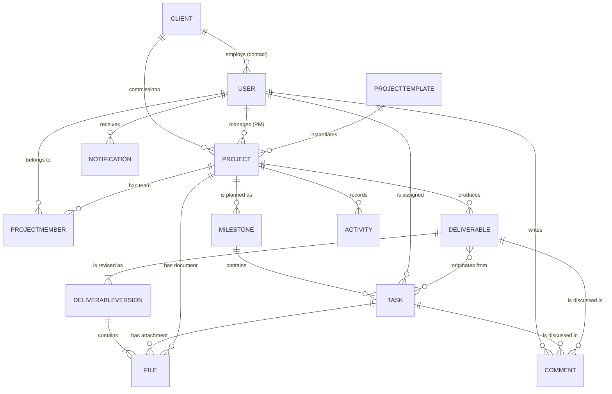
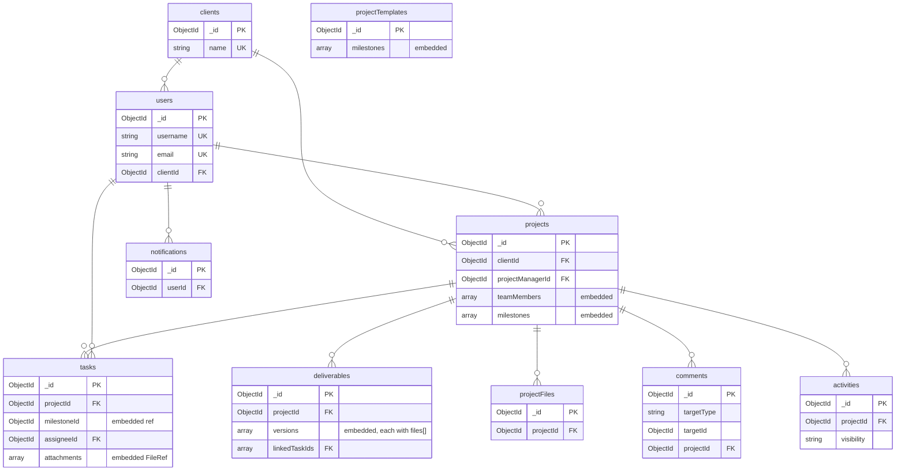

# AgencyFlow — Database Design (MongoDB)

| Field | Value |
|---|---|
| **Document ID** | `06-Database-Design` |
| **Project** | AgencyFlow |
| **Phase** | Phase 4 — Database Design |
| **Version** | 1.0 |
| **Date** | 2026-07-30 |
| **Author** | Senior Software Architect |
| **Status** | **Approved — 2026-07-30** |
| **Binding inputs** | `01-SRS` v1.1 · `05-Software-Architecture` v1.0 · **ADR-0003** · **ADR-0004** |
| **DBMS** | MongoDB 7.x (Atlas), accessed via Mongoose |

---

## Document Control

| Version | Date | Author | Change |
|---|---|---|---|
| 1.0 | 2026-07-30 | Architect | Initial database design derived from the frozen requirement baseline and ADR-0004 |

| Role | Name | Decision | Date |
|---|---|---|---|
| Project Owner | Yassine | ☑ **Approved** | 2026-07-30 |

---

## Table of Contents

1. [Introduction and Method](#1-introduction-and-method)
2. [Design Principles](#2-design-principles)
3. [MCD — Conceptual Data Model](#3-mcd--conceptual-data-model)
4. [MLD — Logical Data Model](#4-mld--logical-data-model)
5. [Common Structures](#5-common-structures)
6. [Enumerations](#6-enumerations)
7. [MPD — Physical Data Model](#7-mpd--physical-data-model)
8. [Index Strategy](#8-index-strategy)
9. [Referential Integrity](#9-referential-integrity)
10. [Soft Delete, Archive and Audit](#10-soft-delete-archive-and-audit)
11. [Sample Documents](#11-sample-documents)
12. [Naming Conventions](#12-naming-conventions)
13. [Volume and Sizing Analysis](#13-volume-and-sizing-analysis)
14. [Design Validation](#14-design-validation)
15. [Risks and Open Questions](#15-risks-and-open-questions)

---

## 1. Introduction and Method

### 1.1 Purpose

This document defines the complete data model for AgencyFlow: what is stored, in what shape, with what constraints, and with what indexes. It is the binding input to Phase 5 (UML), Phase 6 (Backend Design), and Phase 8 (Implementation).

### 1.2 Method — Merise applied to a document database

The three-level Merise progression (**MCD → MLD → MPD**) is used, because separating *what the business means* from *how it is stored* from *how the engine stores it* is exactly the discipline a document model needs.

However, one adaptation must be stated explicitly, because getting it wrong is the most common failure in MongoDB projects:

> **The classical MCD → MLD translation rules are relational.** They say: every entity becomes a table, every 1:N relationship becomes a foreign key, every N:N becomes a junction table, and normalize to 3NF.
>
> **Applying those rules unchanged to MongoDB produces a relational schema stored in a document database** — the worst of both worlds. You lose join support without gaining locality, and every screen becomes a fan-out of queries.

The adaptation used here:

| Level | Relational Merise | This document |
|---|---|---|
| **MCD** | Entities, attributes, relationships, cardinalities — **technology-free** | ✅ **Identical.** The conceptual model is the business, and the business does not change with the DBMS |
| **MLD** | Entity → table, relationship → foreign key, normalize | ⚠️ **Adapted.** Entity → collection **or embedded document**, decided by *lifecycle, boundedness, and access pattern* |
| **MPD** | Columns, SQL types, constraints, indexes | ✅ **Equivalent.** Fields, BSON types, validation rules, indexes |

The MLD decisions were made and justified in **ADR-0004**; §4 restates them with their reasoning so this document stands alone.

### 1.3 Out of scope

Class diagrams, sequence diagrams, and state diagrams are **Phase 5**. Mongoose schema code, repositories, and migrations are **Phase 8**. The entity-relationship diagrams below are **Merise/ER notation**, not UML.

---

## 2. Design Principles

Each principle traces to a driver. None is stylistic.

| # | Principle | Driver |
|---|---|---|
| **P-1** | **Model for access patterns, not for normal forms.** Shape follows the queries the dashboards actually make | NFR-12, NFR-13 |
| **P-2** | **Embed when bounded, always read together, and lifecycle-dependent. Reference otherwise** | ADR-0004 |
| **P-3** | **Never store a value that can be derived.** Milestone status and progress are computed on read | BR-08, ADR-0004 §3 |
| **P-4** | **Every unique index is partial on `deletedAt: null`** | BR-30 — otherwise soft delete permanently blocks reuse of emails and names |
| **P-5** | **Every collection carries a scoping field** the `AccessScope` can filter on without a lookup | BR-10, `05-Architecture` §11.3 |
| **P-6** | **All timestamps stored UTC.** Locale conversion is a presentation concern | NFR-05, ADR-0004 §8 |
| **P-7** | **Soft delete everywhere; physical deletion never** | BR-30 |
| **P-8** | **Referential integrity is enforced in the application**, deliberately and explicitly, because MongoDB does not enforce it | §9 |
| **P-9** | **Every array has a documented upper bound**, enforced in the service layer | 16 MB document limit |

---

## 3. MCD — Conceptual Data Model

Technology-free. This is the business, and it would be identical for PostgreSQL.

### 3.1 Entities and their conceptual meaning

| # | Entity | Conceptual definition | Identifying attributes |
|---|---|---|---|
| E-01 | **User** | A person who can authenticate. Holds exactly one role | username, email |
| E-02 | **Client** | A client **organization** commissioning work | name |
| E-03 | **Project** | A body of work delivered for one Client | name + client |
| E-04 | **ProjectMember** | The fact that a Team Member belongs to a Project's team | project + user |
| E-05 | **Milestone** | A named stage of a Project's roadmap | project + name |
| E-06 | **Task** | A unit of work within a Milestone, owned by one Team Member | milestone + title |
| E-07 | **Deliverable** | A formal Project output submitted for Client approval | project + name |
| E-08 | **DeliverableVersion** | One revision of a Deliverable, preserved for audit | deliverable + versionNumber |
| E-09 | **File** | An uploaded document | originalName + context |
| E-10 | **Comment** | A flat message attached to a Task or a Deliverable | — |
| E-11 | **Notification** | An in-app alert addressed to one User | — |
| E-12 | **Activity** | An immutable record of a business event | — |
| E-13 | **ProjectTemplate** | A reusable set of standard Milestones | name |

### 3.2 Conceptual relationships and cardinalities

| # | Relationship | Cardinality | Rule |
|---|---|---|---|
| R-01 | Client **employs** User *(as contact)* | 1 : 0..N | BR-09 — only for role Client Contact |
| R-02 | Client **commissions** Project | 1 : 0..N | BR-03 |
| R-03 | User **manages** Project *(as PM)* | 1 : 0..N | BR-24 — exactly one PM per project |
| R-04 | User **belongs to** Project *(as member)* | 0..N : 0..N via ProjectMember | BR-23 |
| R-05 | Project **is planned as** Milestone | 1 : 0..N | A-02 — a project may have none |
| R-06 | Milestone **contains** Task | 1 : 0..N | A-02 |
| R-07 | User **is assigned** Task | 1 : 0..N | BR-03 — exactly one assignee |
| R-08 | Project **produces** Deliverable | 1 : 0..N | A-04 — belongs to Project, not Milestone |
| R-09 | Deliverable **is revised as** DeliverableVersion | 1 : 1..N | BR-06 — at least one version always exists |
| R-10 | Deliverable **originates from** Task | 0..N : 0..N | A-05 — optional |
| R-11 | DeliverableVersion **contains** File | 1 : 1..N | FR-047 — submission requires ≥ 1 file |
| R-12 | Task **has attachment** File | 1 : 0..N | BR-16 |
| R-13 | Project **has document** File | 1 : 0..N | BR-16, BR-27 |
| R-14 | User **writes** Comment | 1 : 0..N | — |
| R-15 | Task \| Deliverable **is discussed in** Comment | 1 : 0..N | BR-14 — visibility differs by target |
| R-16 | User **receives** Notification | 1 : 0..N | BR-17 |
| R-17 | Project **records** Activity | 1 : 0..N | BR-21 |
| R-18 | ProjectTemplate **instantiates** Project | 1 : 0..N | FR-076 |

### 3.3 MCD diagram



### 3.4 Conceptual integrity rules

Business truths that constrain the model regardless of storage:

| # | Rule | Source |
|---|---|---|
| CIR-1 | A User has `skill` **if and only if** their role is Team Member | BR-02 |
| CIR-2 | A User has a Client **if and only if** their role is Client Contact | BR-09 |
| CIR-3 | A Task's assignee must be a member of the Task's Project | BR-23 |
| CIR-4 | Milestone status and progress are **never stored** | BR-08 |
| CIR-5 | A Deliverable's versions are **append-only** | BR-06, BR-07 |
| CIR-6 | A Task in `Blocked` must have a non-empty reason | BR-22 |
| CIR-7 | Every Activity is either client-visible or internal — never both, never neither | BR-21 |

---

## 4. MLD — Logical Data Model

Where the conceptual model meets MongoDB. **13 conceptual entities → 10 collections.**

### 4.1 The decision rule applied

For each entity: *Is it queried independently? Is its volume bounded? Does it share its parent's lifecycle?*

| Entity | Independent? | Bounded? | Shares lifecycle? | → Decision |
|---|:--:|:--:|:--:|---|
| User | Yes | — | No | 📦 Collection `users` |
| Client | Yes | — | No | 📦 Collection `clients` |
| Project | Yes | — | No | 📦 Collection `projects` |
| **ProjectMember** | **No** | **Yes ~3–10** | **Yes** | 🔗 Embed → `projects.teamMembers[]` |
| **Milestone** | **No** | **Yes ~5–15** | **Yes** | 🔗 Embed → `projects.milestones[]` |
| Task | **Yes** | **No — up to 500/project** | No | 📦 Collection `tasks` |
| Deliverable | Yes | — | No | 📦 Collection `deliverables` |
| **DeliverableVersion** | **No** | **Yes ~1–5** | **Yes** | 🔗 Embed → `deliverables.versions[]` |
| File — deliverable | No | Yes | Yes | 🔗 Embed → `deliverables.versions[].files[]` |
| File — task | No | Yes | Yes | 🔗 Embed → `tasks.attachments[]` |
| **File — project** | **Yes** | **No — unbounded** | No | 📦 Collection `projectFiles` |
| Comment | Yes | **No** | No | 📦 Collection `comments` |
| Notification | Yes | No | No | 📦 Collection `notifications` |
| Activity | Yes | No | No | 📦 Collection `activities` |
| ProjectTemplate | Yes | — | No | 📦 Collection `projectTemplates` |

### 4.2 The ten collections



### 4.3 Justification of the four non-obvious decisions

**① `teamMembers` embedded rather than a join collection.**
Bounded at roughly 3–10 entries. The only queries are "who is on this project" — already loaded with the project — and "which projects am I on", answered by a multikey index on `teamMembers.userId`. A separate collection would add a lookup to every project read and deliver nothing.

**② `milestones` embedded rather than their own collection.**
Bounded at roughly 5–15, meaningless outside their project, and always displayed with it. Reordering becomes a single atomic document update instead of N updates that could interleave. Each milestone carries its own `_id` so tasks can reference it.

*Consequence:* `ProjectsModule` becomes the **sole writer** of the project document (`05-Architecture` §6.1), which is precisely why a separate `MilestonesModule` was rejected — two modules writing one document is the classic route to lost updates.

**③ `versions` embedded rather than their own collection.**
Typically 1–5, always read with the parent, never queried alone. The decisive argument is not performance but **correctness**: appending to an array and never touching earlier elements is a *structural* guarantee of BR-06 and BR-07. A separate collection would leave an `UPDATE` path open that only convention keeps closed.

**④ Files split by growth characteristic.**
Deliverable files and task attachments are bounded and lifecycle-bound → embedded. **Project files are unbounded** — a year-long engagement accumulates contracts, briefs, and brand assets indefinitely, and clients upload here too (BR-27) — and they need their own listing and pagination → own collection.

*On the apparent inconsistency:* a single **`FileRef`** structure (§5.2) is used identically in all three places. The shape is uniform; only the location differs, and it differs for a stated reason.

### 4.4 ⚠️ Design refinement: file download routes

`05-Architecture` §5 sketched a global `GET /api/v1/files/:id`. **The MLD makes that the wrong shape.** With file metadata embedded in two collections and stored in a third, a global id would require searching three collections on every download.

> **Refinement — file access is context-scoped:**
> `GET /deliverables/:deliverableId/versions/:versionNumber/files/:fileId`
> `GET /tasks/:taskId/attachments/:fileId`
> `GET /project-files/:projectFileId`
>
> Each route reaches its permission context directly, so the BR-10 / BR-28 check is a natural consequence of the route rather than a lookup chain. This **improves** the security posture and costs nothing. The endpoint list is finalized in Phase 6.

---

## 5. Common Structures

Defined once, used everywhere. Uniformity here is what makes the audit and soft-delete strategy enforceable.

### 5.1 Audit block

| Field | Type | Required | Notes |
|---|---|---|---|
| `createdAt` | Date (UTC) | Yes | Set on insert, never modified |
| `createdBy` | ObjectId → users | Yes | The acting user. `null` only for system-seeded records |
| `updatedAt` | Date (UTC) | Yes | Refreshed on every write |
| `updatedBy` | ObjectId → users | Yes | — |
| `deletedAt` | Date (UTC) \| null | No | `null` = live. **The single indicator of deletion** |
| `deletedBy` | ObjectId → users \| null | No | — |

**Applied to all collections except `activities`,** which omits `updatedAt` / `updatedBy` — see §5.4.

### 5.2 `FileRef` — embedded value object

Used in `deliverables.versions[].files[]`, `tasks.attachments[]`, and as the file block of `projectFiles`.

| Field | Type | Required | Constraint |
|---|---|---|---|
| `_id` | ObjectId | Yes | Addressable within its context (§4.4) |
| `originalName` | String | Yes | 1–255 chars; sanitized, never used as a filesystem path |
| `mimeType` | String | Yes | Validated **server-side** against BR-15 — the client-declared value is not trusted (NFR-24) |
| `extension` | String | Yes | Lowercase, in the BR-15 allow-list |
| `sizeBytes` | Int32 | Yes | 1 – **20 971 520** (20 MB, BR-15) |
| `storageKey` | String | Yes | Cloudinary `public_id` (ADR-0003). **Never exposed to the client** |
| `uploadedById` | ObjectId → users | Yes | — |
| `uploadedAt` | Date (UTC) | Yes | — |

> **Considered and rejected:** a `storageProvider` field for future multi-provider support. ADR-0003 records a migration trigger, but a provider change would be a one-time backfill script — cheaper than carrying a field every document pays for and nothing reads. This is YAGNI applied consistently rather than selectively.

### 5.3 Reference field convention

All cross-collection references are `ObjectId` named `<entity>Id` or `<entity>Ids`. **No DBRefs** — they add indirection with no driver support worth having.

### 5.4 Immutability of `activities`

`activities` carries `createdAt` / `createdBy` and **no `updatedAt` / `updatedBy`**. A schema with no way to record a modification is a structure that cannot be modified — a stronger guarantee than a comment.

> **Clarification of ADR-0004.** ADR-0004 §7 says `activities` omits update fields, while §6 requires cascading `deletedAt` on project deletion. These are reconciled here: **`activities` carries `deletedAt` / `deletedBy` but not `updatedAt` / `updatedBy`.** Content is immutable; lifecycle is not. Recording this rather than silently choosing one — a design document that contradicts itself is worse than one that admits the tension.

---

## 6. Enumerations

Stored as uppercase strings, not integers. Strings cost a few bytes and make every document self-describing in the shell, in logs, and in Compass — worth far more than the saving at this scale.

| Enum | Values | Applies to |
|---|---|---|
| **Role** | `ADMINISTRATOR` · `PROJECT_MANAGER` · `TEAM_MEMBER` · `CLIENT_CONTACT` | `users.role` |
| **Skill** | `BACKEND` · `FRONTEND` · `UI_UX` · `GRAPHIC_DESIGN` · `QA` | `users.skill` (A-01) |
| **ProjectStatus** | `PLANNED` · `IN_PROGRESS` · `ON_HOLD` · `COMPLETED` · `CANCELLED` | `projects.status` |
| **MilestoneStatus** | `NOT_STARTED` · `IN_PROGRESS` · `COMPLETED` | **Computed — never stored** |
| **TaskStatus** | `TODO` · `IN_PROGRESS` · `IN_REVIEW` · `DONE` · `BLOCKED` · `CANCELLED` | `tasks.status` |
| **DeliverableStatus** | `DRAFT` · `SUBMITTED` · `UNDER_REVIEW` · `APPROVED` · `CHANGES_REQUESTED` | `deliverables.status` |
| **VersionOutcome** | `PENDING` · `APPROVED` · `CHANGES_REQUESTED` | `deliverables.versions[].outcome` |
| **CommentTargetType** | `TASK` · `DELIVERABLE` | `comments.targetType` |
| **ActivityVisibility** | `CLIENT_VISIBLE` · `INTERNAL` | `activities.visibility` (BR-21) |
| **ActivityType** | `PROJECT_CREATED` · `PROJECT_STATUS_CHANGED` · `MILESTONE_COMPLETED` · `DELIVERABLE_SUBMITTED` · `DELIVERABLE_APPROVED` · `DELIVERABLE_CHANGES_REQUESTED` · `DELIVERABLE_COMMENTED` · `DELIVERABLE_FILE_UPLOADED` · `TASK_CREATED` · `TASK_ASSIGNED` · `TASK_STATUS_CHANGED` · `TASK_COMMENTED` · `TASK_ATTACHMENT_UPLOADED` · `PROJECT_FILE_UPLOADED` · `TEAM_MEMBER_ADDED` · `TEAM_MEMBER_REMOVED` | `activities.type` |
| **NotificationType** | `TASK_ASSIGNED` · `TASK_STATUS_CHANGED` · `DELIVERABLE_SUBMITTED` · `DELIVERABLE_APPROVED` · `DELIVERABLE_CHANGES_REQUESTED` · `COMMENT_CREATED` · `USER_MENTIONED` | `notifications.type` |

> ⚠️ **`TaskStatus`, `ProjectStatus`, and `MilestoneStatus` are three separate types** that happen to share the member `IN_PROGRESS`. They shall **never** be unified into one enum — that would couple three independent state machines, and a change to one would silently alter the others (ADR-0004 §9).

---

## 7. MPD — Physical Data Model

Field-level specification. `PK` = primary key · `FK` = application-enforced reference · `UK` = unique.

Validation is expressed in **Mongoose schemas** as the single source of truth. Collection-level `$jsonSchema` validators were considered as defence in depth and deferred — maintaining two definitions of the same constraint invites divergence, and NFR-32 requires one authoritative place per rule.

---

### 7.1 `users`

| Field | Type | Req | Constraints / Validation |
|---|---|:--:|---|
| `_id` | ObjectId | ✅ | PK |
| `name` | String | ✅ | 2–100 chars, trimmed |
| `username` | String | ✅ | **UK partial**. Lowercase, 3–30, `^[a-z0-9][a-z0-9._-]{1,28}[a-z0-9]$`. **Immutable after creation** (BR-33, A-13) |
| `email` | String | ✅ | **UK partial**. Lowercase, trimmed, RFC-shaped |
| `passwordHash` | String | ✅ | bcrypt, cost ≥ 10. **Never returned by any query projection** (NFR-18) |
| `role` | Role | ✅ | Enum §6 |
| `skill` | Skill | ⚠️ | **Required ⟺ `role = TEAM_MEMBER`; forbidden otherwise** (CIR-1) |
| `clientId` | ObjectId → `clients` | ⚠️ | **Required ⟺ `role = CLIENT_CONTACT`; forbidden otherwise** (CIR-2) |
| `isActive` | Boolean | ✅ | Default `true`. Authentication gate — **distinct from `deletedAt`** |
| *audit block* | — | ✅ | §5.1 |

**Invariants** — enforced in `UsersService`, not merely by field presence:
- CIR-1 and CIR-2 are conditional-required rules. A `TEAM_MEMBER` without `skill`, or an `ADMINISTRATOR` carrying `clientId`, is rejected.
- **BR-32:** deactivation is refused while the user has tasks that are neither `DONE` nor `CANCELLED`.
- **A-10:** the last active `ADMINISTRATOR` cannot be deactivated or deleted.

---

### 7.2 `clients`

| Field | Type | Req | Constraints |
|---|---|:--:|---|
| `_id` | ObjectId | ✅ | PK |
| `name` | String | ✅ | **UK partial**. 2–150, trimmed |
| `contactEmail` | String | ❌ | Organization-level contact; distinct from contact accounts |
| `contactPhone` | String | ❌ | — |
| `address` | String | ❌ | ≤ 300 |
| `notes` | String | ❌ | ≤ 2000 |
| `archivedAt` | Date \| null | ❌ | FR-018 |
| `archivedBy` | ObjectId → `users` \| null | ❌ | — |
| *audit block* | — | ✅ | §5.1 |

**Rule:** while `archivedAt` is set, new projects cannot be created for this client; existing projects remain fully accessible (ADR-0004 §6).

---

### 7.3 `projects` — the central aggregate

| Field | Type | Req | Constraints |
|---|---|:--:|---|
| `_id` | ObjectId | ✅ | PK |
| `name` | String | ✅ | 2–150, trimmed |
| `description` | String | ❌ | ≤ 5000 |
| `clientId` | ObjectId → `clients` | ✅ | **FK. Exactly one** (BR-03). **The BR-10 scoping field** |
| `projectManagerId` | ObjectId → `users` | ✅ | FK. Exactly one; role must be `PROJECT_MANAGER` or `ADMINISTRATOR` (BR-24) |
| `status` | ProjectStatus | ✅ | Default `PLANNED`. Transitions per SRS §6.4 |
| `startDate` | Date (UTC) | ✅ | — |
| `endDate` | Date (UTC) | ✅ | **≥ `startDate`** |
| `templateId` | ObjectId → `projectTemplates` \| null | ❌ | Provenance only; later template edits never affect the project (FR-076) |
| **`teamMembers`** | Array&lt;TeamMember&gt; | ✅ | Default `[]`. **Max 50** (P-9) |
| **`milestones`** | Array&lt;Milestone&gt; | ✅ | Default `[]`. **Max 50** (P-9) |
| `archivedAt` | Date \| null | ❌ | FR-027 — archived projects are read-only |
| `archivedBy` | ObjectId \| null | ❌ | — |
| *audit block* | — | ✅ | §5.1 |

#### Embedded — `teamMembers[]`

| Field | Type | Req | Constraints |
|---|---|:--:|---|
| `userId` | ObjectId → `users` | ✅ | **Unique within the array.** Role must be `TEAM_MEMBER` |
| `addedAt` | Date (UTC) | ✅ | — |
| `addedById` | ObjectId → `users` | ✅ | — |

#### Embedded — `milestones[]`

| Field | Type | Req | Constraints |
|---|---|:--:|---|
| `_id` | ObjectId | ✅ | Explicitly generated; referenced by `tasks.milestoneId` |
| `name` | String | ✅ | 2–150 |
| `description` | String | ❌ | ≤ 2000 |
| `dueDate` | Date (UTC) | ❌ | — |
| `order` | Int32 | ✅ | ≥ 0, **unique within the array**. Defines roadmap sequence |
| `createdAt` | Date (UTC) | ✅ | — |
| `createdById` | ObjectId → `users` | ✅ | — |

> ### 🔴 `milestones[]` has **no `status` and no `progress` field**
>
> This is the most important single statement in this document, and the omission is deliberate.
>
> **BR-08** requires both to be computed. **ADR-0004 §3** chose computation on read. Storing them — even "as a cache" — creates a value that can disagree with the tasks it summarises, and numeric corruption is silent: no error, no crash, just a wrong percentage shown to a client.
>
> Both are derived by aggregating `tasks` grouped by `milestoneId`, excluding `CANCELLED` (BR-12):
>
> ```
> progress = count(status = DONE) / count(status ≠ CANCELLED) × 100     // 0 when denominator = 0
> status   = COMPLETED   when all non-cancelled tasks are DONE and count > 0
>            NOT_STARTED when no non-cancelled task has left TODO
>            IN_PROGRESS otherwise
> ```
>
> Adding these fields later — should the migration trigger in ADR-0004 §3 be met — is a deliberate, measured decision. It is not a shortcut to be taken during implementation.

---

### 7.4 `tasks`

| Field | Type | Req | Constraints |
|---|---|:--:|---|
| `_id` | ObjectId | ✅ | PK |
| `projectId` | ObjectId → `projects` | ✅ | FK. **Scoping field** (P-5) |
| `milestoneId` | ObjectId | ✅ | References an **embedded** `projects.milestones[]._id`. Application-enforced (§9) |
| `title` | String | ✅ | 2–200, trimmed |
| `description` | String | ❌ | ≤ 5000 |
| `assigneeId` | ObjectId → `users` | ✅ | **Exactly one** (BR-03). Must be in the project's `teamMembers[]` (BR-23) |
| `status` | TaskStatus | ✅ | Default `TODO`. Transitions per SRS §6.1 |
| `dueDate` | Date (UTC) | ❌ | Drives due-soon / overdue (BR-20) |
| `blockedReason` | String \| null | ⚠️ | **Required ⟺ `status = BLOCKED`.** Non-empty after trimming (BR-22, CIR-6) |
| `blockedAt` | Date \| null | ❌ | — |
| `blockedById` | ObjectId \| null | ❌ | — |
| `completedAt` | Date \| null | ❌ | Set when entering `DONE` |
| `completedById` | ObjectId \| null | ❌ | **The PM who approved it** — the audit trail for BR-04 |
| `attachments` | Array&lt;FileRef&gt; | ✅ | Default `[]`. **Max 20** (P-9) |
| *audit block* | — | ✅ | §5.1 |

**Invariants** — in `TasksService`:
- **BR-04:** only `PROJECT_MANAGER` / `ADMINISTRATOR` may set `DONE`, and only from `IN_REVIEW`.
- **BR-26:** a Team Member may modify only tasks where `assigneeId` is their own id.
- **BR-22:** clearing `BLOCKED` clears `blockedReason`, `blockedAt`, `blockedById`.

---

### 7.5 `deliverables`

| Field | Type | Req | Constraints |
|---|---|:--:|---|
| `_id` | ObjectId | ✅ | PK |
| `projectId` | ObjectId → `projects` | ✅ | FK. **Scoping field** (A-04) |
| `name` | String | ✅ | 2–150 |
| `description` | String | ❌ | ≤ 5000 |
| `dueDate` | Date (UTC) | ❌ | — |
| `status` | DeliverableStatus | ✅ | Default `DRAFT`. Transitions per SRS §6.2 |
| `currentVersionNumber` | Int32 | ✅ | Default `1`. Always equals `versions.length` |
| **`versions`** | Array&lt;Version&gt; | ✅ | **Append-only** (BR-06). Min 1, **max 30** (P-9) |
| `linkedTaskIds` | Array&lt;ObjectId&gt; | ✅ | Default `[]`. Optional (A-05). Max 50 |
| `reviewStartedAt` | Date \| null | ❌ | Set by `start-review` (FR-081, BR-31) |
| `reviewStartedById` | ObjectId \| null | ❌ | The Client Contact who started it |
| `approvedAt` | Date \| null | ❌ | Terminal (BR-07) |
| `approvedById` | ObjectId \| null | ❌ | **The client's formal acceptance record** |
| *audit block* | — | ✅ | §5.1 |

#### Embedded — `versions[]`

| Field | Type | Req | Constraints |
|---|---|:--:|---|
| `versionNumber` | Int32 | ✅ | Starts at 1, increments by 1, **unique within the array** |
| `files` | Array&lt;FileRef&gt; | ✅ | **≥ 1 required to submit** (FR-047). Max 20 |
| `submittedAt` | Date \| null | ❌ | Null while the version is still a draft |
| `submittedById` | ObjectId \| null | ❌ | The PM (BR-05) |
| `outcome` | VersionOutcome | ✅ | Default `PENDING` |
| `decidedAt` | Date \| null | ❌ | — |
| `decidedById` | ObjectId \| null | ❌ | The Client Contact |
| `decisionComment` | String \| null | ⚠️ | **Required ⟺ `outcome = CHANGES_REQUESTED`** (FR-049) |
| `createdAt` | Date (UTC) | ✅ | — |

**Invariants** — in `DeliverablesService`:
- **BR-06:** requesting changes appends a new version. Elements at index `< versions.length - 1` are **never** written to again.
- **BR-07:** once `status = APPROVED`, every write to the document is refused — no edits, no new versions, no file deletions, no un-approval.
- **BR-31:** `UNDER_REVIEW` is reachable only through the explicit `start-review` command. No read touches this document.
- **BR-05:** only the owning PM or an Administrator may submit.

---

### 7.6 `projectFiles`

| Field | Type | Req | Constraints |
|---|---|:--:|---|
| `_id` | ObjectId | ✅ | PK |
| `projectId` | ObjectId → `projects` | ✅ | FK. **Scoping field** |
| `file` | FileRef | ✅ | §5.2 |
| `description` | String | ❌ | ≤ 500 |
| *audit block* | — | ✅ | §5.1 |

**Rule (BR-27):** Client Contacts may create documents here **only** where `projectId` belongs to their own organization. Team Members may read but not create (SRS §8).

---

### 7.7 `comments`

| Field | Type | Req | Constraints |
|---|---|:--:|---|
| `_id` | ObjectId | ✅ | PK |
| `targetType` | CommentTargetType | ✅ | `TASK` \| `DELIVERABLE` |
| `targetId` | ObjectId | ✅ | The task or deliverable |
| `projectId` | ObjectId → `projects` | ✅ | **Denormalized — see below** |
| `authorId` | ObjectId → `users` | ✅ | — |
| `body` | String | ✅ | 1–5000, non-empty after trimming |
| `mentionedUserIds` | Array&lt;ObjectId&gt; | ✅ | Default `[]`. Resolved at write time (BR-33). Max 20 |
| *audit block* | — | ✅ | §5.1 |

> **Why `projectId` is denormalized here.** It is derivable from `targetType` + `targetId`, so storing it duplicates data. It is stored anyway because **BR-10 scoping would otherwise require a lookup into `tasks` or `deliverables` on every comment query** — turning the most common read in the system into a two-step operation, and putting a join in the path of the security check.
>
> This is a **deliberate, bounded denormalization**: `projectId` is written once at creation and can never legitimately change, because a comment cannot move between projects. Denormalization is dangerous when the copied value mutates; here it cannot.
>
> **BR-14 is derived, not stored:** visibility follows from `targetType` — `TASK` comments are internal, `DELIVERABLE` comments are client-visible. Storing a visibility flag would allow it to contradict the target.

---

### 7.8 `notifications`

| Field | Type | Req | Constraints |
|---|---|:--:|---|
| `_id` | ObjectId | ✅ | PK |
| `userId` | ObjectId → `users` | ✅ | **Recipient. Scoping field** |
| `type` | NotificationType | ✅ | Enum §6 |
| `message` | String | ✅ | ≤ 500. Stored in **French** (NFR-01) |
| `targetType` | String | ✅ | `TASK` \| `DELIVERABLE` \| `PROJECT` |
| `targetId` | ObjectId | ✅ | Deep-link destination (FR-065) |
| `projectId` | ObjectId → `projects` | ✅ | Context and cascade |
| `triggeredById` | ObjectId → `users` \| null | ✅ | Never notify a user of their own action (DM-08) |
| `isRead` | Boolean | ✅ | Default `false` |
| `readAt` | Date \| null | ❌ | — |
| *audit block* | — | ✅ | §5.1 |

**Note:** notifications exist only for the seven event types in FR-064. Due-soon and overdue alerts are **computed on read and never stored** (BR-20).

---

### 7.9 `activities`

| Field | Type | Req | Constraints |
|---|---|:--:|---|
| `_id` | ObjectId | ✅ | PK |
| `projectId` | ObjectId → `projects` | ✅ | FK. **Scoping field** |
| `type` | ActivityType | ✅ | Enum §6 |
| `visibility` | ActivityVisibility | ✅ | **Derived from `type`, never client-supplied** (BR-21, CIR-7) |
| `actorId` | ObjectId → `users` | ✅ | Who performed the action |
| `targetType` | String | ✅ | `PROJECT` \| `MILESTONE` \| `TASK` \| `DELIVERABLE` \| `FILE` \| `COMMENT` |
| `targetId` | ObjectId | ✅ | — |
| `payload` | Object | ❌ | Type-specific context, e.g. `{ from: "TODO", to: "IN_PROGRESS" }`. ≤ 2 KB |
| `createdAt` | Date (UTC) | ✅ | — |
| `createdById` | ObjectId → `users` | ✅ | — |
| `deletedAt` | Date \| null | ❌ | Cascade only (§5.4) |
| `deletedBy` | ObjectId \| null | ❌ | — |

**No `updatedAt` / `updatedBy`** — the schema itself forbids modification (§5.4).

**`visibility` is set by the writing code from `type`**, using the fixed mapping in SRS §4 (BR-21). It is never accepted from a request, and never inferred at read time — which would put the security decision in the query path rather than the write path.

---

### 7.10 `projectTemplates`

| Field | Type | Req | Constraints |
|---|---|:--:|---|
| `_id` | ObjectId | ✅ | PK |
| `name` | String | ✅ | **UK partial**. 2–150 |
| `description` | String | ❌ | ≤ 2000 |
| `milestones` | Array&lt;TemplateMilestone&gt; | ✅ | Min 1, max 50 |
| *audit block* | — | ✅ | §5.1 |

#### Embedded — `milestones[]`

| Field | Type | Req | Constraints |
|---|---|:--:|---|
| `name` | String | ✅ | 2–150 |
| `description` | String | ❌ | ≤ 2000 |
| `order` | Int32 | ✅ | ≥ 0, unique within the array |

**Per A-06,** a template defines milestones only — no tasks, deliverables, or team assignments. Copying is **by value at creation**: later template edits never propagate to existing projects (FR-076).

---

## 8. Index Strategy

Every index below serves a named query. **An index with no query is write cost with no read benefit.**

### 8.1 Index catalogue

| # | Collection | Index | Type | Serves |
|---|---|---|---|---|
| 1 | `users` | `{ email: 1 }` | **Unique, partial** `deletedAt: null` | Login FR-001 · **P-4** |
| 2 | `users` | `{ username: 1 }` | **Unique, partial** `deletedAt: null` | Mentions FR-063 · **P-4** |
| 3 | `users` | `{ role: 1, skill: 1, isActive: 1 }` | Compound | Filtered user list FR-011 |
| 4 | `users` | `{ clientId: 1 }` | Sparse | Contacts of an organization FR-017 |
| 5 | `clients` | `{ name: 1 }` | **Unique, partial** `deletedAt: null` | FR-013 · **P-4** |
| 6 | `clients` | `{ archivedAt: 1, name: 1 }` | Compound | Default client list FR-015 |
| 7 | **`projects`** | `{ clientId: 1, deletedAt: 1 }` | Compound | 🔒 **BR-10 client isolation — the most security-critical index in the system** |
| 8 | `projects` | `{ projectManagerId: 1, status: 1 }` | Compound | PM dashboard FR-069 · BR-25 |
| 9 | **`projects`** | `{ "teamMembers.userId": 1 }` | **Multikey** | "Projects I belong to" BR-26 — *the index that makes embedding members viable* |
| 10 | `projects` | `{ status: 1, archivedAt: 1 }` | Compound | Admin dashboard FR-068 |
| 11 | `tasks` | `{ projectId: 1, milestoneId: 1, status: 1 }` | Compound | **Progress aggregation FR-031/032** · Kanban FR-044 |
| 12 | `tasks` | `{ assigneeId: 1, status: 1, dueDate: 1 }` | Compound | Team Member dashboard FR-070 · due-soon/overdue FR-072 |
| 13 | `tasks` | `{ projectId: 1, status: 1 }` | Compound | Task list and filter FR-043 |
| 14 | `tasks` | `{ status: 1, dueDate: 1 }` | Compound | Agency-wide overdue FR-068 |
| 15 | `deliverables` | `{ projectId: 1, status: 1 }` | Compound | Project deliverables FR-052 |
| 16 | `deliverables` | `{ status: 1, dueDate: 1 }` | Compound | "Awaiting client approval" FR-068/069 |
| 17 | `projectFiles` | `{ projectId: 1, deletedAt: 1, createdAt: -1 }` | Compound | Project file list FR-058 |
| 18 | `comments` | `{ targetType: 1, targetId: 1, createdAt: -1 }` | Compound | Comment thread FR-061 |
| 19 | `comments` | `{ projectId: 1 }` | Single | BR-10 scoping without a lookup (§7.7) |
| 20 | `notifications` | `{ userId: 1, isRead: 1, createdAt: -1 }` | Compound | Notification centre FR-065 |
| 21 | **`activities`** | `{ projectId: 1, visibility: 1, createdAt: -1 }` | Compound | Activity feed FR-067 — **BR-21 filtering built into the index** |
| 22 | `projectTemplates` | `{ name: 1 }` | **Unique, partial** `deletedAt: null` | FR-075 · **P-4** |
| 23 | `projects` | `{ name: "text", description: "text" }` | Text | Global search FR-074 |
| 24 | `tasks` | `{ title: "text", description: "text" }` | Text | Global search FR-074 |
| 25 | `deliverables` | `{ name: "text", description: "text" }` | Text | Global search FR-074 |

### 8.2 Design notes

**Compound index field order follows ESR — Equality, Sort, Range.** Index 12 puts `assigneeId` (equality) first, `status` (equality) next, `dueDate` (range) last. Reversing this makes the index unusable for the query it exists to serve.

**Index 21 embeds a security rule.** Placing `visibility` in the index means the client-visible activity feed is an index scan rather than a fetch-then-filter — the BR-21 restriction is applied by the storage engine, not by application code that could be skipped.

**Index 9 justifies decision ①.** Without a multikey index on `teamMembers.userId`, embedding team membership would force a collection scan for "my projects." With it, the query is as fast as a join collection would have been, at zero extra storage.

**⚠️ MongoDB permits only one text index per collection.** Indexes 23–25 are therefore one compound text index each, not several. Search (FR-074) is 🟡 Should — if it is not implemented, these three are not created.

**Partial unique indexes (1, 2, 5, 22) are non-negotiable.** Without the `deletedAt: null` filter, soft-deleting a user permanently reserves their email, and the system reports "already in use" for an account no interface can show.

### 8.3 Deliberately not indexed

| Not indexed | Why |
|---|---|
| `users.name` | Never a filter; searched by username and email |
| `activities.type` | Feeds filter by project and visibility, not by type |
| `tasks.blockedReason` | Free text, never queried |
| Any `updatedAt` | Never sorted or filtered on |
| Embedded `versions[]` fields | Always accessed through the parent deliverable |

---

## 9. Referential Integrity

**MongoDB enforces no foreign keys.** Every reference below is maintained by the application — deliberately, explicitly, and in one place per rule (NFR-32).

### 9.1 Reference catalogue

| Reference | Target | Enforcement |
|---|---|---|
| `users.clientId` | `clients._id` | Existence checked at creation; **immutable** (A-08) |
| `projects.clientId` | `clients._id` | Existence + not archived, at creation |
| `projects.projectManagerId` | `users._id` | Existence + role + active |
| `projects.teamMembers[].userId` | `users._id` | Existence + role `TEAM_MEMBER` + active + not already present |
| `projects.templateId` | `projectTemplates._id` | Existence at creation only; never re-read (FR-076) |
| **`tasks.milestoneId`** | `projects.milestones[]._id` | ⚠️ **Cross-document reference into an embedded array.** See below |
| `tasks.projectId` | `projects._id` | Existence; **immutable** — a task never moves project |
| `tasks.assigneeId` | `users._id` | Must be in that project's `teamMembers[]` (BR-23) |
| `deliverables.projectId` | `projects._id` | Existence; immutable |
| `deliverables.linkedTaskIds[]` | `tasks._id` | Must belong to the same project |
| `comments.targetId` | `tasks._id` \| `deliverables._id` | Existence, resolved by `targetType` |
| `comments.projectId` | `projects._id` | Derived at write from the target; never client-supplied |
| `activities.projectId` | `projects._id` | Set by the event listener |
| `notifications.userId` | `users._id` | Existence |

### 9.2 ⚠️ The one structurally weak reference

`tasks.milestoneId` points at an `_id` inside `projects.milestones[]`. No index and no constraint can protect it, and a milestone deleted while tasks still point at it leaves orphaned tasks that vanish from every milestone view while still existing.

**Three mitigations, layered:**

1. **FR-034** already refuses milestone deletion while non-cancelled tasks remain.
2. Task creation and milestone reassignment validate that `milestoneId` exists in that project's `milestones[]`.
3. A **consistency check** — tasks whose `milestoneId` matches no milestone in their project — is added to the Phase 9 test suite. It is the cheapest possible detector for the highest-risk integrity gap in the model.

> This weakness is a **direct consequence** of embedding milestones (decision ②) and is accepted knowingly. The alternative — a `milestones` collection — trades this risk for two modules writing one document and an extra query on every project read. Recording the trade-off is the point: a design document that hides its weak spots cannot be reviewed.

### 9.3 Cascade behaviour

Per ADR-0004 §6.

| Trigger | Effect |
|---|---|
| Client archived | Projects untouched. New projects blocked |
| Client deleted | **Refused** while non-deleted projects exist |
| Project archived | Everything beneath becomes read-only. **No cascading write** |
| **Project deleted** | **Cascade `deletedAt`** → `tasks`, `deliverables`, `projectFiles`, `comments`, `activities`, `notifications` of that project. Executed in a **transaction** |
| Milestone deleted | **Refused** while non-cancelled tasks remain (FR-034) |
| Team member removed | **Refused** while they hold open tasks (FR-024) |
| **User deactivated** | **Refused** while they hold non-`DONE`, non-`CANCELLED` tasks (BR-32) |
| User deleted | Never hard-deleted. Authorship retained everywhere |
| Deliverable approved | Document becomes immutable (BR-07) |
| Task cancelled | Excluded from progress. Comments and attachments retained |

> ⚠️ **Cascading project deletion spans six collections and must be transactional** — a partial cascade leaves orphaned tasks visible in dashboards. MongoDB transactions require a **replica set**: Atlas provides one, a plain single-node Docker container does not. See `05-Architecture` §12, AR-02.

---

## 10. Soft Delete, Archive and Audit

### 10.1 Three distinct lifecycle states

| Field | Meaning | Applies to | Effect |
|---|---|---|---|
| `isActive` | May authenticate | `users` | Login refused; all data intact and visible |
| `archivedAt` | Retired from active use | `clients`, `projects` | Hidden from default lists; **read-only**; fully retrievable |
| `deletedAt` | Soft-deleted | **All** | Excluded from every query; retained for history |

These are **not interchangeable**. A deactivated user is not deleted; an archived project is not deleted; and nothing is ever physically removed (BR-30, NFR-29).

### 10.2 Query default

**Every repository read implicitly filters `deletedAt: null`.** Retrieving deleted records requires an explicit, deliberate flag — available only to administrative operations.

This mirrors the `AccessScope` principle from `05-Architecture` §11.3: **the safe behaviour is the default, and the unsafe one must be asked for by name.** A soft-delete scheme where every query must remember to filter is a soft-delete scheme that leaks deleted records within a fortnight.

### 10.3 Audit coverage

| Collection | created | updated | deleted | archived |
|---|:--:|:--:|:--:|:--:|
| `users` | ✅ | ✅ | ✅ | — *(uses `isActive`)* |
| `clients` | ✅ | ✅ | ✅ | ✅ |
| `projects` | ✅ | ✅ | ✅ | ✅ |
| `tasks` | ✅ | ✅ | ✅ | — |
| `deliverables` | ✅ | ✅ | ✅ | — |
| `projectFiles` | ✅ | ✅ | ✅ | — |
| `comments` | ✅ | ✅ | ✅ | — |
| `notifications` | ✅ | ✅ | ✅ | — |
| **`activities`** | ✅ | **❌ by design** | ✅ *(cascade only)* | — |

### 10.4 Two audit trails that are business records, not metadata

| Field | Why it matters |
|---|---|
| `tasks.completedById` | The **proof of BR-04** — the record that a task was verified by someone other than its author |
| `deliverables.approvedById` + `approvedAt` | The **client's formal acceptance** — the whole purpose of PG-06, and the record an agency would rely on in a dispute |

Neither is decorative. Both are the reason the corresponding business rules exist.

---

## 11. Sample Documents

Illustrative values. `ObjectId`s are abbreviated for readability.

### 11.1 `users` — a Team Member

```json
{
  "_id": "ObjectId('64a1...0001')",
  "name": "Amine Benali",
  "username": "amine.benali",
  "email": "amine.benali@newdev.ma",
  "passwordHash": "$2b$12$K8x...  (never returned)",
  "role": "TEAM_MEMBER",
  "skill": "BACKEND",
  "isActive": true,
  "createdAt": "2026-07-30T09:12:00.000Z",
  "createdBy": "ObjectId('64a1...0000')",
  "updatedAt": "2026-07-30T09:12:00.000Z",
  "updatedBy": "ObjectId('64a1...0000')",
  "deletedAt": null,
  "deletedBy": null
}
```

*Note the absence of `clientId` — forbidden for internal roles (CIR-2).*

### 11.2 `users` — a Client Contact

```json
{
  "_id": "ObjectId('64a1...0007')",
  "name": "Salma Idrissi",
  "username": "salma.idrissi",
  "email": "s.idrissi@atlas-resto.ma",
  "passwordHash": "$2b$12$Qw9...",
  "role": "CLIENT_CONTACT",
  "clientId": "ObjectId('64a1...0100')",
  "isActive": true,
  "createdAt": "2026-07-30T10:02:00.000Z",
  "createdBy": "ObjectId('64a1...0002')",
  "updatedAt": "2026-07-30T10:02:00.000Z",
  "updatedBy": "ObjectId('64a1...0002')",
  "deletedAt": null,
  "deletedBy": null
}
```

*No `skill`; `clientId` present. This document is the anchor of BR-10 — every scoped query for this user filters on `clientId`.*

### 11.3 `projects` — with embedded team and milestones

```json
{
  "_id": "ObjectId('64a1...0200')",
  "name": "Refonte site vitrine Atlas Resto",
  "description": "Refonte complète du site vitrine et de la charte graphique.",
  "clientId": "ObjectId('64a1...0100')",
  "projectManagerId": "ObjectId('64a1...0002')",
  "status": "IN_PROGRESS",
  "startDate": "2026-08-03T00:00:00.000Z",
  "endDate": "2026-10-15T00:00:00.000Z",
  "templateId": "ObjectId('64a1...0900')",

  "teamMembers": [
    { "userId": "ObjectId('64a1...0001')", "addedAt": "2026-08-03T08:00:00.000Z", "addedById": "ObjectId('64a1...0002')" },
    { "userId": "ObjectId('64a1...0003')", "addedAt": "2026-08-03T08:01:00.000Z", "addedById": "ObjectId('64a1...0002')" }
  ],

  "milestones": [
    {
      "_id": "ObjectId('64a1...0201')",
      "name": "Analyse",
      "description": "Recueil des besoins et cadrage.",
      "dueDate": "2026-08-10T00:00:00.000Z",
      "order": 0,
      "createdAt": "2026-08-03T08:00:00.000Z",
      "createdById": "ObjectId('64a1...0002')"
    },
    {
      "_id": "ObjectId('64a1...0202')",
      "name": "Conception UI/UX",
      "dueDate": "2026-08-24T00:00:00.000Z",
      "order": 1,
      "createdAt": "2026-08-03T08:00:00.000Z",
      "createdById": "ObjectId('64a1...0002')"
    }
  ],

  "archivedAt": null,
  "archivedBy": null,
  "createdAt": "2026-08-03T07:58:00.000Z",
  "createdBy": "ObjectId('64a1...0002')",
  "updatedAt": "2026-08-05T14:22:00.000Z",
  "updatedBy": "ObjectId('64a1...0002')",
  "deletedAt": null,
  "deletedBy": null
}
```

> **Look at what is missing:** neither milestone has a `status` or `progress` field. Both are computed from `tasks` at read time (§7.3, BR-08). If you ever see those fields appear in this document, a business rule has been violated.

### 11.4 `tasks` — a blocked task

```json
{
  "_id": "ObjectId('64a1...0300')",
  "projectId": "ObjectId('64a1...0200')",
  "milestoneId": "ObjectId('64a1...0202')",
  "title": "Maquette page d'accueil",
  "description": "Version desktop et mobile.",
  "assigneeId": "ObjectId('64a1...0003')",
  "status": "BLOCKED",
  "dueDate": "2026-08-14T00:00:00.000Z",
  "blockedReason": "En attente de la charte graphique fournie par le client.",
  "blockedAt": "2026-08-08T11:30:00.000Z",
  "blockedById": "ObjectId('64a1...0003')",
  "completedAt": null,
  "completedById": null,
  "attachments": [
    {
      "_id": "ObjectId('64a1...0301')",
      "originalName": "wireframe-v1.pdf",
      "mimeType": "application/pdf",
      "extension": "pdf",
      "sizeBytes": 842113,
      "storageKey": "agencyflow/tasks/64a1_0300/wireframe-v1",
      "uploadedById": "ObjectId('64a1...0003')",
      "uploadedAt": "2026-08-07T16:05:00.000Z"
    }
  ],
  "createdAt": "2026-08-04T09:00:00.000Z",
  "createdBy": "ObjectId('64a1...0002')",
  "updatedAt": "2026-08-08T11:30:00.000Z",
  "updatedBy": "ObjectId('64a1...0003')",
  "deletedAt": null,
  "deletedBy": null
}
```

*`blockedReason` is non-empty because `status = BLOCKED` (CIR-6, BR-22).*

### 11.5 `deliverables` — two versions after a change request

```json
{
  "_id": "ObjectId('64a1...0400')",
  "projectId": "ObjectId('64a1...0200')",
  "name": "Charte graphique v1",
  "description": "Logo, palette, typographies.",
  "dueDate": "2026-08-20T00:00:00.000Z",
  "status": "APPROVED",
  "currentVersionNumber": 2,

  "versions": [
    {
      "versionNumber": 1,
      "files": [
        {
          "_id": "ObjectId('64a1...0401')",
          "originalName": "charte-v1.pdf",
          "mimeType": "application/pdf",
          "extension": "pdf",
          "sizeBytes": 3145728,
          "storageKey": "agencyflow/deliverables/64a1_0400/v1/charte-v1",
          "uploadedById": "ObjectId('64a1...0002')",
          "uploadedAt": "2026-08-18T10:00:00.000Z"
        }
      ],
      "submittedAt": "2026-08-18T10:05:00.000Z",
      "submittedById": "ObjectId('64a1...0002')",
      "outcome": "CHANGES_REQUESTED",
      "decidedAt": "2026-08-19T09:40:00.000Z",
      "decidedById": "ObjectId('64a1...0007')",
      "decisionComment": "La palette est trop sombre. Merci de proposer une variante plus claire.",
      "createdAt": "2026-08-18T09:55:00.000Z"
    },
    {
      "versionNumber": 2,
      "files": [
        {
          "_id": "ObjectId('64a1...0402')",
          "originalName": "charte-v2.pdf",
          "mimeType": "application/pdf",
          "extension": "pdf",
          "sizeBytes": 3301244,
          "storageKey": "agencyflow/deliverables/64a1_0400/v2/charte-v2",
          "uploadedById": "ObjectId('64a1...0002')",
          "uploadedAt": "2026-08-21T14:10:00.000Z"
        }
      ],
      "submittedAt": "2026-08-21T14:15:00.000Z",
      "submittedById": "ObjectId('64a1...0002')",
      "outcome": "APPROVED",
      "decidedAt": "2026-08-22T08:30:00.000Z",
      "decidedById": "ObjectId('64a1...0007')",
      "decisionComment": null,
      "createdAt": "2026-08-21T14:08:00.000Z"
    }
  ],

  "linkedTaskIds": ["ObjectId('64a1...0300')"],
  "reviewStartedAt": "2026-08-22T08:12:00.000Z",
  "reviewStartedById": "ObjectId('64a1...0007')",
  "approvedAt": "2026-08-22T08:30:00.000Z",
  "approvedById": "ObjectId('64a1...0007')",
  "createdAt": "2026-08-18T09:55:00.000Z",
  "createdBy": "ObjectId('64a1...0002')",
  "updatedAt": "2026-08-22T08:30:00.000Z",
  "updatedBy": "ObjectId('64a1...0007')",
  "deletedAt": null,
  "deletedBy": null
}
```

> **This document is the audit record BR-06 and BR-07 exist to produce.** Version 1 retains its original file, its rejection, and the client's exact words. Version 2 was appended, never overwriting it. Because `status = APPROVED`, this document is now closed to all writes.

### 11.6 `activities` — one internal, one client-visible

```json
{
  "_id": "ObjectId('64a1...0500')",
  "projectId": "ObjectId('64a1...0200')",
  "type": "TASK_STATUS_CHANGED",
  "visibility": "INTERNAL",
  "actorId": "ObjectId('64a1...0003')",
  "targetType": "TASK",
  "targetId": "ObjectId('64a1...0300')",
  "payload": { "from": "IN_PROGRESS", "to": "BLOCKED", "reason": "En attente de la charte graphique." },
  "createdAt": "2026-08-08T11:30:00.000Z",
  "createdById": "ObjectId('64a1...0003')",
  "deletedAt": null,
  "deletedBy": null
}
```

```json
{
  "_id": "ObjectId('64a1...0501')",
  "projectId": "ObjectId('64a1...0200')",
  "type": "DELIVERABLE_APPROVED",
  "visibility": "CLIENT_VISIBLE",
  "actorId": "ObjectId('64a1...0007')",
  "targetType": "DELIVERABLE",
  "targetId": "ObjectId('64a1...0400')",
  "payload": { "deliverableName": "Charte graphique v1", "versionNumber": 2 },
  "createdAt": "2026-08-22T08:30:00.000Z",
  "createdById": "ObjectId('64a1...0007')",
  "deletedAt": null,
  "deletedBy": null
}
```

*Neither carries `updatedAt`. The first is invisible to Salma Idrissi; the second appears in her feed (BR-21, BR-28).*

### 11.7 `comments` — with a mention

```json
{
  "_id": "ObjectId('64a1...0600')",
  "targetType": "TASK",
  "targetId": "ObjectId('64a1...0300')",
  "projectId": "ObjectId('64a1...0200')",
  "authorId": "ObjectId('64a1...0002')",
  "body": "@amine.benali peux-tu préparer l'intégration pendant qu'on attend la charte ?",
  "mentionedUserIds": ["ObjectId('64a1...0001')"],
  "createdAt": "2026-08-08T12:00:00.000Z",
  "createdBy": "ObjectId('64a1...0002')",
  "updatedAt": "2026-08-08T12:00:00.000Z",
  "updatedBy": "ObjectId('64a1...0002')",
  "deletedAt": null,
  "deletedBy": null
}
```

*`targetType = TASK` makes this comment internal (BR-14) — derived, not stored. `projectId` is denormalized so the BR-10 check needs no lookup (§7.7).*

---

## 12. Naming Conventions

Applied uniformly; consistent with `00-Project-Foundation.md` §12.4.

| Element | Convention | Examples |
|---|---|---|
| Collections | `camelCase`, **plural** | `users`, `projectFiles`, `projectTemplates` |
| Fields | `camelCase` | `createdAt`, `projectManagerId`, `blockedReason` |
| References | `<entity>Id` / `<entity>Ids` | `clientId`, `assigneeId`, `linkedTaskIds` |
| Booleans | `is` / `has` prefix | `isActive`, `isRead` |
| Timestamps | `<verb>At`, past participle | `createdAt`, `submittedAt`, `approvedAt`, `blockedAt` |
| Actor fields | `<verb>ById` | `createdBy`, `approvedById`, `uploadedById` |
| Enum values | `UPPER_SNAKE_CASE` | `IN_REVIEW`, `CHANGES_REQUESTED`, `CLIENT_VISIBLE` |
| Embedded arrays | `camelCase`, plural noun | `teamMembers`, `milestones`, `versions`, `attachments` |
| Indexes | `idx_<field>[_<field>][_unique]` | `idx_email_unique`, `idx_project_milestone_status` |

**Why `camelCase` and not `snake_case`:** field names cross the wire into JavaScript objects with zero transformation. `snake_case` in the database would force either a mapping layer or `snake_case` keys inside TypeScript that uses `camelCase` everywhere else. Consistency with the language beats a convention imported from SQL.

**One inconsistency, deliberately retained:** the audit block uses `createdBy` / `updatedBy` / `deletedBy` while domain fields use `createdById` / `uploadedById`. The audit block is a fixed, universal structure applied identically to all ten collections; renaming it for local consistency would make it harder to recognize as *the audit block*. Uniformity of a shared structure outweighs local naming symmetry — recorded here so it reads as a decision rather than an oversight.

---

## 13. Volume and Sizing Analysis

### 13.1 Estimates at the NFR-16 ceiling

| Collection | Documents | Avg size | Est. data |
|---|---|---|---|
| `users` | ~700 | 400 B | < 1 MB |
| `clients` | 300 | 500 B | < 1 MB |
| `projects` | 1 000 | ~4 KB *(embedded team + milestones)* | ~4 MB |
| **`tasks`** | **up to 500 000** | ~700 B | **~350 MB** |
| `deliverables` | ~10 000 | ~3 KB | ~30 MB |
| `projectFiles` | ~20 000 | 600 B | ~12 MB |
| `comments` | ~200 000 | 500 B | ~100 MB |
| `notifications` | ~500 000 | 400 B | ~200 MB |
| **`activities`** | **~1 000 000+** | 500 B | **~500 MB+** |
| `projectTemplates` | ~20 | 1 KB | < 1 MB |
| | | **Total** | **~1.2 GB + indexes** |

### 13.2 🔴 Two findings the numbers reveal

**① The MongoDB Atlas M0 free tier (512 MB) does not cover the NFR-16 ceiling.**

NFR-16's figures — 1 000 projects × 500 tasks — are **maxima the system must not break at**, not expected volumes. A real single agency runs perhaps 30 active projects with 40 tasks each: roughly 20 MB, comfortably inside the free tier.

> **Conclusion:** the free tier is sufficient for the internship, the demonstration, and realistic single-agency use. It would **not** support the stated ceiling. This is a documented limitation, not a defect — but it must be stated, because "we said it supports 1 000 projects" and "it runs on a 512 MB free tier" cannot both be true without qualification. Relevant to OQ-06.

**② `activities` is the collection that exhausts storage first — and it has no retention policy.**

Every business event writes an activity, forever. It is the largest collection by an order of magnitude and the only one that grows without any bound tied to business volume.

> **Recommendation:** accept unbounded growth for v1 (correct for a 6-day budget), and record the mitigation: a **TTL index** expiring internal activities after 12–24 months, with client-visible activities retained longer. Not a v1 feature; a known limitation with a named solution — which is what separates "we didn't think about it" from "we decided."

### 13.3 Document size ceilings

MongoDB's hard limit is **16 MB per document**. The realistic worst case here is a project with 50 milestones and 50 team members — roughly 25 KB, **0.15 %** of the limit. Every embedding decision has ample headroom, and the §7 array caps (P-9) keep it that way.

---

## 14. Design Validation

### 14.1 Business rule coverage

Every rule with a data-model consequence, and the structure that carries it.

| BR | Enforced by | Where |
|---|---|---|
| BR-02 | Conditional-required `skill`; role-only permissions | §7.1 CIR-1 |
| BR-03 | Single `assigneeId`, single `clientId` | §7.3, §7.4 |
| **BR-04** | `completedById` audit + service guard | §7.4, §10.4 |
| **BR-05** | `versions[].submittedById` + service guard | §7.5 |
| **BR-06** | Append-only `versions[]` array | §7.5, §11.5 |
| **BR-07** | Document closed to writes once `APPROVED` | §7.5 |
| **BR-08** | 🔴 **No `status`/`progress` field exists on milestones** | §7.3 |
| BR-09 | `users.clientId` + `clients` collection | §7.1, §7.2 |
| **BR-10** | Scoping field on every collection + index 7 | §8.1, P-5 |
| BR-12 | `CANCELLED` excluded in the aggregation | §7.3 |
| BR-13 | `passwordHash` bcrypt; no reset token fields | §7.1 |
| BR-14 | Derived from `comments.targetType` — not stored | §7.7 |
| BR-15 | `FileRef` size and type constraints | §5.2 |
| BR-16 | Three file contexts, three locations | §4.1 |
| BR-17 | `notifications` only; no email fields anywhere | §7.8 |
| BR-19 | Flat comments; `mentionedUserIds[]` | §7.7 |
| BR-20 | 🔴 **No stored deadline alerts** — computed | §7.8 |
| **BR-21** | `activities.visibility` + index 21 | §7.9, §8.1 |
| BR-22 | Conditional-required `blockedReason` | §7.4 CIR-6 |
| BR-23 | `teamMembers[]` checked before assignment | §7.3, §9.1 |
| BR-24 | Single `projectManagerId` | §7.3 |
| BR-25 / BR-26 | Scoping fields + indexes 8, 9 | §8.1 |
| BR-27 | `projectFiles` writable by Client Contacts | §7.6 |
| BR-28 | Task data unreachable from client-scoped queries | §8.1 |
| BR-30 | `deletedAt` on all collections + **partial unique indexes** | §10, P-4 |
| **BR-31** | `reviewStartedAt` set only by the explicit command | §7.5 |
| **BR-32** | Deactivation guard | §7.1, §9.3 |
| **BR-33** | `username` unique partial + immutable | §7.1, index 2 |

**Coverage: 28 of 28 data-relevant business rules.** BR-01, BR-11, BR-18, BR-29 have no data-model consequence — single-tenancy is architectural, no-registration is an absent endpoint, no-chat is an absent collection, and full-admin-permission is an absent restriction.

### 14.2 Requirement coverage

| Check | Result |
|---|---|
| Entities from SRS §5 modelled | **13 / 13** ✅ |
| Relationships from SRS §5.3 modelled | **18 / 18** ✅ |
| Data-relevant business rules structurally supported | **28 / 28** ✅ |
| Collections with a BR-10 scoping field | **10 / 10** ✅ |
| Unique indexes that are partial on `deletedAt` | **4 / 4** ✅ |
| Indexes traceable to a named query | **25 / 25** ✅ |
| Derived values stored anywhere | **0** ✅ |
| Arrays without a documented cap | **0** ✅ |

### 14.3 Anti-patterns explicitly avoided

| Anti-pattern | How it was avoided |
|---|---|
| Relational schema in a document DB | Embedding decided by lifecycle and boundedness, not by normal forms (§1.2) |
| Unbounded array growth | Every array capped; unbounded data given its own collection (P-9, §4.1) |
| Derived data stored and drifting | Milestone progress computed; comment visibility derived (§7.3, §7.7) |
| Soft delete breaking uniqueness | Partial unique indexes (P-4) |
| Security enforced only in queries | Scoping field on every collection; visibility in the index (§8.2) |
| Indexes "just in case" | Every index cites its query; §8.3 lists what is *not* indexed |
| Local timezone stored | UTC everywhere; conversion at presentation (P-6) |
| One shared status enum | Three separate state machines kept separate (§6) |

---

## 15. Risks and Open Questions

| ID | Risk | Likelihood | Impact | Mitigation |
|---|---|---|---|---|
| **DB-R1** | Orphaned `tasks.milestoneId` after milestone deletion | Medium | High | FR-034 guard + write validation + Phase 9 consistency check (§9.2) |
| **DB-R2** | Cascade delete partially applied without a transaction | Medium | High | Transactional cascade; **local Mongo must be a replica set** (§9.3, AR-02) |
| **DB-R3** | `activities` growth exhausts free-tier storage | Medium | Medium | Documented limitation; TTL index recorded as the future answer (§13.2) |
| **DB-R4** | Partial unique indexes omitted at creation | Low | **High** | Explicit in §8.1; verified by a Phase 9 test that soft-deletes and recreates a user |
| **DB-R5** | Progress aggregation slow on the Admin dashboard | Low | Medium | Indexes 11, 13; measured migration trigger (ADR-0004 §3) |
| **DB-R6** | Denormalized `comments.projectId` diverges | **Very low** | Medium | Written once, immutable — a comment cannot change project (§7.7) |

| ID | Open question | Needed by |
|---|---|---|
| ~~OQ-06~~ | ✅ **RESOLVED 2026-07-30.** MongoDB Atlas **M0 Free** · Cloudinary Free · Render (backend) · Vercel (frontend). The §13.2 scalability limits are accepted for an internship deliverable | Closed |
| ~~OQ-12~~ | ✅ **RESOLVED 2026-07-30.** `skill` remains a **fixed enum** on the User entity (§6, A-01). No `skills` collection in v1; it can be introduced later without disturbing the model, since the field would change from an enum string to an `ObjectId` reference | Closed |
| **OQ-13** | Should `activities` have a retention policy in v1? **Recommendation: no** — accept growth, document the limitation | Phase 10 |

### 15.1 Confirmed database tier (OQ-06)

**MongoDB Atlas M0 Free — 512 MB storage, shared cluster.**

| Consequence | Detail |
|---|---|
| ✅ Transactions available | M0 is a **3-node replica set**, so the transactional cascade in §9.3 works in production. **Local Docker MongoDB must be configured as a single-node replica set to match** (DB-R2) |
| ✅ Sufficient for realistic use | ~30 active projects ≈ 20 MB — well inside 512 MB (§13.2) |
| ⚠️ Below the NFR-16 ceiling | The stated maxima would require ~1.2 GB. Documented limitation, accepted |
| ⚠️ No automated backup on M0 | NFR-28 already declares backups best-effort. Reinforce in Phase 11 as a known limitation |
| ⚠️ Network access | The API host has no static egress IP, so the Atlas IP allowlist must permit `0.0.0.0/0`. **The database is therefore reachable from any address with valid credentials** — a real weakening of defence in depth. Mitigation: a strong generated password, least-privilege database user, and the connection string held only as an environment variable (NFR-25). Recorded as a known limitation for Phase 11. *(Written against Render; unchanged when the backend moved to Railway — [ADR-0006](adr/0006-backend-hosting-platform.md) — which offers no static egress on its free or trial plans either.)* |

---

## 16. Phase 4 Exit Criteria

- [x] MCD produced — entities, attributes, relationships, cardinalities, technology-free
- [x] MLD produced — embed/reference decisions justified per entity
- [x] MPD produced — every field typed, constrained, and validated
- [x] 10 collections fully specified
- [x] Embedded structures specified with array caps
- [x] Enumerations defined
- [x] Index strategy — 25 indexes, each traced to a query
- [x] Referential integrity rules and the one weak reference documented
- [x] Cascade rules specified
- [x] Soft delete, archive, and audit strategy specified
- [x] Naming conventions applied and exceptions justified
- [x] Sample documents for every significant collection
- [x] Volume analysis with free-tier implications stated
- [x] All 28 data-relevant business rules traced to a structure
- [x] **Project Owner approval — 2026-07-30**

---

## END OF PHASE 4 DELIVERABLE

**Awaiting approval.** On approval, Phase 5 (UML Design) begins, taking this model as its binding input — class diagrams derived from §7, state diagrams from the enumerations in §6, and sequence diagrams from the use cases in `03-Use-Cases` v1.1.
