# AgencyFlow — UML Design

| Field | Value |
|---|---|
| **Document ID** | `07-UML-Design` |
| **Project** | AgencyFlow |
| **Phase** | Phase 5 — UML Design |
| **Version** | 1.0 |
| **Date** | 2026-07-30 |
| **Author** | Senior Software Architect |
| **Status** | **Approved — 2026-07-30** |
| **Binding inputs** | `01-SRS` v1.1 · `03-Use-Cases` v1.1 · `05-Architecture` v1.0 · `06-Database-Design` v1.0 · ADR-0001 – ADR-0004 |
| **Notation** | UML 2.5, rendered in Mermaid |

---

## Document Control

| Version | Date | Author | Change |
|---|---|---|---|
| 1.0 | 2026-07-30 | Architect | Complete UML model: 8 diagram types, 27 diagrams |

| Role | Name | Decision | Date |
|---|---|---|---|
| Project Owner | Yassine | ☑ **Approved** | 2026-07-30 |

---

## Table of Contents

1. [Introduction and Notation](#1-introduction-and-notation)
2. [Use Case Diagrams](#2-use-case-diagrams)
3. [Class Diagrams](#3-class-diagrams)
4. [State Machine Diagrams](#4-state-machine-diagrams)
5. [Sequence Diagrams](#5-sequence-diagrams)
6. [Activity Diagrams](#6-activity-diagrams)
7. [Component Diagram](#7-component-diagram)
8. [Package Diagrams](#8-package-diagrams)
9. [Deployment Diagram](#9-deployment-diagram)
10. [Traceability](#10-traceability)
11. [Consistency Validation](#11-consistency-validation)
12. [Phase 5 Exit Criteria](#12-phase-5-exit-criteria)

---

## 1. Introduction and Notation

### 1.1 Purpose

This document expresses the approved requirements, architecture, and data model in UML. It adds **no new decisions**. Every class, state, message, and node traces to something already approved — a UML model that introduces design is a model that has escaped its baseline.

### 1.2 Diagram inventory

| Type | Count | Answers |
|---|---|---|
| Use Case | 5 | Who can do what |
| Class | 5 | What things are, and how they relate |
| State Machine | 4 | How things change over time |
| Sequence | 9 | How objects collaborate to fulfil a use case |
| Activity | 4 | What the workflow and decision logic are |
| Component | 1 | How the system is assembled from parts |
| Package | 2 | How the code is organized and what may depend on what |
| Deployment | 1 | Where it runs |
| **Total** | **31** | |

### 1.3 Notation policy

Diagrams are written in **Mermaid**, per `00-Project-Foundation.md` §7.5: they render natively on GitHub, diff as text, and are editable without a licensed tool. A diagram whose source cannot be edited is a dead diagram.

**Where Mermaid approximates UML, it is stated.** Mermaid has native support for class, sequence, and state machine diagrams. Use case, component, package, and deployment diagrams are drawn with `flowchart` using UML stereotypes (`«actor»`, `«component»`, `«device»`, `«artifact»`) and standard relationship semantics. The semantics are UML; the glyphs are approximations. This is a deliberate, stated trade-off, not an oversight.

### 1.4 Reading conventions

| Symbol | Meaning |
|---|---|
| `*--` | **Composition** — the part cannot exist without the whole; **implemented as an embedded document** |
| `o--` | **Aggregation** — the part exists independently |
| `-->` | **Association** — a reference, implemented as an `ObjectId` |
| `..>` | **Dependency** — uses, but does not hold |
| `..|>` | **Realization** — implements an interface |
| `«include»` | The base use case always performs the included one |
| `«extend»` | The extending use case is optional |
| `/attribute` | **Derived** — computed, never stored |

### 1.5 The single most important convention

> **Composition (`*--`) in the class diagrams maps exactly to embedding in `06-Database-Design`.**
> `Project *-- Milestone` is an embedded array, not a foreign key. Anyone reading these diagrams as a relational model would produce a different, and wrong, database.

---

## 2. Use Case Diagrams

### 2.1 UCD-1 — System overview

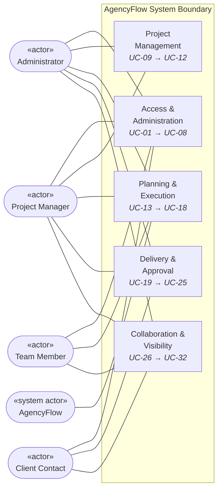

**Note the asymmetry, and that it is the product's central security property:** the Client Contact touches only three packages. They have **no** relationship to Project Management or to the internal parts of Planning & Execution — which is BR-28 expressed structurally rather than as a rule to remember.

### 2.2 UCD-2 — Access and Administration

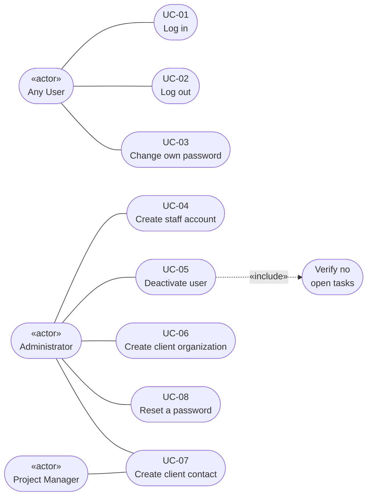

**`UC-05 «include» Verify no open tasks`** is BR-32 in UML form. It is an `«include»`, not an `«extend»`, because the check is unconditional — deactivation cannot occur without it.

### 2.3 UCD-3 — Project Management, Planning and Execution

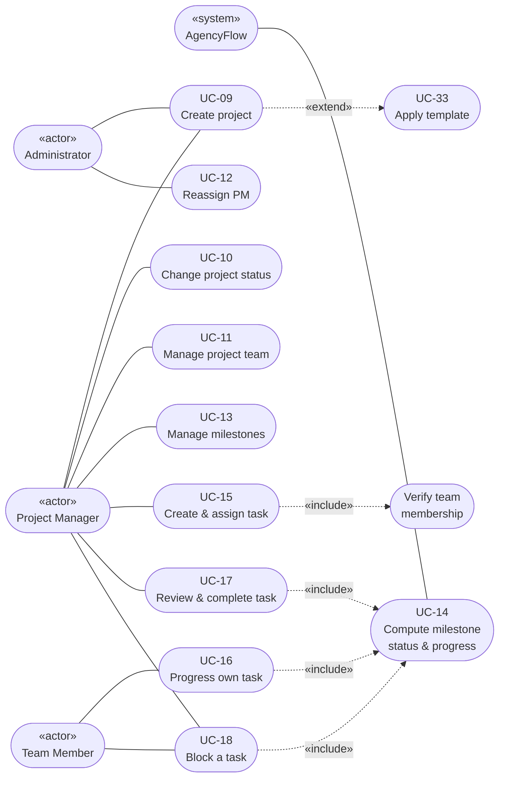

Three relationships carry real meaning here:

| Relationship | Rule |
|---|---|
| `UC-09 «extend» Apply template` | 🟢 Could-priority and optional — a project can be created without one (FR-076) |
| `UC-15 «include» Verify team membership` | **BR-23** — assignment is impossible without it |
| `UC-16/17/18 «include» UC-14` | **BR-08** — every task state change recomputes milestone progress. Making this an `«include»` on three separate use cases is what guarantees progress can never be stale |

### 2.4 UCD-4 — Delivery and Approval

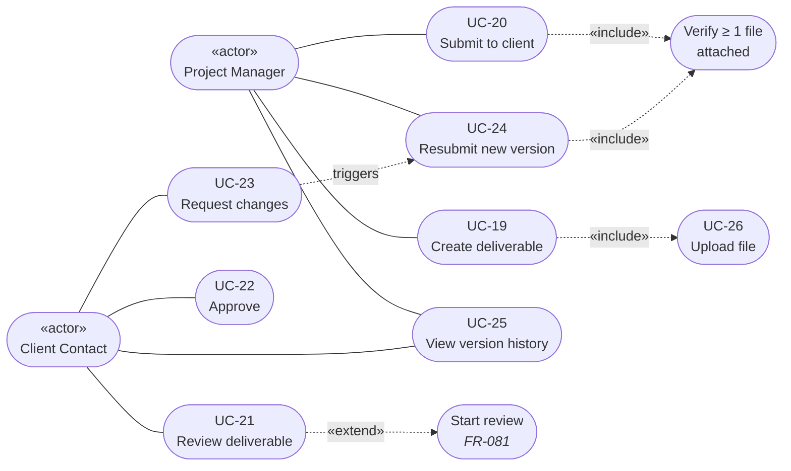

> **`UC-21 «extend» Start review` is the UML expression of BR-31 and A-14.** It is an `«extend»`, not an `«include»`, because starting a review is **optional** — a Client Contact may approve or request changes directly from `Submitted`. Had v1.0's automatic transition survived, this would have been an `«include»`, and the model would have encoded a read that mutates state.

### 2.5 UCD-5 — Collaboration and Visibility

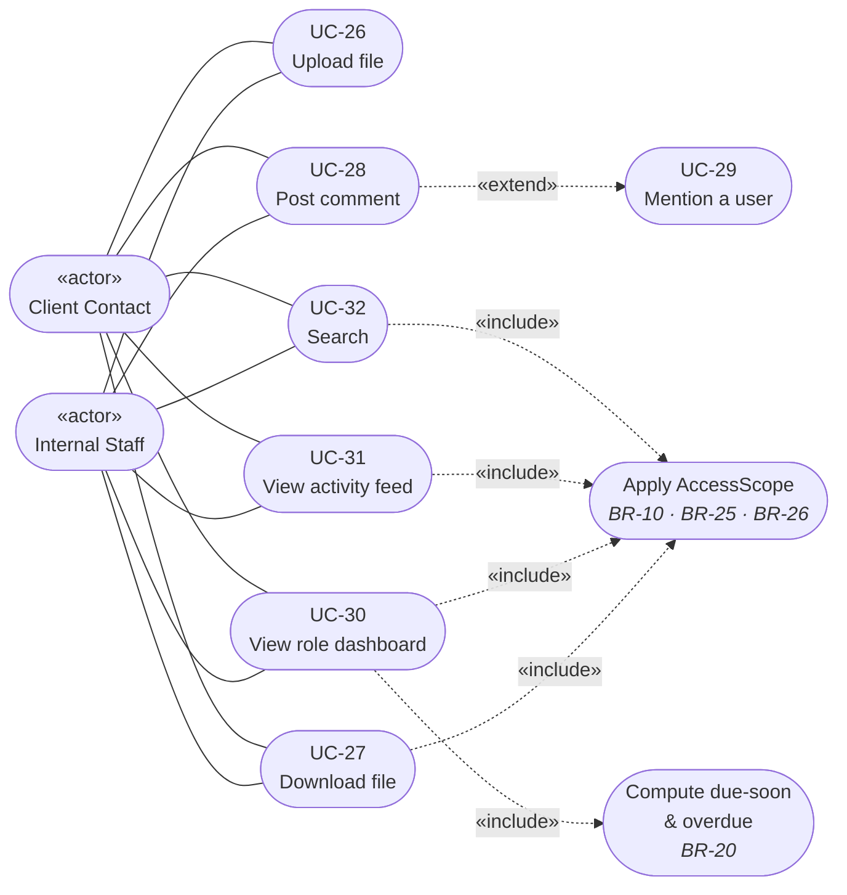

**Four use cases `«include»` *Apply AccessScope*.** That repetition is the point: isolation is not a feature of one screen, it is a precondition of every read. It is the diagrammatic form of `05-Architecture` §11.3.

---

## 3. Class Diagrams

Split into five diagrams by concern. One diagram containing fifteen classes and forty relationships is technically complete and practically unreadable — and an unreadable diagram is never consulted, which defeats its purpose.

### 3.1 CD-1 — Core domain: identity, client, project

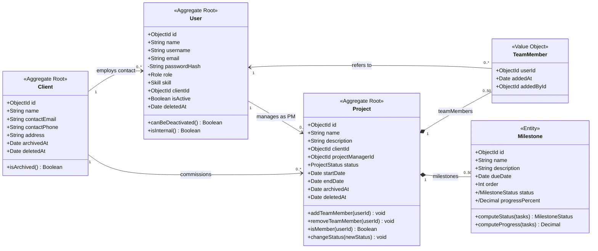

> ### 🔴 `Milestone.status` and `Milestone.progressPercent` are marked `/` — **derived**
>
> In UML, a leading slash means the value is **computed, never stored**. Both are calculated from the milestone's tasks at read time.
>
> This is the exact diagrammatic counterpart of the omission in `06-Database-Design` §7.3, and it is why the operations `computeStatus(tasks)` and `computeProgress(tasks)` appear on the class while no corresponding stored attribute does. **BR-08 and BR-12.**

**Multiplicity notes.** `Project *-- "0..50" TeamMember` and `*-- "0..50" Milestone` are compositions with an explicit upper bound — the array caps from `06-Database-Design` §7.3 (P-9). An unbounded composition would be a modelling error in a document database.

### 3.2 CD-2 — Execution domain: tasks and files

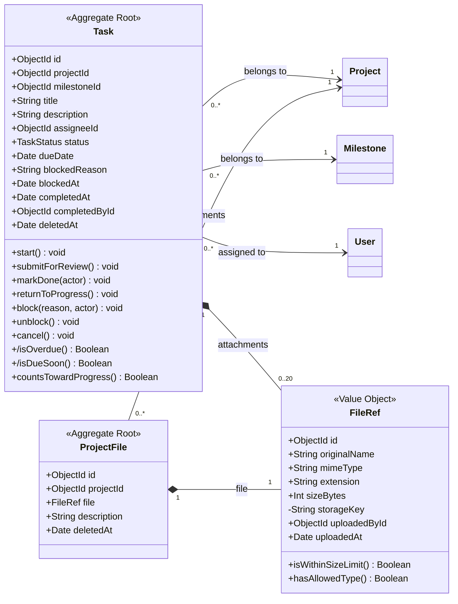

**`markDone(actor)` takes the acting user as a parameter.** That signature is BR-04 made visible: completion is not a property of the task alone, it depends on **who** is asking. A `markDone()` with no actor would be a signature that cannot enforce the rule.

**`isOverdue()` and `isDueSoon()` are derived operations, not stored fields** — BR-20. Nothing persists a deadline alert, so nothing can go stale and no scheduler is needed.

**`storageKey` is private (`-`).** It is the Cloudinary identifier and is never serialized to a client (ADR-0003).

### 3.3 CD-3 — Delivery domain: the approval workflow

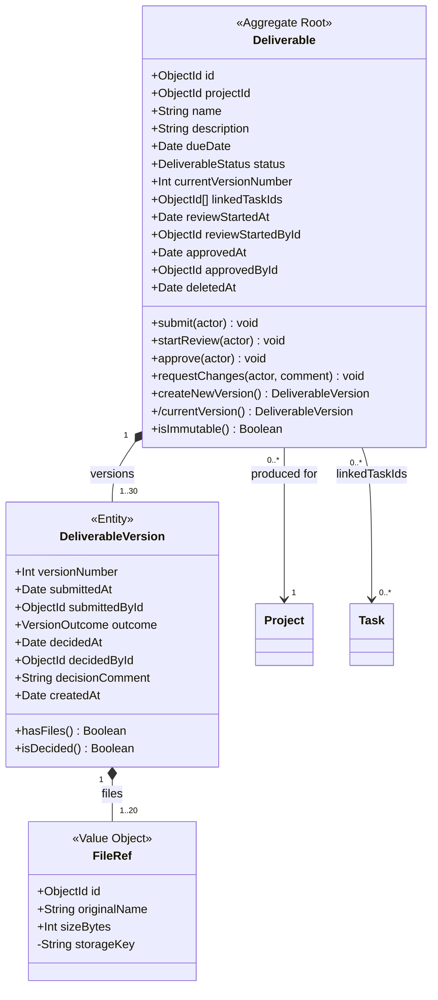

Three details encode the rules that make this the product's differentiating feature:

| Element | Rule |
|---|---|
| `createNewVersion()` returns a version; **no `updateVersion()` exists** | **BR-06** — the class has no operation capable of modifying an existing version |
| `isImmutable()` | **BR-07** — every mutating operation consults it first; once `APPROVED` it returns true forever |
| `*-- "1..30"` composition, minimum 1 | **BR-06** — a deliverable always has at least one version, and versions cannot outlive it |

**The absence of `updateVersion()` and `unapprove()` is deliberate and load-bearing.** A class diagram is also a statement about what the system *cannot* do.

### 3.4 CD-4 — Collaboration and system records

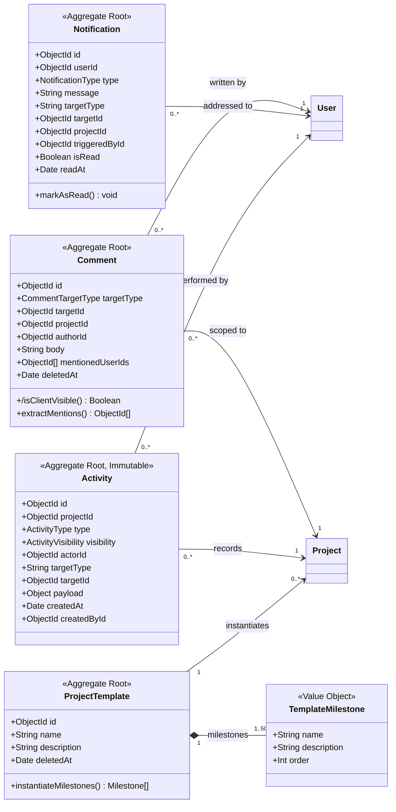

**`Comment.isClientVisible()` is derived (`/`), not stored** — it returns `targetType == DELIVERABLE`. A stored flag could contradict its target; a derived one cannot (BR-14, `06-Database-Design` §7.7).

**`Activity` is stereotyped `«Immutable»` and has no operations.** A class with no mutating behaviour is one that cannot be mutated — the object-oriented counterpart of omitting `updatedAt` from the schema.

### 3.5 CD-5 — Application layer: how BR-10 is enforced

This diagram has no counterpart in the database design. It models the **mechanism** from `05-Architecture` §11.3, and it is the most architecturally significant class diagram in the document.

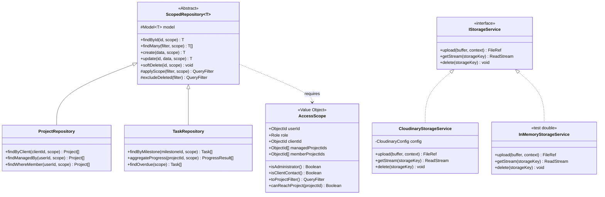

> ### Why this diagram matters more than it looks
>
> **`AccessScope` is a required parameter of every method on `ScopedRepository`.** There is no overload without it. A developer who forgets the scope does not create a data leak — they fail to compile.
>
> That converts **BR-10**, the highest-risk rule in the system, from something people must remember into a property of the type system. Everything else about isolation follows from this one signature.
>
> `IStorageService` with two realizations delivers ADR-0003's replaceability and lets Phase 9 test file features with no network (QA-6).

### 3.6 CD-6 — Enumerations

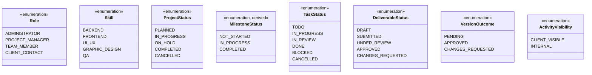

> ⚠️ **`TaskStatus`, `ProjectStatus`, and `MilestoneStatus` are three distinct types** that coincidentally share the literal `IN_PROGRESS`. They are drawn as separate classes precisely so no one is tempted to unify them — that would couple three independent state machines, and altering one would silently alter the others.

---

## 4. State Machine Diagrams

### 4.1 SM-1 — Task

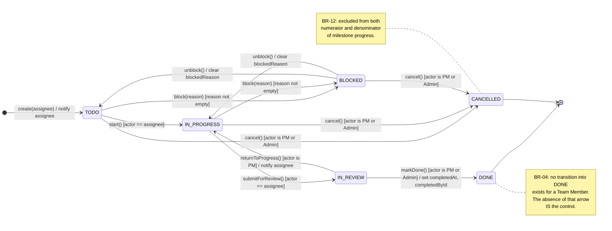

**Every transition into `DONE` carries the guard `[actor is PM or Admin]`.** There is no unguarded path. BR-04 is enforced by the *shape* of the machine, not by a note attached to it.

### 4.2 SM-2 — Deliverable

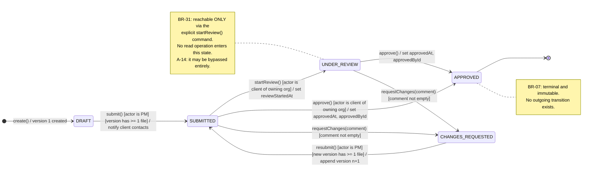

**Two structural facts:**
- `APPROVED` has **no outgoing transition**. BR-07 is not a rule the code checks; it is a state with no exit.
- `SUBMITTED` reaches `APPROVED` **directly as well as via `UNDER_REVIEW`** — A-14. That bypass path is why UCD-4 models `Start review` as `«extend»`.

### 4.3 SM-3 — Project

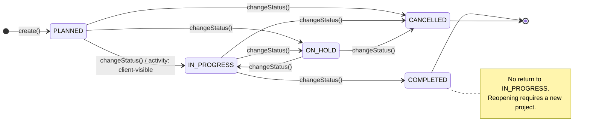

All transitions are guarded by `[actor is owning PM or Admin]` (BR-25), omitted from the labels only to keep the diagram legible.

### 4.4 SM-4 — Milestone (derived state)

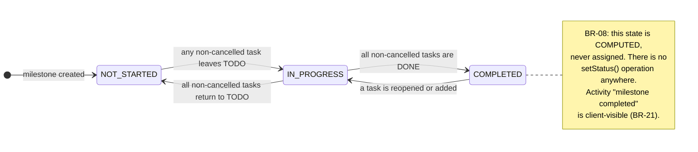

> **This machine is unlike the other three.** Its transitions have no actor and no command — they are *consequences* of task changes elsewhere. That is precisely what a derived state means, and it is why `COMPLETED → IN_PROGRESS` exists: unlike Task's `DONE` or Deliverable's `APPROVED`, a computed state has no terminal, because reopening one task recomputes it automatically.

---

## 5. Sequence Diagrams

Nine diagrams covering authentication, the two segregation-of-duties controls, the full approval loop, isolation enforcement, file handling, and dashboard assembly.

### 5.1 SD-1 — Log in (UC-01)

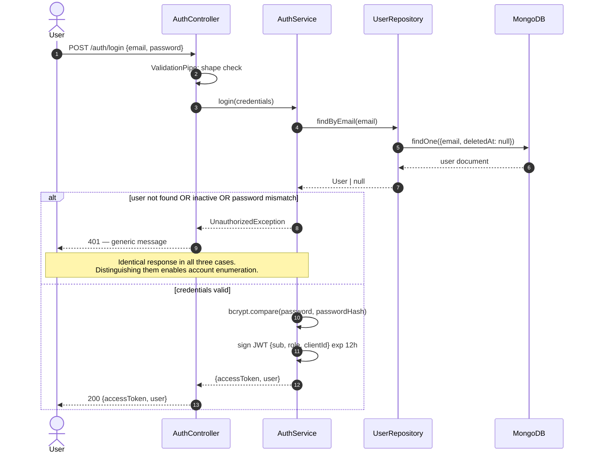

### 5.2 SD-2 — Create and assign a task (UC-15)

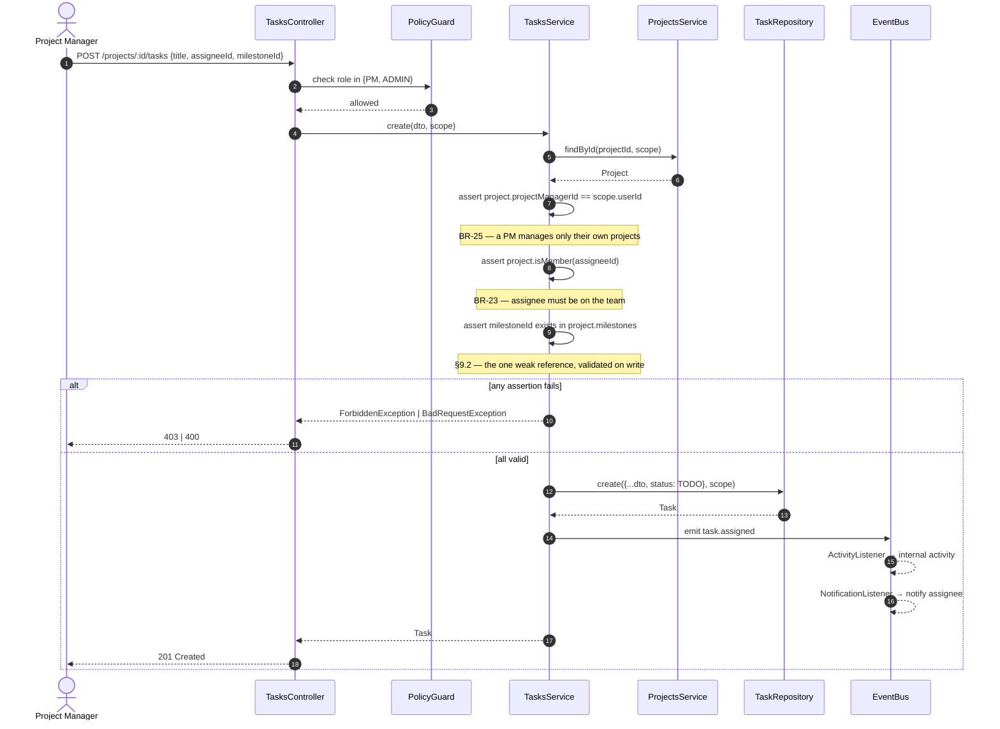

### 5.3 SD-3 — 🔒 Team Member attempts to mark a task Done (UC-16, BR-04)

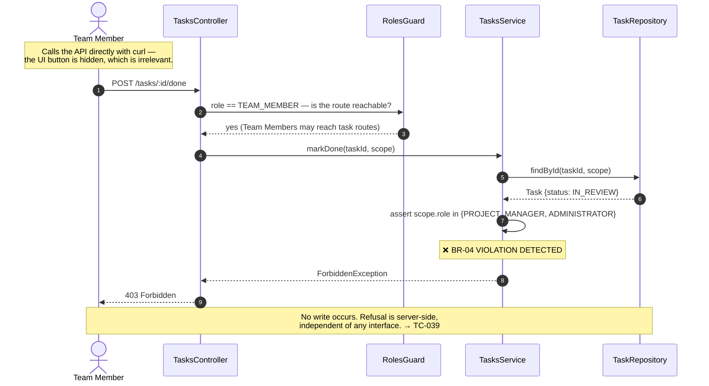

> **Why the `RolesGuard` allows this through.** A Team Member legitimately reaches task routes — they start and submit their own tasks. The role guard cannot express *"may act on this task, in this state."* Only the service can. This diagram exists to show that **layer 2 deliberately does not catch it, and layer 3 does** — the defence-in-depth argument of `05-Architecture` §11.2.

### 5.4 SD-4 — PM reviews a task; milestone recomputes (UC-17 + UC-14)

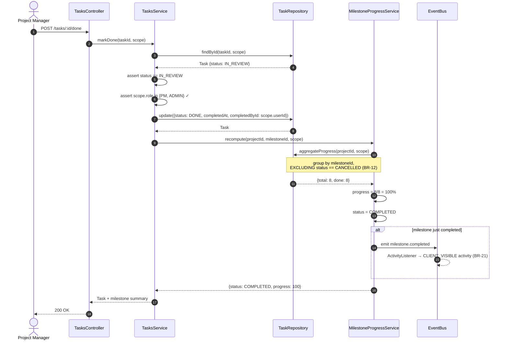

**Nothing is written to the milestone.** The recomputation returns values; it does not persist them (BR-08). Were a write to appear here, this diagram would contradict CD-1 and `06-Database-Design` §7.3.

### 5.5 SD-5 — Submit a deliverable (UC-20)

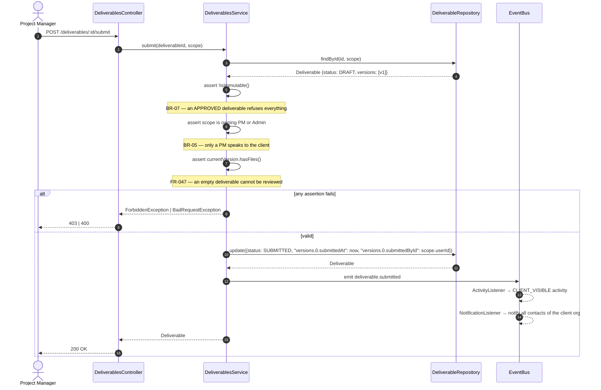

### 5.6 SD-6 — Client starts review and approves (UC-21 + UC-22, BR-31)

```mermaid
sequenceDiagram
    autonumber
    actor CC as Client Contact
    participant C as DeliverablesController
    participant S as DeliverablesService
    participant R as DeliverableRepository
    participant E as EventBus

    CC->>C: GET /deliverables/:id
    C->>S: findOne(id, scope)
    S->>R: findById(id, scope)
    Note over R: AccessScope injects<br/>project.clientId == scope.clientId (BR-10)
    R-->>S: Deliverable
    S-->>C: Deliverable
    C-->>CC: 200 — status UNCHANGED
    Note over CC,R: BR-31 — this read mutates nothing.

    CC->>C: POST /deliverables/:id/start-review
    C->>S: startReview(id, scope)
    S->>S: assert status == SUBMITTED
    alt already UNDER_REVIEW (a colleague started it)
        S-->>C: no-op, current state
        C-->>CC: 200 — not an error
        Note over CC,S: UC-21 E4 — review is a fact about<br/>the organization, not one person
    else status == SUBMITTED
        S->>R: update({status: UNDER_REVIEW, reviewStartedAt, reviewStartedById})
        S->>E: emit deliverable.review-started
        C-->>CC: 200 UNDER_REVIEW
    end

    CC->>C: POST /deliverables/:id/approve
    C->>S: approve(id, scope)
    S->>S: assert status in {SUBMITTED, UNDER_REVIEW}
    S->>S: assert scope.clientId == project.clientId
    S->>R: update({status: APPROVED, approvedAt, approvedById, "versions.$.outcome": APPROVED})
    S->>E: emit deliverable.approved
    E-->>E: ActivityListener → CLIENT_VISIBLE
    E-->>E: NotificationListener → notify owning PM
    C-->>CC: 200 APPROVED — terminal (BR-07)
```

### 5.7 SD-7 — Changes requested, then resubmission (UC-23 + UC-24, BR-06)

```mermaid
sequenceDiagram
    autonumber
    actor CC as Client Contact
    actor PM as Project Manager
    participant S as DeliverablesService
    participant R as DeliverableRepository
    participant ST as StorageService

    CC->>S: requestChanges(id, "La palette est trop sombre", scope)
    S->>S: assert comment not empty
    Note over S: FR-049 — rejection without a reason is useless
    S->>R: update({status: CHANGES_REQUESTED, "versions.0.outcome": CHANGES_REQUESTED, "versions.0.decisionComment": ..., "versions.0.decidedById": ...})
    R-->>S: Deliverable {versions: [v1 rejected]}

    Note over PM: PM corrects the work

    PM->>ST: upload(correctedFile)
    ST-->>PM: FileRef {storageKey}
    PM->>S: createNewVersion(id, [fileRef], scope)
    S->>S: assert status == CHANGES_REQUESTED
    S->>R: $push versions: {versionNumber: 2, files: [...], outcome: PENDING}
    Note over R: BR-06 — APPEND ONLY.<br/>v1 and its files are never touched.
    R-->>S: Deliverable {versions: [v1, v2]}

    PM->>S: submit(id, scope)
    S->>R: update({status: SUBMITTED, currentVersionNumber: 2})
    S-->>PM: Deliverable
    Note over CC,ST: v1's file, rejection and the client's exact<br/>words remain permanently retrievable. → TC-050
```

### 5.8 SD-8 — 🔒 Cross-organization access refused (FR-079, BR-10)

```mermaid
sequenceDiagram
    autonumber
    actor CC as Client Contact<br/>(Atlas Resto)
    participant C as ProjectsController
    participant G as JwtAuthGuard
    participant I as ScopeInterceptor
    participant S as ProjectsService
    participant R as ProjectRepository
    participant DB as MongoDB

    Note over CC: Substitutes another organization's<br/>project id taken from a URL.

    CC->>C: GET /projects/:otherOrgProjectId
    C->>G: verify JWT
    G-->>C: valid {sub, role: CLIENT_CONTACT, clientId: ATLAS}
    C->>I: build AccessScope from token
    Note over I: clientId comes from the SIGNED TOKEN,<br/>never from the request
    I-->>C: AccessScope {role: CLIENT_CONTACT, clientId: ATLAS}
    C->>S: findById(otherOrgProjectId, scope)
    S->>R: findById(id, scope)
    R->>R: applyScope() → filter {_id: id, clientId: ATLAS, deletedAt: null}
    R->>DB: findOne(scopedFilter)
    DB-->>R: null
    Note over DB,R: The document exists but is<br/>OUTSIDE the scoped query.
    R-->>S: null
    S-->>C: NotFoundException
    C-->>CC: 404 Not Found
    Note over CC,DB: 404, not 403 — a 403 would confirm<br/>the project exists (§10.5). → TC-079
```

> **The key step is 9.** The scope filter is applied *inside the repository*, before the query reaches the database. The service never had the opportunity to omit it, because `findById` cannot be called without a scope. This is CD-5 in action.

### 5.9 SD-9 — Upload a file (UC-26)

```mermaid
sequenceDiagram
    autonumber
    actor U as Project Manager
    participant C as DeliverablesController
    participant V as FileValidationPipe
    participant S as DeliverablesService
    participant ST as CloudinaryStorageService
    participant CDN as Cloudinary
    participant R as DeliverableRepository

    U->>C: POST /deliverables/:id/versions/:v/files (multipart)
    C->>V: validate(file)
    V->>V: extension in BR-15 allow-list?
    V->>V: sizeBytes <= 20 MB?
    V->>V: inspect actual content type — client header NOT trusted
    Note over V: NFR-24

    alt validation fails
        V-->>C: BadRequestException
        C-->>U: 400 — reason stated
    else valid
        V-->>C: buffer
        C->>S: attachFile(deliverableId, versionNumber, buffer, scope)
        S->>S: assert !isImmutable() (BR-07)
        S->>ST: upload(buffer, context)
        ST->>CDN: upload resource_type raw
        CDN-->>ST: {public_id}
        ST-->>S: FileRef {storageKey, sizeBytes, mimeType}
        S->>R: $push versions.$[v].files: FileRef
        R-->>S: Deliverable
        S-->>C: FileRef (storageKey stripped)
        C-->>U: 201 Created
        Note over C,U: storageKey is never serialized —<br/>the client can never address Cloudinary directly.
    end
```

### 5.10 SD-10 — Client Contact dashboard (UC-30, BR-20)

```mermaid
sequenceDiagram
    autonumber
    actor CC as Client Contact
    participant C as DashboardsController
    participant S as DashboardsService
    participant PR as ProjectRepository
    participant TR as TaskRepository
    participant DR as DeliverableRepository
    participant AR as ActivityRepository

    CC->>C: GET /dashboard
    C->>S: build(scope)
    Note over S: scope.role == CLIENT_CONTACT → client view

    par assembled concurrently
        S->>PR: findMany({clientId: scope.clientId}, scope)
        PR-->>S: Project[]
    and
        S->>DR: findMany({status: SUBMITTED|UNDER_REVIEW}, scope)
        DR-->>S: Deliverable[] — awaiting my approval
    and
        S->>AR: findMany({visibility: CLIENT_VISIBLE}, scope)
        Note over AR: BR-21 filter is IN THE INDEX (idx 21)
        AR-->>S: Activity[]
    end

    loop for each project
        S->>TR: aggregateProgress(projectId, scope)
        TR-->>S: per-milestone {total, done}
        S->>S: compute progress % excluding CANCELLED (BR-12)
    end

    S->>S: compute upcoming milestones from dueDate
    Note over S: BR-20 — computed at read time.<br/>No stored alerts, no scheduler.
    S-->>C: ClientDashboard
    C-->>CC: 200 — projects, progress, deliverables awaiting me
    Note over CC,AR: Zero task data reaches this response (BR-28).
```

---

## 6. Activity Diagrams

Swimlanes are rendered as subgraphs — a Mermaid approximation of UML partitions (§1.3).

### 6.1 AD-1 — Deliverable approval workflow (end to end)

```mermaid
flowchart TB
    subgraph PM["🏊 Project Manager"]
        A1([Start]) --> A2[Create deliverable]
        A2 --> A3[Attach files]
        A3 --> A4{At least<br/>one file?}
        A4 -->|No| A3
        A4 -->|Yes| A5[Submit to client]
        A12[Correct the work] --> A13[Create new version]
        A13 --> A14[Attach corrected files]
        A14 --> A5
    end

    subgraph SYS["🏊 System"]
        A6[Set status SUBMITTED]
        A6 --> A7[Record client-visible activity]
        A7 --> A8[Notify client contacts]
        A15[Append version n+1<br/><i>never overwrite</i>]
        A18[Set status APPROVED<br/>record approver + date]
        A19[Close document to all writes]
    end

    subgraph CC["🏊 Client Contact"]
        A9[Open deliverable<br/><i>read only — no state change</i>]
        A9 --> A10{Start review?}
        A10 -->|Yes| A11[Status UNDER_REVIEW]
        A10 -->|No, decide now| A16
        A11 --> A16{Decision}
        A16 -->|Request changes| A17[Enter mandatory comment]
        A16 -->|Approve| A18
    end

    A5 --> A6
    A8 --> A9
    A17 --> A15
    A15 --> A12
    A18 --> A19
    A19 --> A20([End — terminal])
```

Three branches encode business rules: `A4` is FR-047 (no empty submission), `A10` is BR-31 and A-14 (starting review is optional), `A19` is BR-07 (approval is terminal).

### 6.2 AD-2 — Task lifecycle

```mermaid
flowchart TB
    subgraph PM["🏊 Project Manager"]
        B1([Start]) --> B2[Create task]
        B2 --> B3{Assignee is a<br/>project member?}
        B3 -->|No| B4[Refuse — add to team first]
        B3 -->|Yes| B5[Task created — TODO]
        B12{Work acceptable?}
        B12 -->|No| B13[Return to IN_PROGRESS]
        B12 -->|Yes| B14[Mark DONE]
    end

    subgraph TM["🏊 Team Member"]
        B6[Start work — IN_PROGRESS]
        B7{Blocked?}
        B7 -->|Yes| B8[Enter mandatory reason]
        B8 --> B9[Status BLOCKED]
        B9 --> B10[Blockage resolved]
        B10 --> B6
        B7 -->|No| B11[Submit for review]
    end

    subgraph SYS["🏊 System"]
        B15[Recompute milestone progress<br/><i>excluding CANCELLED</i>]
        B15 --> B16{All non-cancelled<br/>tasks DONE?}
        B16 -->|Yes| B17[Milestone COMPLETED<br/>client-visible activity]
        B16 -->|No| B18[Milestone IN_PROGRESS]
    end

    B5 --> B6
    B6 --> B7
    B11 --> B12
    B13 --> B6
    B14 --> B15
    B17 --> B19([End])
    B18 --> B19
```

> **The Team Member lane contains no path to `DONE`.** That is BR-04 rendered as a workflow: the swimlane boundary *is* the control. Work must cross into the Project Manager's lane to be completed.

### 6.3 AD-3 — Milestone progress computation (UC-14)

```mermaid
flowchart TB
    C1([Trigger: any task<br/>status change]) --> C2[Load all tasks<br/>of the milestone]
    C2 --> C3[Exclude tasks with<br/>status = CANCELLED]
    C3 --> C4{Any tasks<br/>remaining?}
    C4 -->|No| C5[progress = 0%<br/>status = NOT_STARTED]
    C4 -->|Yes| C6[denominator = count of remaining]
    C6 --> C7[numerator = count where status = DONE]
    C7 --> C8[progress = numerator / denominator × 100]
    C8 --> C9{numerator ==<br/>denominator?}
    C9 -->|Yes| C10[status = COMPLETED]
    C9 -->|No| C11{Any task left TODO?}
    C11 -->|No| C12[status = NOT_STARTED]
    C11 -->|Yes| C13[status = IN_PROGRESS]
    C10 --> C14[Emit milestone.completed<br/>→ client-visible activity]
    C5 --> C15([Return values — NOTHING IS PERSISTED])
    C12 --> C15
    C13 --> C15
    C14 --> C15
```

**`C4 → C5` is the division-by-zero guard** (A-02, `06-Database-Design` §7.3 E1) — a milestone with no tasks, or with only cancelled ones, reports 0 % rather than crashing. **`C15` is BR-08**: values are returned, never written.

### 6.4 AD-4 — User deactivation (BR-32)

```mermaid
flowchart TB
    D1([Administrator requests<br/>deactivation]) --> D2{Is this the last<br/>active Administrator?}
    D2 -->|Yes| D3[Refuse — A-10]
    D2 -->|No| D4[Query tasks where<br/>assigneeId = user]
    D4 --> D5{Any task neither<br/>DONE nor CANCELLED?}
    D5 -->|Yes| D6[Refuse — list blocking tasks<br/>BR-32]
    D6 --> D7[Administrator reassigns<br/>or cancels them]
    D7 --> D4
    D5 -->|No| D8[Set isActive = false]
    D8 --> D9[Historical records retained<br/>authorship intact — BR-30]
    D9 --> D10([End])
    D3 --> D11([End — refused])
```

**Without the `D5` branch, deactivating an employee would leave tasks assigned to an account that can never log in — and BR-12 would then prevent their milestones from ever reaching 100 %.** This diagram is the finding DM-04 from the domain review, in workflow form.

---

## 7. Component Diagram

```mermaid
flowchart TB
    subgraph WEB["«component» Web Application (Vercel)"]
        W1["«component»<br/>Internal Workspace"]
        W2["«component»<br/>Client Portal"]
        W3["«component»<br/>API Client Layer"]
        W1 --> W3
        W2 --> W3
    end

    subgraph API["«component» API Application (Railway)"]
        subgraph HTTP["«subsystem» HTTP Layer"]
            H1["«component» Guards<br/>Jwt · Roles · Policy"]
            H2["«component» Pipes<br/>Validation · FileValidation"]
            H3["«component» Filters &amp; Interceptors<br/>Exception · Logging · Scope"]
        end

        subgraph FEAT["«subsystem» Feature Modules"]
            F1["«component» Auth"]
            F2["«component» Users"]
            F3["«component» Clients"]
            F4["«component» Projects"]
            F5["«component» Tasks"]
            F6["«component» Deliverables"]
            F7["«component» Files"]
            F8["«component» Comments"]
            F9["«component» Notifications"]
            F10["«component» Activities"]
            F11["«component» Dashboards"]
        end

        subgraph CORE["«subsystem» Core"]
            K1["«component» Authorization<br/>◐ IAccessScope"]
            K2["«component» Storage<br/>◐ IStorageService"]
            K3["«component» Events<br/>◐ IEventBus"]
            K4["«component» Database<br/>◐ IScopedRepository"]
            K5["«component» Config"]
        end
    end

    DB[("«device»<br/>MongoDB Atlas")]
    CDN[("«external system»<br/>Cloudinary")]

    W3 -->|HTTPS/JSON| HTTP
    HTTP --> FEAT
    FEAT --> CORE
    F11 -.->|reads| F4
    F11 -.->|reads| F5
    F11 -.->|reads| F6
    F5 -.->|publishes| K3
    F6 -.->|publishes| K3
    K3 -.->|delivers| F9
    K3 -.->|delivers| F10
    K4 --> DB
    K2 --> CDN
```

### 7.1 Provided and required interfaces

| Component | Provides | Requires |
|---|---|---|
| Authorization | `IAccessScope` builder, policy evaluation | Users |
| Storage | `IStorageService` (ADR-0003) | Cloudinary |
| Events | `IEventBus` publish/subscribe | — |
| Database | `IScopedRepository<T>` | MongoDB |
| Feature modules | Their own service interface | Core + permitted peers (§8.2) |

**Dependency arrows point one way only: HTTP → Features → Core.** Core never points back. That is rule R2 of `05-Architecture` §7.1, and it is what keeps a module extractable later.

**Notice that Notifications and Activities have no inbound arrows from business modules** — only from the Event bus. That is the decoupling of `05-Architecture` §9, drawn.

---

## 8. Package Diagrams

### 8.1 PD-1 — Monorepo structure

```mermaid
flowchart TB
    subgraph REPO["«monorepo» agencyflow"]
        subgraph APPS["«folder» apps"]
            API["«package»<br/>@agencyflow/api<br/><i>NestJS</i>"]
            WEB["«package»<br/>@agencyflow/web<br/><i>React + Vite</i>"]
        end
        subgraph PKGS["«folder» packages"]
            CON["«package»<br/>@agencyflow/contracts<br/><i>pure types + enums</i>"]
            CFG["«package»<br/>@agencyflow/config<br/><i>eslint · tsconfig · prettier</i>"]
        end
    end

    API -->|«import»| CON
    WEB -->|«import»| CON
    API -->|«import»| CFG
    WEB -->|«import»| CFG
    API -.->|❌ forbidden| WEB
    WEB -.->|❌ forbidden| API
```

**`contracts` has zero runtime dependencies and is imported by both applications.** Rename a field there and the frontend fails to compile in CI — the argument that justified the monorepo in ADR-0001, expressed as a package dependency.

**The two forbidden edges matter.** `api` and `web` share types, never code. An import between them would couple a Node application to a browser application and defeat the separation the deployment topology depends on.

### 8.2 PD-2 — Backend package dependencies

```mermaid
flowchart TB
    subgraph L1["Layer 1 — HTTP"]
        HTTP["«package» http<br/>guards · pipes · filters"]
    end
    subgraph L2["Layer 2 — Feature Modules"]
        AUTH["auth"]
        USERS["users"]
        CLIENTS["clients"]
        PROJ["projects"]
        TASKS["tasks"]
        DELIV["deliverables"]
        FILES["files"]
        COMM["comments"]
        NOTIF["notifications"]
        ACT["activities"]
        DASH["dashboards"]
    end
    subgraph L3["Layer 3 — Core"]
        AUTHZ["authorization"]
        STOR["storage"]
        EVT["events"]
        DBP["database"]
        CONF["config"]
    end

    HTTP --> L2
    AUTH --> USERS
    PROJ --> USERS
    PROJ --> CLIENTS
    TASKS --> PROJ
    DELIV --> PROJ
    FILES --> PROJ
    FILES --> TASKS
    FILES --> DELIV
    COMM --> USERS
    DASH --> PROJ
    DASH --> TASKS
    DASH --> DELIV
    DASH --> ACT
    L2 --> L3
    NOTIF -.->|subscribes| EVT
    ACT -.->|subscribes| EVT
```

### 8.3 Dependency rules — machine-enforced

| Rule | Enforcement |
|---|---|
| R1 — Features may depend on Core | NestJS module imports |
| **R2 — Core never depends on a feature** | ESLint `import/no-restricted-paths` |
| R3 — Cross-module access only via exported services | NestJS DI — non-exported providers are unreachable |
| **R4 — Never import another module's repository or schema** | ESLint `import/no-restricted-paths` — a deep import fails CI |
| **R5 — No circular dependencies** | `madge --circular` in CI |

> **Dashboards depends on four modules and is depended on by none.** It is a pure read model — the one place cross-module reads are expected — and it holds no business rules of its own. If a rule ever appears there, it has been duplicated from its owning module and NFR-32 is broken.

---

## 9. Deployment Diagram

```mermaid
flowchart TB
    subgraph CLIENT["«device» User Device"]
        BROWSER["«execution environment»<br/>Web Browser<br/><i>Chrome · Firefox · Edge · Safari</i>"]
        SPA["«artifact»<br/>agencyflow-web<br/><i>SPA bundle</i>"]
        BROWSER --- SPA
    end

    subgraph VERCEL["«device» Vercel — Global CDN"]
        VNODE["«execution environment»<br/>Static Hosting"]
        VART["«artifact»<br/>dist/ (Vite build)"]
        VNODE --- VART
    end

    subgraph RENDER["«device» Railway — service (trial / free)"]
        NODE["«execution environment»<br/>Node.js 24 LTS"]
        APIART["«artifact»<br/>agencyflow-api<br/><i>NestJS build</i>"]
        NODE --- APIART
    end

    subgraph ATLAS["«device» MongoDB Atlas M0"]
        RS["«execution environment»<br/>3-node replica set"]
        DBART["«artifact»<br/>agencyflow database<br/><i>10 collections</i>"]
        RS --- DBART
    end

    subgraph CLOUD["«device» Cloudinary"]
        CSTORE["«execution environment»<br/>Object storage + CDN"]
        CART["«artifact»<br/>uploaded files"]
        CSTORE --- CART
    end

    subgraph GH["«device» GitHub Actions"]
        CI["«execution environment»<br/>CI/CD Runner"]
    end

    BROWSER -->|"HTTPS — static assets"| VNODE
    BROWSER -->|"HTTPS/JSON — REST + JWT"| NODE
    NODE -->|"mongodb+srv (TLS)"| RS
    NODE -->|"HTTPS — SDK, server-side only"| CSTORE
    CI -.->|"deploy on merge to main"| VNODE
    CI -.->|"deploy on merge to main"| NODE
```

### 9.1 Node specification

| Node | Runtime | Notes |
|---|---|---|
| User Device | Browser | Holds the JWT. **No authorization logic** — it hides controls for usability only (NFR-20) |
| Vercel | Static CDN | No SSR. Global edge distribution |
| **Railway** | Node.js 24 LTS | **Single instance. Does not sleep (ADR-0006); stops outright when credits are exhausted (AR-11)** |
| MongoDB Atlas M0 | 3-node replica set | Transactions available. `0.0.0.0/0` allowlist required (AR-10) |
| Cloudinary | Object storage | **Reached only from the API node, never from the browser** (ADR-0003) |
| GitHub Actions | CI runner | Lint · type-check · test · build · deploy |

### 9.2 The critical topology fact

> **No arrow runs from the browser to Cloudinary or to MongoDB.**
>
> Every byte of data and every file passes through the API node, where the `AccessScope` is applied. If such an arrow existed, BR-10 would be unenforceable regardless of how the application code were written — architecture would have defeated it before the first line was typed.

---

## 10. Traceability

### 10.1 Diagrams to requirements

| Diagram | Primary requirements |
|---|---|
| UCD-1 – UCD-5 | All 32 use cases; BR-28 |
| CD-1 | E-01 – E-05; **BR-08**, BR-09, BR-23, BR-24 |
| CD-2 | E-06, E-09; **BR-04**, BR-15, BR-20, BR-22 |
| CD-3 | E-07, E-08; **BR-05**, **BR-06**, **BR-07** |
| CD-4 | E-10 – E-13; BR-14, BR-17, BR-21 |
| CD-5 | **BR-10**, FR-079, NFR-20, NFR-21, ADR-0003 |
| CD-6 | §6 of `06-Database-Design` |
| SM-1 | FR-038 – FR-042; **BR-04**, BR-12, BR-22 |
| SM-2 | FR-047 – FR-051, **FR-081**; BR-05 – BR-07, **BR-31** |
| SM-3 | FR-021 |
| SM-4 | FR-031, FR-032; **BR-08**, BR-12 |
| SD-1 | FR-001, FR-002 |
| SD-2 | FR-035, FR-036; BR-23, BR-25 |
| SD-3 | FR-039; **BR-04** → **TC-039** |
| SD-4 | FR-040, FR-031, FR-032; BR-08 |
| SD-5 | FR-047; BR-05 |
| SD-6 | FR-081, FR-048; **BR-31**, BR-07 |
| SD-7 | FR-049, FR-050; **BR-06** → TC-050 |
| SD-8 | FR-079; **BR-10** → **TC-079** |
| SD-9 | FR-055; BR-15, NFR-24 |
| SD-10 | FR-071, FR-072; BR-20, BR-21, BR-28 |
| AD-1 | UC-19 – UC-24 |
| AD-2 | UC-15 – UC-18 |
| AD-3 | UC-14; BR-08, BR-12 |
| AD-4 | FR-010; **BR-32** |
| Component | `05-Architecture` §6, §7 |
| PD-1, PD-2 | ADR-0001; NFR-31; §7 rules |
| Deployment | `05-Architecture` §15 |

### 10.2 Coverage

| Check | Result |
|---|---|
| Use cases appearing in a use case diagram | **32 / 32** ✅ |
| Domain entities modelled as classes | **13 / 13** ✅ |
| State machines for entities with a lifecycle | **4 / 4** ✅ |
| Security-critical rules with a dedicated sequence diagram | **6 / 6** ✅ |
| Diagrams introducing an unapproved decision | **0** ✅ |

---

## 11. Consistency Validation

Every UML artefact was checked against its source. Discrepancies are defects, not variations.

| # | Check | Source | Result |
|---|---|---|---|
| 1 | `Milestone` has **no stored** `status` / `progress` | `06-DB` §7.3 | ✅ Derived (`/`) in CD-1; AD-3 persists nothing |
| 2 | Composition (`*--`) used exactly where the DB embeds | `06-DB` §4.1 | ✅ TeamMember, Milestone, DeliverableVersion, FileRef |
| 3 | Association (`-->`) used exactly where the DB references | `06-DB` §9.1 | ✅ All `ObjectId` links |
| 4 | Multiplicity caps match the array caps | `06-DB` §7 P-9 | ✅ 0..50, 1..30, 0..20 |
| 5 | Task states match the enumeration | `06-DB` §6 | ✅ 6 states, SM-1 |
| 6 | Deliverable states match, including `UNDER_REVIEW` | SRS §6.2 v1.1 | ✅ SM-2 with the `SUBMITTED → APPROVED` bypass |
| 7 | No `GET` mutates state | BR-31 | ✅ SD-6 step 6 explicitly unchanged |
| 8 | No transition into `DONE` available to a Team Member | BR-04 | ✅ SM-1 guards; AD-2 lane boundary; SD-3 |
| 9 | `APPROVED` has no outgoing transition | BR-07 | ✅ SM-2 |
| 10 | Deliverable class has no `updateVersion()` / `unapprove()` | BR-06, BR-07 | ✅ CD-3 |
| 11 | `AccessScope` required by every repository method | `05-Arch` §11.3 | ✅ CD-5; SD-8 step 9 |
| 12 | Core never depends on a feature module | `05-Arch` §7.1 R2 | ✅ PD-2, Component diagram |
| 13 | Notifications/Activities reached only via events | `05-Arch` §9 | ✅ Component diagram, SD-2, SD-5 |
| 14 | Browser never reaches Cloudinary or MongoDB directly | ADR-0003 | ✅ Deployment §9.2 |
| 15 | Cancelled tasks excluded from progress | BR-12 | ✅ AD-3 step C3; SD-4 |
| 16 | Division-by-zero guarded | A-02 | ✅ AD-3 branch C4 |
| 17 | Client dashboard carries no task data | BR-28 | ✅ SD-10 closing note |
| 18 | `storageKey` never serialized to a client | ADR-0003 | ✅ CD-2 private; SD-9 closing note |
| 19 | Three status enums kept separate | `06-DB` §6 | ✅ CD-6 |
| 20 | Deployment matches the approved providers | `05-Arch` §15 | ✅ Vercel · Railway (ADR-0006) · Atlas M0 · Cloudinary |

**20 of 20 consistency checks pass. No contradictions found between the UML model and the approved baseline.**

### 11.1 One notation matter, recorded

`UC-33 Apply template` appears in UCD-3 as an `«extend»` of UC-09 but is **not** in the 32-use-case index of `03-Use-Cases` v1.1, where template instantiation is covered as an alternative flow (UC-09 A1). It is drawn separately here because `«extend»` is the correct UML expression of an optional alternative flow.

**No change to `03-Use-Cases` is proposed** — the use case count remains 32, and UC-33 is presentational, not a new requirement. Recorded so the discrepancy reads as a deliberate notation choice rather than an inconsistency.

---

## 12. Phase 5 Exit Criteria

- [x] Use case diagrams — 5, with `«include»` / `«extend»` relationships carrying business rules
- [x] Class diagrams — 5, with derived attributes, stereotypes, multiplicities, and composition matching embedding
- [x] State machine diagrams — 4, with guards and actions
- [x] Sequence diagrams — 9, including all six security-critical rules
- [x] Activity diagrams — 4, with swimlanes
- [x] Component diagram with provided/required interfaces
- [x] Package diagrams — 2, with machine-enforced dependency rules
- [x] Deployment diagram matching the confirmed providers
- [x] Full traceability to requirements and test cases
- [x] 20 consistency checks passed against SRS, Architecture, and Database Design
- [x] No new design decision introduced
- [x] **Project Owner approval — 2026-07-30**

---

## END OF PHASE 5 DELIVERABLE

**Awaiting approval.** On approval, Phase 6 (Backend Design) begins, taking these diagrams as binding: module decomposition from §7–8, the class model from §3, state machines from §4 as the transition guards, and the sequence diagrams as the endpoint collaboration specification.
