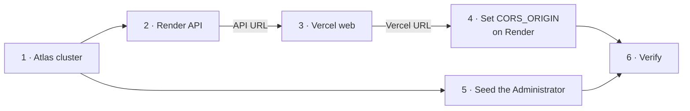

# AgencyFlow — Deployment Runbook

**Not a phase deliverable.** The numbered `00`–`09` documents are the frozen design baseline. This is an operational document and is expected to change whenever the deployment does.

| Component | Platform | Plan | Source of truth |
|---|---|---|---|
| API (NestJS) | Render | Free | `render.yaml` (Blueprint) |
| Web (React/Vite) | Vercel | Hobby | `vercel.json` |
| Database | MongoDB Atlas | M0 | Atlas dashboard |
| File storage | Cloudinary | Free | Cloudinary dashboard |

Targets fixed in `05-Software-Architecture.md` §15 and confirmed by the Project Owner when resolving OQ-06.

---

## 1. Why this is being done now

`05-Software-Architecture.md` records **RISK-04**: deployment is discovered to be broken late, when there is no time left to fix it. Storage and deployment are the two components most likely to fail for environmental reasons rather than logical ones, and neither can be proven by a local test.

So the pipeline is validated while the application is still a health endpoint and a status page. A cold start, a missing environment variable, or a CORS refusal costs an afternoon now; the same failure discovered in the final week costs the deadline.

---

## 2. Order of operations

The four steps have real dependencies, and doing them out of order produces confusing failures.



Steps 2 and 3 each need the other's URL, which is why `CORS_ORIGIN` is set *after* Vercel exists, as a separate step. There is no ordering that avoids this; the loop is closed by deploying with a placeholder and correcting it.

Step 5 depends only on Atlas, so it can be done any time after step 1 — but it is not optional, and skipping it produces a fully working deployment that **nobody can log into**. See §7.

---

## 3. Step 1 — MongoDB Atlas M0

1. Create a free **M0** cluster. Region: closest available to `eu-central` so it sits near the Render Frankfurt region.
2. **Database Access** → create a user with `readWrite` on the `agencyflow` database. Use a generated password with no URL-reserved characters, or percent-encode it.
3. **Network Access** → add `0.0.0.0/0`.

> ⚠️ **AR-10.** Render Free does not offer static outbound IP addresses, so the Atlas allowlist cannot be narrowed to specific hosts. `0.0.0.0/0` permits any IP to *attempt* a connection; authentication still requires the database credentials. This is an accepted, documented risk of the free tier, mitigated by a strong generated password and by the database containing no production data during development.

4. Copy the connection string. It must include the database name:

```
mongodb+srv://<user>:<password>@<cluster>.mongodb.net/agencyflow?retryWrites=true&w=majority
```

Atlas clusters are replica sets, so transactions work — that is the requirement from `06-Database-Design.md` §9.3, and the reason local development uses a single-node replica set rather than a standalone `mongod`.

---

## 4. Step 2 — Render API

**Dashboard → New → Blueprint → select the repository.** Render reads `render.yaml`; nothing is configured by hand except the secrets.

Fill in the three variables marked `sync: false`:

| Variable | Value |
|---|---|
| `MONGODB_URI` | The Atlas string from step 1 |
| `CLOUDINARY_URL` | `cloudinary://<api_key>:<api_secret>@<cloud_name>` from the Cloudinary dashboard |
| `CORS_ORIGIN` | `https://placeholder.vercel.app` — corrected in step 4 |

`JWT_SECRET` is generated by Render (`generateValue: true`) and never appears in the repository. It deliberately differs from the development secret, so a leaked development token cannot authenticate against production.

**Expected result:** the first build takes several minutes. When it finishes:

```bash
curl https://agencyflow-api.onrender.com/health
# {"status":"ok","dependencies":{"database":"up","storage":"up"}}
```

`database: "up"` proves Atlas connectivity and the allowlist. `storage: "up"` proves the Cloudinary credentials. A single request validates both external dependencies — which is exactly what the health endpoint was designed for.

---

## 5. Step 3 — Vercel web client

**New Project → import the repository. Leave Root Directory at the repository root.**

This is the one setting that is easy to get wrong. Pointing Root Directory at `apps/web` makes Vercel run `npm ci` inside that directory, where the npm workspace link to `@agencyflow/contracts` does not resolve — the build fails on a missing module that plainly exists. `vercel.json` at the root handles the workspace ordering instead:

| Setting | Value | Why |
|---|---|---|
| `installCommand` | `npm ci` | Installs the whole workspace tree, including the symlink to `contracts` |
| `buildCommand` | contracts, then web | `contracts` must emit its ESM `dist` before Vite can resolve it |
| `outputDirectory` | `apps/web/dist` | Vite's output, relative to the repository root |
| `rewrites` | everything → `/index.html` | Client-side routing: a deep link must not 404 on refresh. Vercel serves real files first, so assets are unaffected |

**Environment variable** (Production, Preview, Development):

| Variable | Value |
|---|---|
| `VITE_API_URL` | `https://agencyflow-api.onrender.com` — **no trailing slash** |

> Vite inlines `VITE_`-prefixed variables at **build** time. Changing this value requires a redeploy, not a restart, and nothing placed here can be secret — it ships to the browser in plain text.

---

## 6. Step 4 — Close the CORS loop

Return to Render and set `CORS_ORIGIN` to the real Vercel production origin, e.g. `https://agencyflow.vercel.app`. Save; Render restarts the service.

**Known limitation.** `CORS_ORIGIN` accepts exactly one origin, so Vercel *preview* deployments (which get a new URL per commit) are refused by the API. That is the correct trade-off for now: a permissive origin regex is a real security weakness, and preview builds can be checked against a locally running API. If preview environments become part of the workflow, the fix is an explicit allow-list, not a wildcard.

---

## 7. Step 5 — Seed the first Administrator

**Without this step the deployment is complete and unusable.** FR-007 and BR-11 mean there is no registration endpoint: every account exists because an Administrator created it. A fresh Atlas database has no Administrator, so there is no first door — which is what `apps/api/scripts/seed-admin.js` exists to be. It is deliberately outside the HTTP surface: nothing reachable over the network can create an Administrator from nothing.

Render's free plan has no shell, so the seed is run **from a developer machine against Atlas**. That is not a workaround: the script needs credentials that the platform holds as secrets, and running it locally keeps the one privileged operation in the hands of a person rather than in a deploy hook.

```powershell
npm run build --workspace @agencyflow/contracts
npm run build --workspace @agencyflow/api

# The whole application boots, so every variable it validates must be present.
$env:MONGODB_URI       = "<the Atlas string from step 1>"
$env:JWT_SECRET        = "any-value-at-least-32-characters-long-unused-here"
$env:CLOUDINARY_URL    = "<the same value given to Render>"
$env:CORS_ORIGIN       = "https://placeholder.local"

$env:SEED_ADMIN_NAME     = "Your Name"
$env:SEED_ADMIN_USERNAME = "your.name"
$env:SEED_ADMIN_EMAIL    = "you@agencyflow.ma"
$env:SEED_ADMIN_PASSWORD = "<a real password, 8+ characters>"

npm run seed:admin --workspace @agencyflow/api
```

Three things worth stating precisely, because each one has a silent failure mode:

- **`process.env` overrides the repository's `.env` file.** `@nestjs/config` does not let a file overwrite a variable that is already set, so exporting `MONGODB_URI` above genuinely redirects the seed at Atlas. Verified rather than assumed — the failure it prevents is seeding the *local* database and believing production is ready.
- **`JWT_SECRET` and `CORS_ORIGIN` are placeholders here.** The script signs nothing and serves nothing; they are present only because boot-time validation refuses to start without them. Do **not** copy Render's generated `JWT_SECRET` onto a laptop to satisfy a check that does not use it.
- **The script is idempotent.** If an active Administrator already exists it changes nothing and exits 0, so re-running it after a failed attempt is safe.

Expected output:

```
Administrator created: you@agencyflow.ma (username: your.name)
Log in through the web client and create the rest of the team from there.
```

Every other account — Project Managers, Team Members, client organisations and their contacts — is then created through the interface, which is the rule this whole arrangement exists to preserve.

---

## 8. Step 6 — Verification checklist

Run these in order. Each one isolates a different failure.

| # | Check | Command / action | Proves |
|---|---|---|---|
| 1 | API is alive | `curl https://<api>/health` | Build, boot, and env validation succeeded |
| 2 | Database reachable | `dependencies.database == "up"` | Atlas credentials + `0.0.0.0/0` allowlist |
| 3 | Storage reachable | `dependencies.storage == "up"` | Cloudinary credentials survived the environment copy |
| 4 | Versioning intact | `curl https://<api>/api/v1/health` → **404** | The global prefix excludes `/health` as designed |
| 5 | Web client loads | Open the Vercel URL | Vite build and output directory are correct |
| 6 | **Cross-origin call succeeds** | The status page shows the API's health, not an error | `CORS_ORIGIN` matches the Vercel origin exactly |
| 7 | **Login works** | Sign in with the seeded Administrator | Step 5 ran, and JWT signing works with Render's generated secret |
| 8 | Role routing | An Administrator lands on `/app/dashboard` | The two route trees resolve behind Vercel's SPA rewrite |
| 9 | Deep link survives refresh | Reload while on `/app/projects` | The `rewrites` rule is serving `index.html` rather than 404 |
| 10 | **Upload and download** | Attach a file to a deliverable, then download it | Cloudinary write path *and* the proxied read (ADR-0003 S-2) |
| 11 | **Client isolation** | Log in as a Client Contact of one organisation | BR-10 holds across the real network, not only in tests |
| 12 | **Cold start is handled** | Wait 15+ minutes, then reload the status page | AR-09: the client shows the waking message, not a failure |

Check 6 is the one that catches the classic mistake. A trailing slash, `http` instead of `https`, or the preview URL instead of the production URL all produce the same browser console message: *blocked by CORS policy*. The API log will show the origin it actually received; compare the two strings character by character.

Check 10 is worth doing by hand even though the slice-5 script covers it locally, because it is the only check that exercises a **third** external service across the real network. A Cloudinary credential that survived the copy into Render still has to work from Frankfurt, and the download half proves the proxy rather than a provider URL — the guarantee ADR-0003 S-2 rests on.

Check 12 matters because Render's free tier suspends an idle service after roughly 15 minutes, and the next request pays a 30–60 second wake-up. `QueryBoundary` swaps the spinner for an explanatory French message after 5 seconds precisely for this (AR-09). A user who sees a frozen screen concludes the application is broken; a user who is told the server is waking waits.

---

## 9. What is deliberately not automated

| Not automated | Why |
|---|---|
| Creating the Render and Vercel projects | Both require account authentication. A one-time click is cheaper and clearer than storing platform tokens in CI |
| Secrets in `render.yaml` | `sync: false` exists so secrets are entered in the dashboard and never enter Git (NFR-25) |
| `npm run verify:storage` in CI | Needs real credentials and makes live network calls against a shared free-tier account |

Deploys themselves **are** automated: `autoDeploy: true` on Render and Vercel's Git integration both build on every push to `main`. Combined with branch protection, that means only reviewed, CI-passing code ever reaches either platform.

---

## 10. Troubleshooting

| Symptom | Cause | Fix |
|---|---|---|
| Build fails, `nest: not found` | `NODE_ENV=production` made npm skip devDependencies | `npm ci --include=dev` — already in `render.yaml` |
| Build fails, cannot resolve `@agencyflow/contracts` | Built out of order, or Vercel Root Directory set to `apps/web` | Build `contracts` first; keep Root Directory at the repository root |
| Boot fails, `Invalid environment configuration` | A variable is missing or malformed | The error names every failing variable at once — read the whole list before redeploying |
| `database: "down"` | Atlas allowlist, or a password with unescaped URL characters | Confirm `0.0.0.0/0`; percent-encode the password |
| `storage: "down"` | `CLOUDINARY_URL` truncated on copy | Re-copy from the Cloudinary dashboard; the value ends with the cloud name |
| Web shows a JSON parse error | `VITE_API_URL` unset in the Vercel build | The client requested Vercel's own domain and received `index.html` |
| Blocked by CORS policy | `CORS_ORIGIN` does not match byte for byte | Compare the origin in the Render log with the browser's; watch for a trailing slash |
| First request of the day times out | Render free-tier cold start | Expected (AR-09). The client waits; the timeout must not be shortened |
| Login returns 401 with correct credentials | The Administrator was never seeded, or was seeded into the *local* database | Re-run §7 with `MONGODB_URI` exported in the shell; the script is idempotent |
| Seed reports "already exists" but login still fails | It connected to local MongoDB, not Atlas | Confirm the exported `MONGODB_URI` starts `mongodb+srv://` and names the `agencyflow` database |
| Vercel build fails on the Node version | `engines.node` names a major Vercel does not offer | Vercel offers majors only (24.x, 22.x, 20.x); keep the range bounded and current |
| Deploy fails, `MongooseServerSelectionError` at boot | Atlas was still provisioning, or the allowlist had not propagated | Wait for the cluster to report *Active*, then redeploy — `serverSelectionTimeoutMS` is 5 s by design, to fail fast rather than hang |
